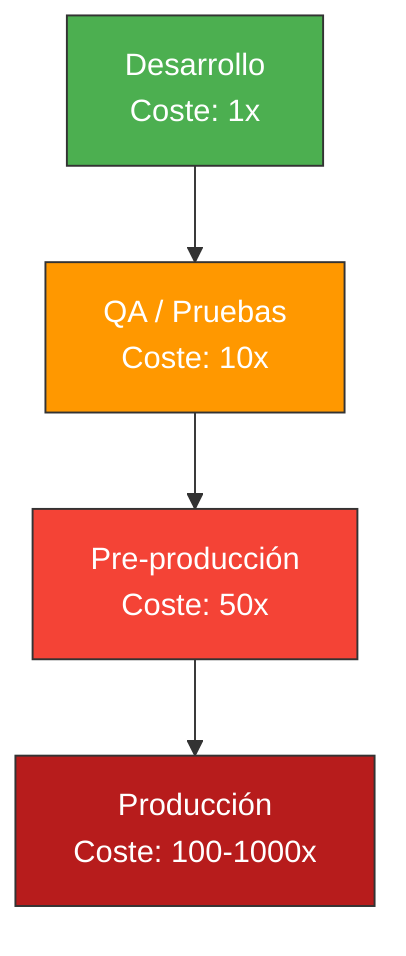

- [1. Introducción al QA y a las Pruebas de Software](#1-introducción-al-qa-y-a-las-pruebas-de-software)
  - [1.1. ¿Por qué importan las Pruebas en el Desarrollo?](#1-por-qué-importan-las-pruebas-en-el-desarrollo)
    - [El Mito del "Funciona en Mi Máquina"](#el-mito-del-funciona-en-mi-máquina)
  - [1.2. Calidad de Software: Más Allá de "Compila y Ya"](#12-calidad-de-software-más-allá-de-compila-y-ya)
    - [¿Qué es la Calidad de Software?](#qué-es-la-calidad-de-software)
  - [1.3. Verificación vs Validación: No Son lo Mismo](#13-verificación-vs-validación-no-son-lo-mismo)
  - [1.4. El Ciclo de Vida del Error: Por Qué Probar Temprano](#14-el-ciclo-de-vida-del-error-por-qué-probar-temprano)
    - [La Regla del 1-10-100](#la-regla-del-1-10-100)
  - [1.5. QA en el Desarrollo: Integración desde el Primer Día](#15-qa-en-el-desarrollo-integración-desde-el-primer-día)
    - [El Modelo "Shift-Left"](#el-modelo-shift-left)
  - [1.6. Tipos de Errores Comunes](#16-tipos-de-errores-comunes)


# 1. Introducción al QA y a las Pruebas de Software

En el mundo del desarrollo de software moderno, **escribir código no es suficiente**. Una aplicación puede compilar correctamente, ejecutarse sin errores evidentes y aún así no cumplir con las expectativas del usuario o contener fallos críticos que solo aparecen cuando el sistema está en producción.

La **Calidad de Software** (QA - Quality Assurance) y las **Pruebas de Software** son dos pilares fundamentales que garantizan no solo que el software *funcione*, sino que funcione *correctamente* y *como se espera*.

> 📝 **Nota del Profesor:** Muchos estudiantes piensan que las pruebas son "perder tiempo" o algo que se hace "al final". Esta mentalidad es exactamente lo que vamos a cambiar en esta unidad. Las pruebas son una **inversión**, no un coste.

---

## 1.1. ¿Por qué importan las Pruebas en el Desarrollo?

Cada línea de código que escribes tiene el potencial de contener un error. A medida que el proyecto crece, las posibilidades de que algo falle aumentan exponencialmente. Sin pruebas, cada cambio que haces podría romper algo que ya funcionaba.

### El Mito del "Funciona en Mi Máquina"

Es una frase que hemos escuchado todos:

> *"En mi ordenador funciona perfectly."*

```csharp
public class Calculadora
{
    public int Dividir(int dividendo, int divisor)
    {
        return dividendo / divisor;  // ¿Qué pasa si divisor es 0?
    }
}

// En desarrollo:
// var calc = new Calculadora();
// calc.Dividir(10, 2);  // Funciona: 5
// calc.Dividir(10, 0);  // DivideByZeroException en PRODUCCIÓN
```

Este ejemplo trivial ilustra un problema fundamental: **lo que funciona en desarrollo puede fallar en producción**. Las razones son infinitas:

- Datos diferentes (vacíos, nulos, extremos)
- Concurrencia y accesos simultáneos
- Condiciones de carrera
- Integración con sistemas externos
- Rendimiento bajo carga

> 💡 **Analogía del Constructor:** Antes de entregar un edificio, un arquitecto no dice "confía en mí, he revisado los planos mentalmente". Un inspector verifica cada estructura. Las pruebas de software son tu inspector.

---

## 1.2. Calidad de Software: Más Allá de "Compila y Ya"

La calidad de software no es solo "que no haya errores". Es un concepto multidimensional.

### ¿Qué es la Calidad de Software?

La calidad de software se mide en múltiples dimensiones:

| Dimensión          | Descripción                                                                 |
| ------------------ | --------------------------------------------------------------------------- |
| **Funcionalidad**  | El software hace lo que se espera que haga                                  |
| **Fiabilidad**     | El software funciona consistentemente sin fallar                           |
| **Rendimiento**     | El software responde en tiempos aceptables                                  |
| **Seguridad**      | El software protege los datos y previene accesos no autorizados           |
| **Mantenibilidad** | El código es fácil de entender, modificar y extender                       |
| **Usabilidad**     | El software es fácil de usar para el usuario final                        |

> ⚠️ **Error Común:** Pensar que "compilar sin errores" significa que el software tiene calidad. Un programa puede compilar perfectamente y:
> - Devolver resultados incorrectos
> - Bloquearse con ciertos datos
> - Ser vulnerable a ataques
> - Ser imposible de mantener

```csharp
// Ejemplo: Código que compila pero tiene calidad cuestionable
public class Usuario
{
    public string nombre;  // Público: accesible desde anywhere
    public string password;  // Sin encriptar: riesgo de seguridad
    
    public bool Validar(string inputPassword)
    {
        return password == inputPassword;  // Comparación insegura: timing attack
    }
}
```

> 💡 **Tip del Examinador:** En un examen, si te preguntan sobre calidad de software, menciona al menos 3 dimensiones. No te limites a "que no haya bugs".

---

## 1.3. Verificación vs Validación: No Son lo Mismo

Aunque a menudo se utilizan indistintamente, son conceptos distintos y ambos son necesarios.

| Concepto         | Pregunta Clave                                            | Enfoque                                                            |
| ---------------- | -------------------------------------------------------- | ------------------------------------------------------------------ |
| **Verificación** | ¿Estamos construyendo el producto **correctamente**?     | Comprueba que el software cumple con las especificaciones técnicas |
| **Validación**   | ¿Estamos construyendo el producto **correcto**?          | Verifica que el software satisface las necesidades del usuario     |

**Ejemplo práctico:**

Imagina que desarrollas un sistema de login:

- **Verificación**: ¿El método `HashPassword()` utiliza SHA-256 como especifica la documentación técnica? ¿Se guardan las contraseñas hasheadas?
- **Validación**: ¿El usuario puede acceder a su cuenta de forma intuitiva? ¿La experiencia de usuario es fluida?

```csharp
// VERIFICACIÓN: ¿Estamos construyendo correctamente?
public class Autenticador
{
    public string HashPassword(string password)
    {
        // Verificamos que usamos SHA-256 como especifica el estándar
        using var sha256 = SHA256.Create();
        var bytes = sha256.ComputeHash(Encoding.UTF8.GetBytes(password));
        return Convert.ToBase64String(bytes);
    }
}

// VALIDACIÓN: ¿Estamos construyendo el producto correcto?
// ¿El usuario puede usar el sistema de login de forma intuitiva?
// ¿El flujo de "olvidé mi contraseña" funciona correctamente?
```

> 🧠 **Analogía de la Receta de Cocina:**
> - **Verificación:** ¿Estás siguiendo la receta correctamente? ¿Has puesto los ingredientes en el orden adecuado?
> - **Validación:** ¿El plato final sabe bien? ¿El cliente queda satisfecho?

---

## 1.4. El Ciclo de Vida del Error: Por Qué Probar Temprano

Los estudios de la industria demuestran que **el coste de corregir un bug crece exponencialmente** según la fase en que se detecta.

### La Regla del 1-10-100

| Fase de Detección     | Coste Relativo | Impacto Real                                                             |
| --------------------- | -------------- | ------------------------------------------------------------------------ |
| **Desarrollo**        | 1x             | Lo corriges tú mismo en minutos                                         |
| **Pruebas (QA)**      | 10x            | Requiere reportar, investigar, asignar y corregir                      |
| **Pre-producción**    | 50x            | Incluye reuniones, análisis de impacto, regresiones                    |
| **Producción**        | 100x-1000x     | Daño reputacional, pérdida de clientes, posibles demandas, crisis total |



**Ejemplo real:**

```csharp
// Error en fase de desarrollo (minutos para corregir):
// "Me falta validar que el campo no esté vacío"
// → Añades un if y listo.

// Error en producción (días + consecuencias):
// "El sistema permite transacciones negativas de -1000€"
// → clients perdiendo dinero, medios hablando de ti, investigação interna...
```

> 📝 **Nota del Profesor:** Un bug en producción no solo requiere tiempo de desarrollo para corregirse, sino que involucra reuniones de crisis, análisis de impacto, comunicación con clientes afectados, posible compensación y pérdida de confianza. Por eso, invertir en testing es **siempre** rentable.

---

## 1.5. QA en el Desarrollo: Integración desde el Primer Día

Históricamente, las pruebas se hacían "al final", cuando todo el código estaba escrito. Este enfoque es profundamente problemático.

### El Modelo "Shift-Left"

El término **Shift-Left** se refiere a mover las pruebas "a la izquierda" en la línea de tiempo del desarrollo:

```mermaid
gantt
    title Modelo Shift-Left: Pruebas Antes y Frecuentemente
    dateFormat  X
    axisFormat %s
    
    section Enfoque Antiguo
    Código          :done,    des1, 0, 30
    Pruebas         :active,  test1, 30, 40
    Producción      :crit,    prod1, 40, 50
    
    section Enfoque Moderno
    Código+Pruebas  :active,  des2, 0, 20
    Código+Pruebas  :active,  des3, 20, 40
    Producción      :done,    prod2, 40, 50
```



**¿Por qué Shift-Left?**

1. **Errores más fáciles de corregir:** Cuanto más cerca escribes el código, más fácil es recordar qué estabas pensando
2. **Menos deuda técnica:** Los bugs no se acumulan
3. **Mejor diseño:** Para probar algo, primero debes entender qué hace
4. **Documentación viva:** Los testsdocumentan el comportamiento esperado

```csharp
// Enfoque Antiguo (Mal): Pruebas al final
public class PedidoService
{
    // Escribes 500 líneas de código...
    // Al final dices: "ahora a probar"
    // Resultado: nadie sabe qué debería hacer el sistema
}

// Enfoque Moderno (Bien): TDD - Test Driven Development
// 1. Primero escribes el test
public class PedidoServiceTests
{
    [Fact]
    public void CalcularTotal_ConProductos_ReturnsSumaCorrecta()
    {
        // Arrange
        var servicio = new PedidoService();
        var productos = new List<Producto>
        {
            new() { Precio = 10m },
            new() { Precio = 20m }
        };
        
        // Act
        var total = servicio.CalcularTotal(productos);
        
        // Assert
        Assert.Equal(30m, total);
    }
}

// 2. Luego escribes el código que pasa el test
public class PedidoService
{
    public decimal CalcularTotal(List<Producto> productos)
    {
        return productos.Sum(p => p.Precio);
    }
}
```

> 💡 **Analogía del Revisor Ortográfico:** ¿Esperarías a terminar todo el libro para revisar la ortografía? No, usas el corrector mientras escribes. Las pruebas son el "corrector" de tu lógica de negocio.

---

## 1.6. Tipos de Errores Comunes

Para probar eficazmente, primero debes entender qué tipo de errores puedes encontrar:

| Tipo de Error         | Descripción                                            | Ejemplo en C#                          |
| --------------------- | ------------------------------------------------------ | -------------------------------------- |
| **Sintáctico**        | El código no compila                                   | `var x = ;` (falta valor)              |
| **Lógico**            | Compila pero hace algo incorrecto                      | `a + b` en lugar de `a * b`           |
| **Runtime**           | Error en tiempo de ejecución                           | `NullReferenceException`               |
| **De flujo**          | El programa se cuelga o no termina                     | Bucle infinito                         |
| **De precisión**      | Cálculos matemáticos incorrectos                       | No usar `decimal` para dinero         |
| **De concurrencia**   | Problemas con accesos simultáneos                      | `Race condition` en hilos             |
| **De integración**    | Los componentes no trabajan juntos                     | API devuelve formato inesperado       |
| **De seguridad**      | Vulnerabilidades y brechas                             | SQL Injection, passwords sin hashear  |

```csharp
// Ejemplos de errores comunes:

// 1. Lógico: ¿Cuál es el error?
public bool EsMayorDeEdad(int edad)
{
    return edad > 18;  // Funciona, pero ¿y si edad es negativo?
}

// 2. Runtime: NullReferenceException
public string GetNombreUsuario(int id)
{
    var usuario = _repo.GetById(id);
    return usuario.Nombre.ToUpper();  // ¿Y si usuario es null?
}

// 3. De precisión: Usar double para dinero
public double CalcularDescuento(double precio, double porcentaje)
{
    return precio - (precio * porcentaje / 100);
    // double tiene errores de precisión!
    // Para dinero usa decimal siempre
}

// 4. De seguridad: Contraseña expuesta
public class UsuarioMalMal
{
    public string Password { get; set; }  // ¡NUNCA almacenes passwords así!
}
```

> ⚠️ **Warning del Examinador:** En los exámenes de Entornos, espera preguntas sobre tipos de errores. Saber distinguir un error de sintaxis de uno lógico es básico. Saber que los errores de precisión con `double` para dinero son un problema grave demuestra conocimiento profesional.

---

> 💡 **Resumen del Tema:** QA y pruebas no son "algo extra" que se hace al final. Son parte fundamental del desarrollo de software. Cuanto antes detectes un error, más barato es corregirlo. La calidad no se inspecciona, se construye desde el primer día.

> 📝 **Del Profesor:** En la siguiente sección aprenderemos a usar el **depurador** como herramienta fundamental para encontrar errores durante el desarrollo. Porque a veces, por mucho que probemos, los errores se cuelan y necesitamos encontrarlos rápido.
