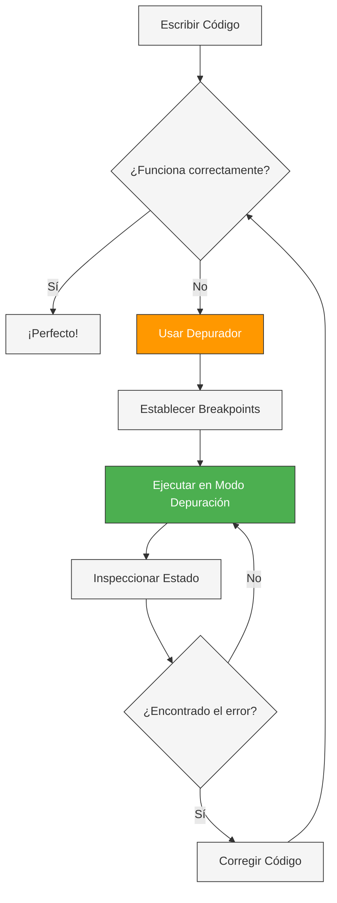
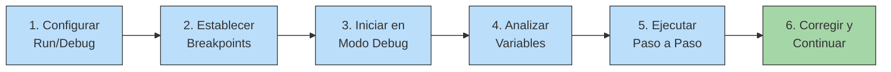
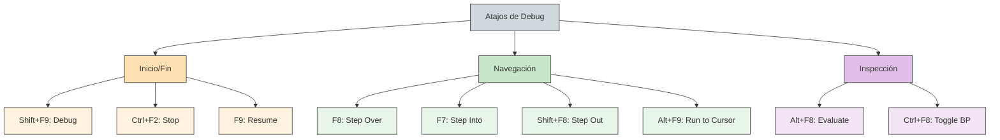

- [2. Uso del Depurador en el Desarrollo](#2-uso-del-depurador-en-el-desarrollo)
  - [2.1. ¿Qué es un Depurador?](#11-qué-es-un-depurador)
  - [2.2. El Depurador en JetBrains Rider](#12-el-depurador-en-jetbrains-rider)
  - [2.3. Tipos de Puntos de Interrupción (Breakpoints)](#13-tipos-de-puntos-de-interrupción-breakpoints)
    - [Puntos de Interrupción de Línea](#puntos-de-interrupción-de-línea)
    - [Puntos de Interrupción Condicionales](#puntos-de-interrupción-condicionales)
    - [Puntos de Interrupción de Excepción](#puntos-de-interrupción-de-excepción)
    - [Puntos de Interrupción de Método](#puntos-de-interrupción-de-método)
    - [Puntos de Interrupción de Datos (Data Breakpoints)](#puntos-de-interrupción-de-datos-data-breakpoints)
    - [Tracepoints: logging sin detener](#tracepoints-logging-sin-detener)
  - [2.4. Sesión de Depuración: Iniciar, Pausar, Reanudar y Detener](#14-sesión-de-depuración-iniciar-pausar-reanudar-y-detener)
    - [Iniciar la depuración](#iniciar-la-depuración)
    - [Pausar la ejecución](#pausar-la-ejecución)
    - [Reanudar la ejecución](#reanudar-la-ejecución)
    - [Detener la depuración](#detener-la-depuración)
  - [2.5. El Depurador Predictivo (Predictive Debugger)](#15-el-depurador-predictivo-predictive-debugger)
    - [Visualización de expresiones booleanas](#visualización-de-expresiones-booleanas)
    - [Código no ejecutable](#código-no-ejecutable)
    - [Predicción de excepciones](#predicción-de-excepciones)
  - [2.6. Depuración de Excepciones](#16-depuración-de-excepciones)
    - [Configurar breakpoints de excepción](#configurar-breakpoints-de-excepción)
    - [Workflow de depuración de excepciones](#workflow-de-depuración-de-excepciones)
  - [2.7. Depuración Visual de LINQ](#17-depuración-visual-de-linq)
    - [¿Por qué es importante la depuración de LINQ?](#por-qué-es-importante-la-depuración-de-linq)
    - [Cómo usar el visualizador de LINQ](#cómo-usar-el-visualizador-de-linq)
    - [Ejemplo práctico: Encontrar números primos](#ejemplo-práctico-encontrar-números-primos)
  - [2.8. Atajos de Teclado Esenciales](#18-atajos-de-teclado-esenciales)


# 2. Uso del Depurador en el Desarrollo

El depurador (debugger) es una de las herramientas más poderosas que tiene un desarrollador para encontrar y corregir errores en su código. En esta sección, profundizaremos en el depurador de **JetBrains Rider**, el IDE que utilizaremos durante todo el curso, y exploraremos sus características avanzadas.

> 📝 **Nota del Profesor:** Muchos estudiantes dependen exclusivamente de `Console.WriteLine` para encontrar errores. Aunque printf-debugging tiene su lugar, el depurador es infinitamente más potente y profesional. Dominar el depurador te diferenciará como desarrollador.

---

## 2.1. ¿Qué es un Depurador?

Un **depurador** es una herramienta que permite ejecutar un programa de manera controlada, deteniendo la ejecución en puntos específicos para examinar el estado de la aplicación. A diferencia de simplemente ejecutar el código, un depurador te permite:

- **Inspeccionar variables** en tiempo de ejecución
- **Ejecutar código paso a paso** (línea a línea o método a método)
- **Evaluar expresiones** sin modificar el código
- **Ver la pila de llamadas** (call stack)
- **Establecer puntos de interrupción** (breakpoints) condicionales



> 💡 **Analogía del Mecánico:** Un depurador es como un mecánico que levanta el capó de un coche mientras está funcionando para ver qué pasa dentro. Sin el depurador, solo oirías "el coche hace un ruido raro" pero no sabrías dónde está el problema.

---

## 2.2. El Depurador en JetBrains Rider

JetBrains Rider incorpora un depurador .NET extremadamente potente que permite examinar el comportamiento en tiempo de ejecución de tu aplicación, identificar código problemático y aislar la fuente de los problemas paso a paso.

### Flujo Típico de Depuración



**Pasos típicos:**

1. **Definir configuración:** Configura el programa que quieres depurar
2. **Establecer breakpoints:** Define dónde quieres que la ejecución se detenga
3. **Iniciar depuración:** Ejecuta el programa en modo debug (Shift+F9)
4. **Examinar variables:** Inspecciona valores mientras el programa está pausado
5. **Paso a paso:** Navega por el código ejecutando línea a línea
6. **Evaluar expresiones:** Usa la ventana de expresiones para calcular valores

> ⚠️ **Importante:** Rider no soporta depuración de aplicaciones single-file o aplicaciones nativas que hospedan CLR.

---

## 2.3. Tipos de Puntos de Interrupción (Breakpoints)

Los breakpoints son fundamentales en la depuración. Rider soporta múltiples tipos de breakpoints, cada uno con propósitos específicos.

### Puntos de Interrupción de Línea

El tipo más común. Se establecen en una línea específica de código y detienen la ejecución cuando se alcanza esa línea.

**Cómo establecerlos:**

- Clic en el margen izquierdo del editor
- Pulsar `Ctrl+F8`
- Menú: `Run | Toggle Breakpoint | Line Breakpoint`

```
┌─────────────────────────────────────────────┐
│ 1: public class Calculadora                 │
│ 2: {                                        │
│ 3:     public int Sumar(int a, int b)       │
│ 4:     {                                    │
│ 5:         return a + b;  ● ← Breakpoint   │
│ 6:     }                                    │
│ 7: }                                        │
└─────────────────────────────────────────────┘
        ● = Punto rojo en el margen
```

**Estados de un breakpoint:**

| Estado | Icono | Descripción |
|--------|-------|-------------|
| Habilitado | 🔴 (rojo lleno) | Activo y Detendrá la ejecución |
| Condicional | 🔴 con ✓ | Se detendrá solo si se cumple la condición |
| Deshabilitado | ⚪ (rojo vacío) | No detendrá la ejecución |
| Temporal | 🔴 con ⊗ | Se elimina automáticamente tras ser alcanzado |
| Muteado | ⬜ (gris) | Todos los breakpoints están desactivados temporalmente |

### Puntos de Interrupción Condicionales

Permiten detener la ejecución solo cuando se cumple una condición específica. Ideal para bucles o casos específicos.

```csharp
public void ProcesarPedidos(List<Pedido> pedidos)
{
    foreach (var pedido in pedidos)
    {
        // Breakpoint condicional: solo parar cuando pedido.Id > 1000
        CalcularTotal(pedido);  
    }
}
```

**Ejemplo de condición:**
```
pedido.Id > 1000 && pedido.Estado == "Pendiente"
```

> 💡 **Tip del Examinador:** Los breakpoints condicionales son esenciales cuando tienes un bucle de 1000 iteraciones y solo quieres parar en la iteración 999. En lugar de darle a "continue" 998 veces, usa una condición.

### Puntos de Interrupción de Excepción

A diferencia de los breakpoints de línea, los breakpoints de excepción no requieren una línea específica. Se configuran para que el depurador se detenga cuando se lanza una excepción específica.

**Cómo configurarlos:**

1. `Ctrl+Shift+F8` → Breakpoints dialog
2. Click en `+` → CLR Exception Breakpoint
3. Especificar el tipo de excepción

```
┌─────────────────────────────────────────────┐
│ Exception Breakpoints                      │
├─────────────────────────────────────────────┤
│ ☑ Any exception                            │
│   ☑ Suspend: User Code + Unhandled         │
│                                             │
│ ☑ System.NullReferenceException            │
│   ☑ Suspend: Always                        │
│                                             │
│ ☐ System.DivideByZeroException             │
└─────────────────────────────────────────────┘
```

### Puntos de Interrupción de Método

Suspenden el programa cada vez que se llama a un método específico. No se muestran en el editor, solo en el diálogo de breakpoints.

**Caso de uso:**
```csharp
//quieres saber cuándo se llama a SaveChanges() en Entity Framework
// sin buscar en todo el código
```

### Puntos de Interrupción de Datos (Data Breakpoints)

Permiten suspender la ejecución cuando el valor de una propiedad o campo específico cambia. Ideal para descubrir quién modifica un valor.

> ⚠️ **Nota:** Solo disponibles en .NET Core 3.x o .NET 5+ en Windows.

```csharp
public class CuentaBancaria
{
    public decimal Saldo { get; set; }  // Data breakpoint aquí
    
    public void Retirar(decimal cantidad)
    {
        Saldo -= cantidad;  // El depurador parará aquí cuando Saldo cambie
    }
}
```

### Tracepoints: logging sin detener

Un **tracepoint** es un breakpoint que no suspende la ejecución pero sí registra información. Perfecto para logging temporal sin modificar el código.

**Configuración:**
1. Establecer un breakpoint normal
2. Clic derecho → More
3. Desmarcar "Suspend"
4. Configurar el mensaje de log

```
┌─────────────────────────────────────────────┐
│ Breakpoint Properties                       │
├─────────────────────────────────────────────┤
│ ☑ Enabled                                   │
│ ☑ Suspend: [ ] No                          │
│                                             │
│ Log:                                        │
│ ☑ "Breakpoint hit"                         │
│ ☑ Stack trace                               │
│ ☑ Evaluate and log:                        │
│    pedido.Id + " - " + pedido.Cliente      │
└─────────────────────────────────────────────┘
```

**Resultado en Debug Output:**
```
Breakpoint hit
pedido: 1001 - Juan Pérez
```

---

## 2.4. Sesión de Depuración: Iniciar, Pausar, Reanudar y Detener

### Iniciar la depuración

| Método | Atajo | Descripción |
|--------|-------|-------------|
| Debug configuración actual | Shift+F9 | Inicia el debugger inmediatamente |
| Debug otra configuración | Alt+Shift+F9 | Selecciona qué ejecutar |
| Start Debugging and Step Over | F8 | Inicia y para en la primera línea |
| Start Debugging and Run to Cursor | Alt+F9 | Inicia y para en el cursor |

```
┌────────────────────────────────────────────────┐
│ ▶ Debug 'Proyecto'  ● Run to Cursor  ⏸ Pause  │
└────────────────────────────────────────────────┘
      Shift+F9              Alt+F9        Ctrl+D,P
```

### Pausar la ejecución

Puedes pausar la ejecución en cualquier momento con `Ctrl+D, P` o haciendo clic en "Pause" en la ventana de debug.

Cuando se pausa:
- El puntero de ejecución (flecha amarilla) aparece en la siguiente línea a ejecutar
- Puedes examinar todas las variables locales
- La ventana de Debug (Alt+5) se activa

```
🔵 public class Ejemplo
🔵 {
🔵     public void Metodo()
🔵     {
🔵 →       int x = Calcular();  ← Ejecución pausada aquí
🔵         Console.WriteLine(x);
🔵     }
🔵 }
       ↑
       Flecha jaunejecutable
```

### Reanudar la ejecución

`F9` o clic en "Resume" continúa la ejecución hasta el siguiente breakpoint.

### Detener la depuración

`Ctrl+F2` o clic en "Stop" termina la sesión de debug y cierra la aplicación.

---

## 2.5. El Depurador Predictivo (Predictive Debugger)

El **Predictive Debugger** es una característica avanzada de Rider que analiza el código hacia adelante y te muestra qué pasará sin necesidad de ejecutar paso a paso.

> 💡 **Nota:** Solo funciona en C# y está habilitado por defecto.

### Visualización de expresiones booleanas

Cuando el predictive debugger está activo, verás hints inline que muestran el resultado de expresiones booleanas:

- **Verde:** La expresión evaluará a `true`
- **Rojo:** La expresión evaluará a `false`

```csharp
public bool ValidarEdad(int edad)
{
    return edad > 18 && edad < 65;  
    //           ↑green      ↑green
}
```

### Código no ejecutable

El código que no se ejecutará se muestra **tachado**:

```csharp
public void Procesar(int opcion)
{
    if (opcion == 1)
    {
        HacerAlgo();  ← Se ejecutará
    }
    else
    {
        HacerOtro();  ← ~~Se ejecutará~~ (no se ejecutará)
    }
}
```

### Predicción de excepciones

Rider te advertirá si la ejecución actual terminará en una excepción:

```csharp
public int Dividir(int a, int b)
{
    return a / b;  ← ⚠️ Warning: Posible DivideByZeroException si b == 0
}
```

**Habilitar/deshabilitar:**
- `Settings` → `Build, Execution, Deployment` → `Debugger`
- `Enable debugger data flow analysis`

---

## 2.6. Depuración de Excepciones

Las excepciones son errores que ocurren en tiempo de ejecución. Rider permite configurar el depurador para que se detenga cuando se lance una excepción específica.

### Configurar breakpoints de excepción

1. **Menú:** `Run | Stop On Exception`
2. **Atajo:** `Ctrl+Shift+F8` → `+` → `CLR Exception Breakpoint`

**Opciones de configuración:**

| Opción | Descripción |
|--------|-------------|
| Suspend execution | Detener cuando se lanza la excepción |
| Log | Registrar en la ventana de debug |
| User Code / External Code | Detener solo en código nuestro o externo |
| Handled / Unhandled | Detener en excepciones tratadas o no tratadas |

### Workflow de depuración de excepciones

Cuando se lanza una excepción configurada:

1. Rider muestra un **popup de excepción** con:
   - Tipo de excepción
   - Stack trace cliqueable
   - Opciones: Stop, Mute and Resume, Resume, Stack Trace Explorer

2. **Opciones del popup:**
   - **Stop:** Termina la depuración
   - **Mute and Resume:** Ignora excepciones similares
   - **Resume:** Continua la ejecución
   - **Stack Trace Explorer:** Explora el stack trace

```
┌─────────────────────────────────────────────────────────┐
│ ⚠ NullReferenceException                               │
│                                                         │
│ Object reference not set to an instance of an object.  │
│                                                         │
│   at Calculadora.Sumar(Calculadora.java:15)            │
│   at Program.Main(Program.java:5)                      │
│                                                         │
│ [Stop] [Mute and Resume] [Resume] [Stack Trace Expl.] │
└─────────────────────────────────────────────────────────┘
```

---

## 2.7. Depuración Visual de LINQ

Esta es una de las características más poderosas de Rider para nosotros que trabajamos intensamente con LINQ.

### ¿Por qué es importante la depuración de LINQ?

LINQ (Language Integrated Query) es fundamental en C#, pero depurar expresiones LINQ puede ser un dolor de cabeza:

```csharp
// ¿Qué está pasando aquí exactamente?
var resultado = numeros
    .Where(n => EsPrimo(n))
    .Skip(10)
    .Take(5)
    .Select(n => n * 2)
    .ToList();
```

Sin el visualizador, tendrías que imaginarte:
- ¿Cuántos números llegan a `Where`?
- ¿Cuáles pasan el filtro `EsPrimo`?
- ¿Qué valores tiene después de `Skip` y `Take`?
- ¿Qué sale después del `Select`?

### Cómo usar el visualizador de LINQ

1. **Establece un breakpoint** en la expresión LINQ
2. **Inicia la depuración** (Shift+F9)
3. Cuando la ejecución se detenga, verás un hint **"Explore LINQ"** sobre la expresión


4. **Clic en "Explore LINQ"** → Se abre el visualizador


### Ejemplo práctico: Encontrar números primos

```csharp
public static void Find()
{
    int skip = 0;
    int limit = 100;
    
    var result = Enumerable.Range(1, int.MaxValue)
        .Skip(skip)
        .Take(limit)
        .Where(IsPrime)
        .ToList();
}

private static bool IsPrime(int candidate)
{
    return candidate == 91 ||  // Bug aquí!
        Enumerable.Range(2, (int)Math.Sqrt(candidate))
            .All(n => candidate % n != 0);
}
```

**Sin el visualizador:** ¿Por qué 91 aparece en los resultados?

**Con el visualizador:** Ves exactamente cómo cada número pasa por cada paso:

| Paso | Datos de entrada | Resultado |
|------|------------------|-----------|
| Range | 1, 2, 3, 4, 5, 6... | Todos los números |
| Skip(0) | 1, 2, 3, 4, 5, 6... | Mismos números |
| Take(100) | 1-100 | 100 números |
| Where(IsPrime) | 1-100 | 2, 3, 5, 7, **91**, 11... |

¡Ahí está el bug! 91 no es primo pero pasa el filtro porque hay un `|| candidate == 91` incorrecto.

> 💡 **Analogía del Embudo:** El visualizador de LINQ es como ver un embudo desde arriba. Ves exactamente cuántos elementos entran y cuántos salen en cada etapa.

> 📝 **Nota del Profesor:** Esta herramienta es esencial para los que habéis trabajado tanto con LINQ. Os permitirá entender mejor cómo funcionan vuestras queries y encontrar errores que antes eran muy difíciles de detectar.

---

## 2.8. Atajos de Teclado Esenciales

| Acción | Atajo |
|--------|-------|
| Iniciar Debug | Shift+F9 |
| Detener Debug | Ctrl+F2 |
| Pausar | Ctrl+D, P |
| Reanudar | F8 |
| Step Over | F8 |
| Step Into | F7 |
| Step Out | Shift+F8 |
| Run to Cursor | Alt+F9 |
| Evaluate Expression | Alt+F8 |
| Toggle Breakpoint | Ctrl+F8 |
| Ver Breakpoints | Ctrl+Shift+F8 |
| Mostrar punto de ejecución | Alt+F10 |
| Ventana Debug | Alt+5 |



---

> 💡 **Resumen del Tema:** El depurador es tu mejor aliado para encontrar errores. En Rider tienes herramientas extremadamente potentes:
> - **Breakpoints de línea, condición, excepción y datos**
> - **Tracepoints** para logging sin detener
> - **Predictive Debugger** para ver qué pasará
> - **Visualizador de LINQ** para entender tus queries

> 📝 **Del Profesor:** En la siguiente sección aprenderemos sobre **Loggers**, otra herramienta fundamental para el desarrollo que complementa perfectamente al depurador.

> ⚠️ **Warning del Examinador:** En el examen espera preguntas sobre tipos de breakpoints y sus diferencias. Saber cuándo usar un breakpoint condicional vs uno de excepción demuestra conocimiento práctico.
