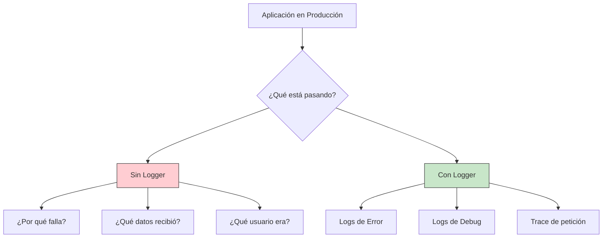
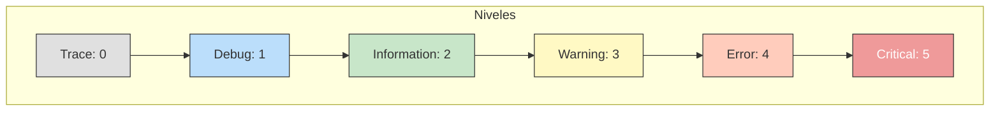
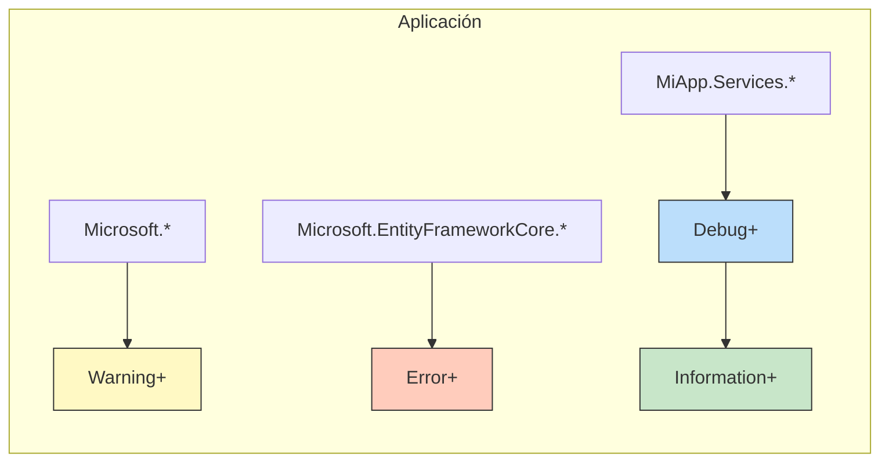
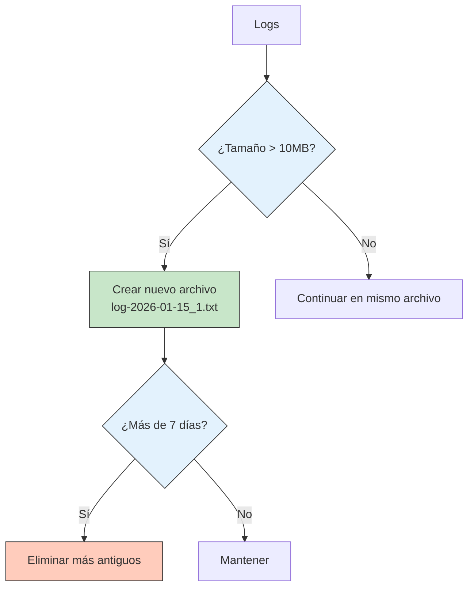
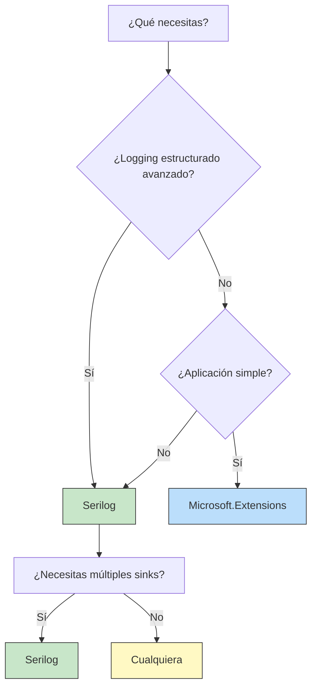

- [3. Uso de Loggers para el Desarrollo](#3-uso-de-loggers-para-el-desarrollo)
  - [3.1. ¿Qué es un Logger?](#11-qué-es-un-logger)
    - [¿Por qué usar un Logger?](#por-qué-usar-un-logger)
    - [Console.WriteLine vs Logger](#consolewriteline-vs-logger)
  - [3.2. Niveles de Logging](#12-niveles-de-logging)
    - [La jerarquía de niveles](#la-jerarquía-de-niveles)
    - [Ejemplo práctico de niveles](#ejemplo-práctico-de-niveles)
  - [3.3. Conceptos Avanzados: Categorías y Filtros](#13-conceptos-avanzados-categorías-y-filtros)
    - [El concepto de Categoría](#el-concepto-de-categoría)
    - [Filtros por categoría](#filtros-por-categoría)
    - [Logging estructurado](#logging-estructurado)
  - [3.4. Microsoft.Extensions.Logging: El Logger Nativo](#14-microsoftextensionslogging-el-logger-nativo)
    - [Instalación de paquetes](#instalación-de-paquetes)
    - [Configuración básica](#configuración-básica)
    - [Configuración de Consola](#configuración-de-consola)
    - [Configuración a Fichero](#configuración-a-fichero)
    - [Filtros por categoría](#filtros-por-categoría)
  - [3.5. Serilog: El Logger Profesional](#15-serilog-el-logger-profesional)
    - [Instalación de paquetes](#instalación-de-paquetes)
    - [Configuración básica](#configuración-básica)
    - [Serilog en Consola](#serilog-en-consola)
    - [Serilog a Fichero con Rolling](#serilog-a-fichero-con-rolling)
    - [Serilog con appsettings.json](#serilog-con-appsettingsjson)
    - [Niveles diferentes por Sink](#niveles-diferentes-por-sink)
    - [Enrichers: Añadir contexto](#enrichers-añadir-contexto)
    - [Retención de logs: Limitar tamaño y tiempo](#retención-de-logs-limitar-tamaño-y-tiempo)
  - [3.6. Comparativa: Microsoft.Extensions.Logging vs Serilog](#16-comparativa-microsoftextensionslogging-vs-serilog)
  - [3.7. Mejores Prácticas](#17-mejores-prácticas)


# 3. Uso de Loggers para el Desarrollo

En el desarrollo de software, especialmente en aplicaciones que se ejecutan en producción, **no podemos depurar con el depurador**. Las aplicaciones web, servicios Windows, aplicaciones móviles y microservicios se ejecutan en servidores remotos donde no tenemos acceso visual a la consola.

Aquí es donde los **loggers** se convierten en nuestra herramienta más valiosa para entender qué está pasando en nuestra aplicación.

> 📝 **Nota del Profesor:** Muchos estudiantes usan `Console.WriteLine` para depurar. Esto es aceptable durante el desarrollo, pero en producción es completamente inútil. Los loggers profesionales te permiten controlar qué se registra, dónde se guarda y cómo filtrar la información.

---

## 3.1. ¿Qué es un Logger?

Un **logger** es una biblioteca que permite registrar mensajes de log durante la ejecución de una aplicación. A diferencia de `Console.WriteLine`, los loggers profesionales ofrecen:

- **Múltiples niveles de severidad** (Debug, Information, Warning, Error, Critical)
- **Destinos configurables** (consola, archivo, base de datos, servicios externos)
- **Filtrado por categoría** (diferentes niveles para diferentes componentes)
- **Logging estructurado** (formato JSON con propiedades)
- **Configuración externa** (sin recompilar para cambiar niveles)

### ¿Por qué usar un Logger?



### Console.WriteLine vs Logger

```csharp
// ❌ MALO: Console.WriteLine
public void ProcesarPedido(Pedido pedido)
{
    Console.WriteLine("Procesando pedido " + pedido.Id);  // Se pierde en producción
    Console.WriteLine("Cliente: " + pedido.Cliente);      // No se filtra por nivel
    // No hay forma de desactivar esto en producción
}

// ✅ BUENO: Logger profesional
public void ProcesarPedido(Pedido pedido, ILogger<PedidoService> logger)
{
    logger.LogDebug("Procesando pedido {PedidoId}", pedido.Id);
    logger.LogInformation("Pedido {PedidoId} para cliente {Cliente}", 
        pedido.Id, pedido.Cliente);
    
    if (pedido.Total > 10000)
    {
        logger.LogWarning("Pedido de alto valor: {Total}", pedido.Total);
    }
}
```

**Salida del logger:**
```
2026-01-15 10:30:45.123 [INF] Procesando pedido 1234 para cliente Juan
2026-01-15 10:30:45.125 [WRN] Pedido de alto valor: 15000
```

---

## 3.2. Niveles de Logging

Los niveles de logging son la base del filtrado. Cada nivel representa la severidad del mensaje.

### La jerarquía de niveles



| Nivel | Valor | Descripción | Uso típico |
|-------|-------|-------------|------------|
| **Trace** | 0 | Detalles exhaustivos | Rastreo de ejecución completo |
| **Debug** | 1 | Información de desarrollo | Variables, flujo de ejecución |
| **Information** | 2 | Eventos normales | Inicio/fin de operaciones |
| **Warning** | 3 | Situaciones anómalas | Datos inesperados pero manejables |
| **Error** | 4 | Errores de aplicación | Excepciones capturadas |
| **Critical** | 5 | Fallos catastróficos | Fallo del sistema |

### Ejemplo práctico de niveles

```csharp
public class CarritoService
{
    private readonly ILogger<CarritoService> _logger;

    public CarritoService(ILogger<CarritoService> logger)
    {
        _logger = logger;
    }

    public void ProcesarCarrito(Carrito carrito)
    {
        // TRACE: Cada paso del proceso
        _logger.LogTrace("Iniciando procesamiento de carrito");

        // DEBUG: Estado del objeto
        _logger.LogDebug("Carrito tiene {CantidadItems} items", 
            carrito.Items.Count);

        // INFORMATION: Eventos importantes
        _logger.LogInformation("Iniciando checkout para carrito {CarritoId}", 
            carrito.Id);

        try
        {
            var resultado = ValidarStock(carrito);
            
            if (!resultado)
            {
                // WARNING: Situación anómala pero manejable
                _logger.LogWarning("Stock insuficiente para algunos items");
            }
        }
        catch (Exception ex)
        {
            // ERROR: Error en el proceso
            _logger.LogError(ex, "Error al procesar carrito {CarritoId}", 
                carrito.Id);
        }

        // CRITICAL: Error fatal
        _logger.LogCritical("Carrito {CarritoId} requiere intervención manual", 
            carrito.Id);
    }
}
```

> 💡 **Tip del Examinador:** En producción, típicos niveles son:
> - **Default:** Information
> - **Microsoft:** Warning (reducir ruido)
> - **Tu código:** Information o Debug

---

## 3.3. Conceptos Avanzados: Categorías y Filtros

### El concepto de Categoría

Cada logger tiene una **categoría** que lo identifica. Por convención, se usa el **nombre completo de la clase**:

```csharp
// La categoría será "MiApp.Services.PedidoService"
ILogger<PedidoService> logger1;

// La categoría será "MiApp.Controllers.HomeController"  
ILogger<HomeController> logger2;

// Categoría personalizada
ILogger logger3 = loggerFactory.CreateLogger("MiApp.Custom.Category");
```

### Filtros por categoría

Puedes configurar niveles diferentes para diferentes categorías:

```json
{
  "Logging": {
    "LogLevel": {
      "Default": "Information",
      "Microsoft": "Warning",
      "Microsoft.EntityFrameworkCore": "Error",
      "MiApp.Services": "Debug",
      "MiApp.Controllers": "Information"
    }
  }
}
```



### Logging estructurado

El logging estructurado permite incluir propiedades en los mensajes:

```csharp
// ❌ Logging de texto (malo)
_logger.LogInformation("Usuario " + usuario.Id + " compro " + producto);

// ✅ Logging estructurado (bueno)
_logger.LogInformation("Usuario {UsuarioId} compró {Producto}", 
    usuario.Id, producto);
```

**Salida estructurada (JSON):**
```json
{
  "Timestamp": "2026-01-15T10:30:45.123Z",
  "Level": "Information",
  "MessageTemplate": "Usuario {UsuarioId} compró {Producto}",
  "Properties": {
    "UsuarioId": 1234,
    "Producto": "Laptop"
  }
}
```

> 💡 **Analogía del Busca:** El logging estructurado es como una base de datos de logs. Puedes buscar/filtrar por cualquier propiedad (UsuarioId, Producto, etc.) en lugar de buscar texto en un log plano.

---

## 3.4. Microsoft.Extensions.Logging: El Logger Nativo

`Microsoft.Extensions.Logging` es la librería de logging nativa de .NET. Viene integrada en ASP.NET Core y es extensible mediante proveedores.

### Instalación de paquetes

```xml
<!-- Para aplicaciones de consola -->
<PackageReference Include="Microsoft.Extensions.Logging" Version="10.0.3" />
<PackageReference Include="Microsoft.Extensions.Logging.Console" Version="10.0.3" />
<PackageReference Include="Microsoft.Extensions.Logging.Debug" Version="10.0.3" />

<!-- Para configuración -->
<PackageReference Include="Microsoft.Extensions.Configuration.Json" Version="10.0.3" />
```

### Configuración básica

```csharp
using Microsoft.Extensions.Logging;

ILoggerFactory factory = LoggerFactory.Create(builder =>
{
    builder
        .SetMinimumLevel(LogLevel.Debug)
        .AddConsole();
});

ILogger<Program> logger = factory.CreateLogger<Program>();

logger.LogInformation("Aplicación iniciada");
logger.LogWarning("Advertencia de ejemplo");
logger.LogError(new Exception("Error de prueba"), "Ha ocurrido un error");
```

### Configuración de Consola

```csharp
ILoggerFactory factory = LoggerFactory.Create(builder =>
{
    builder
        .SetMinimumLevel(LogLevel.Information)
        .AddConsole(options =>
        {
            // Formato simple (una línea)
            options.FormatterName = "Simple";
            
            // O con opciones específicas
            options.TimestampFormat = "HH:mm:ss ";
            options.UseUtcTimestamp = true;
            options.IncludeScopes = true;
        });
});
```

### Configuración a Fichero

`Microsoft.Extensions.Logging` no tiene un proveedor de archivo nativo integrado de la misma manera que Serilog, pero puedes usar proveedores de terceros:

```csharp
// Instalando Serilog.Extensions.Logging para integrar con Microsoft.Extensions.Logging
// (lo vemos en la siguiente sección)
```

### Filtros por categoría

```csharp
ILoggerFactory factory = LoggerFactory.Create(builder =>
{
    builder
        // Nivel por defecto
        .SetMinimumLevel(LogLevel.Information)
        
        // Filtros por categoría
        .AddFilter("Microsoft", LogLevel.Warning)
        .AddFilter("Microsoft.EntityFrameworkCore", LogLevel.Error)
        .AddFilter("MiApp", LogLevel.Debug)
        .AddFilter<ConsoleLoggerProvider>("MiApp.Controllers", LogLevel.Trace);
});
```

### Con appsettings.json

```json
{
  "Logging": {
    "LogLevel": {
      "Default": "Information",
      "Microsoft": "Warning",
      "Microsoft.EntityFrameworkCore": "Error",
      "MiApp": "Debug"
    },
    "Console": {
      "FormatterName": "Simple",
      "LogLevel": {
        "MiApp": "Trace"
      }
    }
  }
}
```

```csharp
// Cargar configuración
IConfigurationRoot configuration = new ConfigurationBuilder()
    .SetBasePath(Directory.GetCurrentDirectory())
    .AddJsonFile("appsettings.json")
    .AddJsonFile($"appsettings.{Environment.GetEnvironmentVariable("ASPNETCORE_ENVIRONMENT")}.json", true)
    .Build();

ILoggerFactory factory = LoggerFactory.Create(builder =>
{
    builder.AddConfiguration(configuration.GetSection("Logging"));
    builder.AddConsole();
});
```

---

## 3.5. Serilog: El Logger Profesional

**Serilog** es la librería de logging más popular para .NET. Se caracteriza por:

- **Logging estructurado nativo** desde el núcleo
- **Sinks modulares** (consola, archivo, Seq, Elasticsearch, etc.)
- **Configuración flexible** (código o appsettings.json)
- **Enrichers** para añadir contexto automáticamente

### Instalación de paquetes

```xml
<!-- Paquetes esenciales -->
<PackageReference Include="Serilog.AspNetCore" Version="8.0.3" />
<PackageReference Include="Serilog.Sinks.Console" Version="6.0.0" />
<PackageReference Include="Serilog.Sinks.File" Version="6.0.0" />
<PackageReference Include="Serilog.Settings.Configuration" Version="8.0.4" />

<!-- Enrichers útiles -->
<PackageReference Include="Serilog.Enrichers.Thread" Version="4.0.0" />
<PackageReference Include="Serilog.Enrichers.Environment" Version="3.0.1" />
<PackageReference Include="Serilog.Enrichers.MachineName" Version="2.0.0" />
```

### Configuración básica

```csharp
using Serilog;

// Configuración mínima
Log.Logger = new LoggerConfiguration()
    .WriteTo.Console()
    .CreateLogger();

Log.Information("Aplicación iniciada");
Log.Warning("Advertencia");
Log.Error(new Exception("Error"), "Error crítico");

// Al finalizar
Log.CloseAndFlush();
```

### Serilog en Consola

```csharp
Log.Logger = new LoggerConfiguration()
    .MinimumLevel.Debug()
    .WriteTo.Console(
        outputTemplate: "[{Timestamp:HH:mm:ss} {Level:u3}] {Message:lj}{NewLine}{Exception}")
    .CreateLogger();
```

**Salida:**
```
[10:30:45 INF] Aplicación iniciada
[10:30:46 WRN] Advertencia de ejemplo
[10:30:47 ERR] Error crítico
```

### Serilog a Fichero con Rolling

```csharp
Log.Logger = new LoggerConfiguration()
    .MinimumLevel.Information()
    .WriteTo.File(
        path: "Logs/log-.txt",              // - se reemplaza por la fecha
        rollingInterval: RollingInterval.Day, // Nuevo archivo cada día
        retainedFileCountLimit: 31,          // Mantener 31 días
        fileSizeLimitBytes: 10 * 1024 * 1024, // 10 MB máximo por archivo
        rollOnFileSizeLimit: true,           // Crear nuevo si se llena
        outputTemplate: "{Timestamp:yyyy-MM-dd HH:mm:ss.fff zzz} [{Level:u3}] {Message:lj}{NewLine}{Exception}")
    .CreateLogger();
```

**Resultado en el sistema de archivos:**
```
Logs/
├── log-2026-01-10.txt
├── log-2026-01-11.txt
├── log-2026-01-12.txt
└── log-2026-01-13.txt
```

### Serilog con appsettings.json

```json
{
  "Serilog": {
    "Using": [ "Serilog.Sinks.Console", "Serilog.Sinks.File" ],
    "MinimumLevel": {
      "Default": "Information",
      "Override": {
        "Microsoft": "Warning",
        "System": "Warning",
        "Microsoft.EntityFrameworkCore": "Error"
      }
    },
    "WriteTo": [
      {
        "Name": "Console",
        "Args": {
          "outputTemplate": "[{Timestamp:HH:mm:ss} {Level:u3}] {Message:lj}{NewLine}{Exception}"
        }
      },
      {
        "Name": "File",
        "Args": {
          "path": "Logs/log-.txt",
          "rollingInterval": "Day",
          "retainedFileCountLimit": 31,
          "fileSizeLimitBytes": 10485760,
          "outputTemplate": "{Timestamp:yyyy-MM-dd HH:mm:ss.fff zzz} [{Level:u3}] {Message:lj}{NewLine}{Exception}"
        }
      }
    ],
    "Enrich": [ "FromLogContext", "WithMachineName", "WithThreadId" ]
  }
}
```

```csharp
// Program.cs
var builder = WebApplication.CreateBuilder(args);

// Configurar Serilog desde appsettings.json
builder.Host.UseSerilog((context, configuration) =>
    configuration
        .ReadFrom.Configuration(context.Configuration)
        .Enrich.FromLogContext()
        .Enrich.WithMachineName()
        .Enrich.WithThreadId());

var app = builder.Build();

app.Run();

// Importante: Cerrar y flush al terminar
Log.CloseAndFlush();
```

### Niveles diferentes por Sink

Puedes tener **diferentes niveles de log para diferentes destinos**:

```csharp
Log.Logger = new LoggerConfiguration()
    // Console: verboso en desarrollo
    .MinimumLevel.Debug()
    .WriteTo.Console(
        restrictedToMinimumLevel: LogEventLevel.Debug,
        outputTemplate: "[{Timestamp:HH:mm:ss} {Level:u3}] {Message:lj}{NewLine}")
    
    // Archivo: solo warnings y errores en producción
    .WriteTo.File(
        path: "Logs/production-.txt",
        rollingInterval: RollingInterval.Day,
        restrictedToMinimumLevel: LogEventLevel.Warning,
        outputTemplate: "{Timestamp:yyyy-MM-dd HH:mm:ss} [{Level:u3}] {Message:lj}{NewLine}")
    
    // Seq: todo para análisis
    .WriteTo.Seq("http://localhost:5341",
        restrictedToMinimumLevel: LogEventLevel.Information)
    .CreateLogger();
```

### Enrichers: Añadir contexto

Los **enrichers** añaden propiedades automáticas a todos los logs:

```csharp
Log.Logger = new LoggerConfiguration()
    .Enrich.FromLogContext()        // {SourceContext} automático
    .Enrich.WithMachineName()       // {MachineName}
    .Enrich.WithThreadId()          // {ThreadId}
    .Enrich.WithProperty("Application", "MiApp")  // Propiedad personalizada
    .WriteTo.Console()
    .CreateLogger();

// Uso
Log.Information("Procesando solicitud");
```

**Salida enriquecida:**
```
[2026-01-15 10:30:45.123 +00:00] [INF] [MiApp] [Machine: SRV-01] [Thread: 5] Procesando solicitud
```

**Logging con propiedades dinámicas:**

```csharp
// Añadir contexto para una operación
using (Log.Logger.BeginScope(new Dictionary<string, object>
{
    ["UserId"] = usuario.Id,
    ["CorrelationId"] = Guid.NewGuid()
}))
{
    Log.Information("Usuario iniciando sesión");
    // Todos los logs dentro de este scope tendrán UserId y CorrelationId
}
```

### Retención de logs: Limitar tamaño y tiempo

```csharp
Log.Logger = new LoggerConfiguration()
    .WriteTo.File(
        path: "Logs/app-.txt",
        rollingInterval: RollingInterval.Day,
        retainedFileCountLimit: 7,           // Solo 7 días
        retainedFileTimeLimit: TimeSpan.FromDays(7),  // Alternativa
        fileSizeLimitBytes: 10 * 1024 * 1024,  // 10 MB por archivo
        rollOnFileSizeLimit: true,           // Crear nuevo archivo al llegar al límite
        shared: false                        // Archivos compartidos entre procesos
    )
    .CreateLogger();
```



---

## 3.6. Comparativa: Microsoft.Extensions.Logging vs Serilog

| Característica | Microsoft.Extensions.Logging | Serilog |
|---------------|----------------------------|---------|
| **Origen** | Oficial de Microsoft | Comunidade |
| **Curva aprendizaje** | Baja | Media |
| **Logging estructurado** | Básico (requiere proveedor) | Nativo y completo |
| **Sinks disponibles** | Limitados | Miles |
| **Configuración** | appsettings.json | appsettings.json + código |
| **Enrichers** | No | Sí, muy potentes |
| **Rendimiento** | Muy bueno | Excelente |
| **Integración ASP.NET** | Nativa | Via Serilog.AspNetCore |

**¿Cuál elegir?**



- **Microsoft.Extensions.Logging:** Para aplicaciones simples o cuando no necesitas features avanzadas
- **Serilog:** Para aplicaciones profesionales que requieren logging estructurado, múltiples destinos, y configuración flexible

> 📝 **Nota del Profesor:** En el mundo real, la mayoría de proyectos profesionales usan Serilog. Es la recomendación para proyectos DAW que quieran simulate un entorno real.

---

## 3.7. Mejores Prácticas

### ✅ Haz

1. **Usa logging estructurado:**
```csharp
// Bien
_logger.LogInformation("Pedido {PedidoId} creado para {Cliente}", 
    pedido.Id, pedido.Cliente);

// Mal
_logger.LogInformation("Pedido " + pedido.Id + " creado");
```

2. **Incluye IDs de correlación:**
```csharp
using (Log.Logger.BeginScope(new { CorrelationId = GetCorrelationId() }))
{
    Log.Information("Procesando petición");
}
```

3. **Configura niveles por entorno:**
```json
// appsettings.Development.json
"Serilog": { "MinimumLevel": { "Default": "Debug" } }

// appsettings.Production.json  
"Serilog": { "MinimumLevel": { "Default": "Warning" } }
```

4. **Loguea excepciones correctamente:**
```csharp
// Bien
try { /* código */ }
catch (Exception ex)
{
    _logger.LogError(ex, "Error al procesar {Id}", id);
}

// Mal
_logger.LogError("Error: " + ex.Message);
```

### ❌ No Hacer

1. **No loguees contraseñas o datos sensibles:**
```csharp
// MALO
_logger.LogInformation("Login con password: {Password}", password);

// BUENO
_logger.LogInformation("Intento de login para usuario {Usuario}", usuario);
```

2. **No exageres con Debug/Trace en producción:**
```csharp
// Esto colapsará tus logs en producción
_logger.LogTrace("Entrando en método");
_logger.LogTrace("Saliendo de método");
```

3. **No captures excepciones solo para loguear:**
```csharp
// MALO - NO HAGAS ESTO
try { /* código */ }
catch (Exception ex)
{
    _logger.LogError(ex, "Error");
    throw;  // Volvier a lanzar - no tiene sentido loguear antes
}
```

---

> 💡 **Resumen del Tema:** Los loggers son esenciales en producción. Ahora conoces:
> - **Niveles de logging** y cuándo usar cada uno
> - **Microsoft.Extensions.Logging** como opción nativa
> - **Serilog** como opción profesional con logging estructurado
> - **Filtros por categoría** para controlar qué se loguea
> - **Rolling files** para gestionar el tamaño de logs
> - **Enrichers** para añadir contexto automático

> 📝 **Del Profesor:** En la siguiente sección aprenderemos sobre **analizadores de código estático**, herramientas que te ayudan a escribir mejor código antes de ejecutarlo.

> ⚠️ **Warning del Examinador:** En el examen espera preguntas sobre niveles de logging y la diferencia entre Microsoft.Extensions.Logging y Serilog. Saber configurar un logger con appsettings.json es fundamental.
