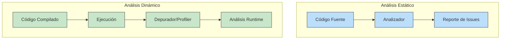
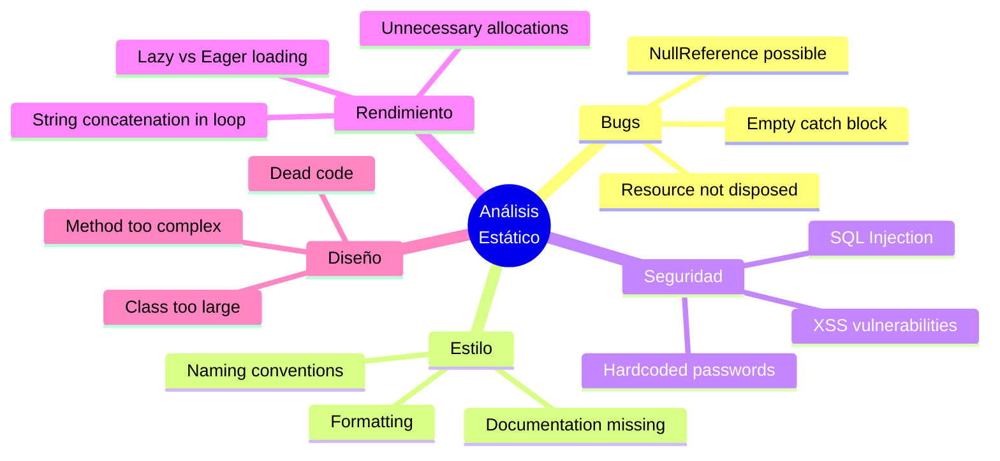
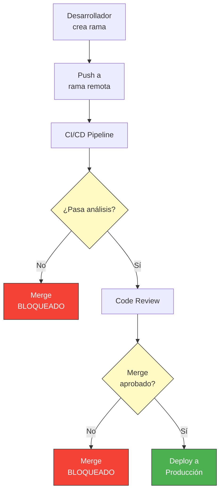
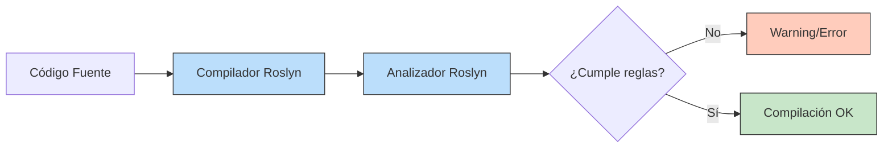
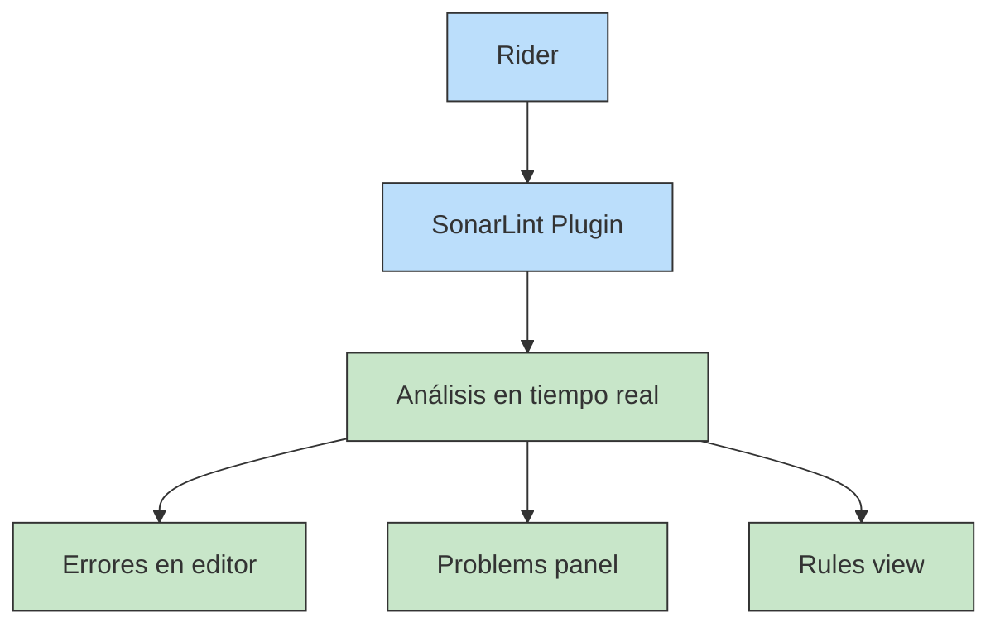
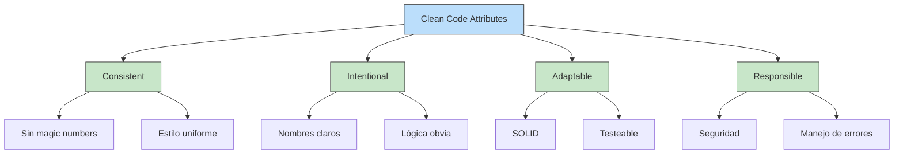
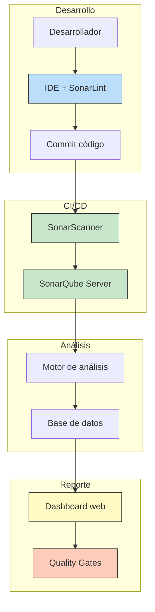
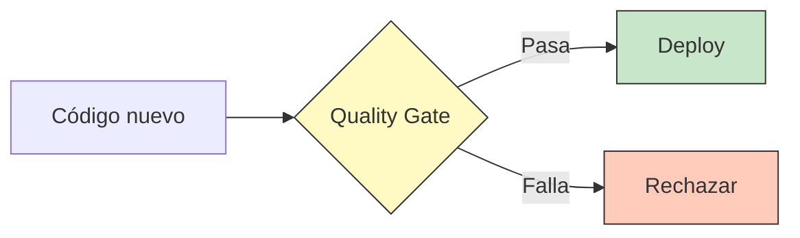

- [4. Analizadores de Código Estático para el Desarrollo](#4-analizadores-de-código-estático-para-el-desarrollo)
  - [4.1. ¿Qué son los Analizadores de Código Estático?](#11-qué-son-los-analizadores-de-código-estático)
    - [Análisis Estático vs Dinámico](#análisis-estático-vs-dinámico)
    - [¿Qué pueden detectar?](#qué-pueden-detectar)
  - [4.2. ¿Por qué es Importante Programar Uniformemente?](#12-por-qué-es-importante-programar-uniformemente)
    - [El problema del "Código Espagueti"](#el-problema-del-código-espagueti)
    - [Beneficios de las convenciones de código](#beneficios-de-las-convenciones-de-código)
  - [4.3. Tipos de Analizadores para C#](#13-tipos-de-analizadores-para-c)
    - [Roslyn Analyzers (Analizadores de Compiler)](#roslyn-analyzers-analizadores-de-compiler)
    - [Linters](#linters)
    - [Herramientas de Calidad Centralizada](#herramientas-de-calidad-centralizada)
  - [4.4. Roslyn Analyzers: El Motor de Análisis de .NET](#14-roslyn-analyzers-el-motor-de-análisis-de-net)
    - [Cómo funcionan](#cómo-funcionan)
    - [Categorías de reglas](#categorías-de-reglas)
    - [Reglas de Calidad (CAxxxx)](#reglas-de-calidad-caxxxx)
    - [Ejemplos de reglas importantes](#ejemplos-de-reglas-importantes)
  - [4.5. StyleCop: Convensiones de Estilo](#15-stylecop-convensiones-de-estilo)
    - [¿Qué es StyleCop?](#qué-es-stylecop)
    - [Instalación](#instalación)
    - [Reglas principales](#reglas-principales)
  - [4.6. SonarLint: Análisis en Tiempo Real](#16-sonarlint-análisis-en-tiempo-real)
    - [¿Qué es SonarLint?](#qué-es-sonarlint)
    - [Instalación en Rider](#instalación-en-rider)
    - [Modos de uso](#modos-de-uso)
    - [Analizando código con SonarLint](#analizando-código-con-sonarlint)
    - [Configuración de reglas](#configuración-de-reglas)
    - [Calidad de código: Clean Code](#calidad-de-código-clean-code)
  - [4.7. SonarQube: Plataforma Centralizada de Calidad](#17-sonarqube-plataforma-centralizada-de-calidad)
    - [¿Qué es SonarQube?](#qué-es-sonarqube)
    - [Arquitectura](#arquitectura)
    - [Integración con CI/CD](#integración-con-cicd)
    - [Métricas y Quality Gates](#métricas-y-quality-gates)
    - [Comparativa SonarLint vs SonarQube](#comparativa-sonarlint-vs-sonarqube)
  - [4.8. Otros Analizadores y Herramientas](#18-otros-analizadores-y-herramientas)
    - [ReSharper](#resharper)
    - [CodeCracker](#codecracker)
    - [Security Code Scan](#security-code-scan)
    - [Coverity](#coverity)
    - [Codacy](#codacy)
  - [4.9. Configuración de Analizadores en Proyectos](#19-configuración-de-analizadores-en-proyectos)
    - [EditorConfig](#editorconfig)
    - [Directory.Build.props](#directorybuildprops)
    - [appsettings.json para análisis](#appsettingsjson-para-análisis)
  - [4.10. Mejores Prácticas](#110-mejores-prácticas)


# 4. Analizadores de Código Estático para el Desarrollo

En el desarrollo de software profesional, escribir código que "funciona" no es suficiente. El código debe ser **limpio**, **mantenible**, **seguro** y **consistente**. Los **analizadores de código estático** son herramientas que examinan tu código sin ejecutarlo, detectando problemas potenciales, vulnerabilidades de seguridad, y violaciones de estilo antes de que el código llegue a producción.

> 📝 **Nota del Profesor:** Muchos estudiantes piensan que "si compila, está bien". Los analizadores de código estático te ayudan a escribir código de calidad profesional, detectando problemas que el compilador no puede ver.

---

## 4.1. ¿Qué son los Analizadores de Código Estático?

Los analizadores de código estático son herramientas que examinan el código fuente **sin ejecutarlo**. Analizan el código en busca de patrones problemáticos, vulnerabilidades de seguridad, violaciones de estilo, y oportunidades de mejora.

### Análisis Estático vs Dinámico



| Característica | Análisis Estático | Análisis Dinámico |
|---------------|------------------|------------------|
| **¿Ejecuta código?** | No | Sí |
| **¿Cuándo opera?** | Durante la escritura/compilación | Durante la ejecución |
| **Detecta** | Estilo, posibles bugs, seguridad | Bugs runtime, rendimiento real |
| **Ejemplo** | SonarLint, StyleCop, Roslyn | Depurador, profiler, tests |

### ¿Qué pueden detectar?



- **Bugs potenciales:** Referencias nulas, recursos sin dispose, excepciones no manejadas
- **Violaciones de estilo:** Nombres de variables, documentación faltante, formateo
- **Vulnerabilidades de seguridad:** SQL injection, contraseñas hardcodeadas, XSS
- **Problemas de rendimiento:** Concatenación en bucles, asignaciones innecesarias
- **Código muerto:** Métodos nunca llamados, variables sin usar

---

## 4.2. ¿Por qué es Importante Programar Uniformemente?

Cuando trabajas en un proyecto, el código lo van a leer, modificar y mantener muchas personas. El código uniforme:

- **Facilita la lectura:** Todos siguen las mismas normas
- **Reduce la carga cognitiva:** No tienes que "adivinar" el estilo de cada uno
- ** Facilita el mantenimiento:** Cambios consistentes son más fáciles de integrar
- **Mejora la colaboración:** Equipos distribuidos trabajan mejor
- **Es profesional:** Demuestra rigor y atención al detalle

### El Problema del "Código Espagueti"

```csharp
// ❌ SIN CONVENCIONES: Cada uno programa como quiere
public class pedidocontroller {
    public ActionResult getPedidos() {
        var lista = db.pedidos.where(x => x.estado == "pendiente").tolist();
        return View(lista);
    }
    
    public ActionResult ObtenerPedidos(int id)
    {
        var p = db.Pedidos.Find(id);
        return Json(p);
    }
}

// ✅ CON CONVENCIONES: Todo uniforme y predecible
public class PedidoController : Controller
{
    private readonly ApplicationDbContext _context;

    public PedidoController(ApplicationDbContext context)
    {
        _context = context;
    }

    public IActionResult Index()
    {
        var pedidos = _context.Pedidos
            .Where(p => p.Estado == EstadoPedido.Pendiente)
            .ToList();
        
        return View(pedidos);
    }

    public IActionResult Details(int id)
    {
        var pedido = _context.Pedidos.Find(id);
        
        if (pedido == null)
        {
            return NotFound();
        }

        return Json(pedido);
    }
}
```

### Beneficios de las Convenciones de Código

| Sin Convenciones | Con Convenciones |
|-----------------|------------------|
| Cada archivo parece escrito por otra persona | Código consistente en todo el proyecto |
| Difícil encontrar errores | Los analizadores encuentran errores automáticamente |
| Code reviews tardan más | Reviews más eficientes |
| Mezcla de estilos causa bugs | Estándares claros previenen bugs |

### Los Analizadores como Barrera de Seguridad

Una de las funcionalidades más importantes de los analizadores es su capacidad de **bloquear código defectuoso antes de que llegue a producción**. Esto es fundamental para mantener la calidad:



**¿Cómo funcionan estas barreras?**

1. **En compilation:** El código no compila si hay errores críticos
2. **En el pipeline CI/CD:** Los tests de análisis deben pasar
3. **En Pull Requests:** Los analizadores impiden el merge
4. **Con Quality Gates:** La rama no llega a producción si no cumple estándares

**Ejemplo práctico:**

```yaml
# GitHub Actions - El análisis debe pasar para hacer merge
- name: SonarQube Scan
  uses: sonarsource/sonarqube-scan-action@master
  with:
    args: >
      -Dsonar.qualitygate.wait=true
      -Dsonar.qualitygate.timeout=300
# Si el Quality Gate falla, el merge se bloquea automáticamente
```

> 💡 **Analogía del Portero de Discoteca:** Los analizadores son como un portero muy estricto. No permiten entrar a nadie que no cumpla las normas. Si tu código no pasa el análisis, no llega a producción, sin importar cuántas veces insistas.

> 📝 **Nota del Profesor:** Esta es una de las razones por las que los analizadores son tan importantes en desarrollo profesional. No solo te ayudan a escribir mejor código, sino que te protegen de introducir problemas en producción. En equipos distribuidos, donde nadie revisa todo el código, esta barrera automática es esencial.

---

## 4.3. Tipos de Analizadores para C#

### Roslyn Analyzers (Analizadores del Compilador)

Roslyn es el compilador de C# de código abierto. Los **Roslyn Analyzers** son extensiones del compilador que analizan el código durante la compilación.

- **Integración nativa:** Se ejecutan durante `dotnet build`
- **Personalizables:** Puedes escribir tus propios analizadores
- **Reglas CAxxxx:** Códigos como CA2000, CA1062, etc.



### Linters

Los **linters** son herramientas de análisis estático independientes del compilador que se enfocan en estilo y buenas prácticas.

| Linter | Enfoque | Para C# |
|--------|---------|---------|
| **StyleCop** | Estilo y convenciones | ✅ |
| **SonarLint** | Calidad y seguridad | ✅ |
| **ESLint** | JavaScript/TypeScript | ❌ |
| **Pylint** | Python | ❌ |

### Herramientas de Calidad Centralizada

Plataformas que analizan todo el código del proyecto y proporcionan métricas centralizadas.

- **SonarQube:** Servidor centralizado de análisis
- **Codacy:** Análisis en la nube
- **CodeClimate:** Análisis SaaS

---

## 4.4. Roslyn Analyzers: El Motor de Análisis de .NET

### Cómo funcionan

Roslyn analiza el código fuente y genera un **Abstract Syntax Tree (AST)**. Los analizadores se "enchufan" a este proceso y pueden:

1. **Detectar patrones:** Buscar secuencias específicas de código
2. **Sugerir refactorizaciones:** Proponer cambios automáticos
3. **Generar errores/warnings:** Detener la compilación si es necesario

```csharp
// Ejemplo: Roslyn Analyzer que detecta concatenación de strings en bucles
// Warning CA1845: Use string.Concat instead of +
for (int i = 0; i < 100; i++)
{
    result += item.ToString();  // ⚠️ CA1845: Use string.Concat
}
```

### Categorías de reglas

Microsoft define categorías de reglas:

| Categoría | Prefijo | Descripción |
|-----------|---------|-------------|
| **Design** | CA1xxx | Reglas de diseño |
| **Documentation** | CA1xxx | Documentación XML |
| **Naming** | CA17xx | Convenciones de nombres |
| **Performance** | CA18xx | Optimización |
| **Security** | CA30xx | Vulnerabilidades |
| **Usage** | CA22xx | Uso correcto de APIs |

### Reglas de Calidad (CAxxxx)

El compilador incluye cientos de reglas de análisis de calidad. Puedes verlas en la documentación oficial de Microsoft.

### Ejemplos de reglas importantes

```csharp
// CA1062: Validar argumentos de métodos públicos
public void ProcesarPedido(Pedido pedido)
{
    // ❌ WARNING: argumento puede ser null
    var nombre = pedido.Nombre;  
}

// ✅ CORRECTO
public void ProcesarPedido(Pedido? pedido)
{
    ArgumentNullException.ThrowIfNull(pedido);
    var nombre = pedido.Nombre;  // Ahora es seguro
}

// CA2000: Dispose objects before losing scope
public void CrearArchivo()
{
    var stream = new FileStream("test.txt", FileMode.Create);
    // ⚠️ WARNING: stream no se dispone explícitamente
    File.WriteAllText("test.txt", "contenido");
}

// ✅ CORRECTO
public void CrearArchivo()
{
    using var stream = new FileStream("test.txt", FileMode.Create);
    File.WriteAllText("test.txt", "contenido");
}  // Se dispone automáticamente

// CA1031: No capturar Exception genérica
try { /* código */ }
catch (Exception)  // ⚠️ WARNING: capturar Exception genérica
{
    // No hacer nada es malo
}

// ✅ CORRECTO
try { /* código */ }
catch (InvalidOperationException ex)
{
    // Manejar específicamente
}
```

---

## 4.5. StyleCop: Convenciones de Estilo

### ¿Qué es StyleCop?

**StyleCop** es un analizador de código que aplica las convenciones de estilo de Microsoft para C#. Se centra en:

- **Formato del código:** Espacios, saltos de línea, indentación
- **Nomenclatura:** Cómo nombrar variables, métodos, clases
- **Documentación:** Cuándo y cómo documentar
- **Ordenación:** Orden de elementos dentro de una clase

### Instalación

```xml
<PackageReference Include="StyleCop.Analyzers" Version="1.2.0-beta.507" />
```

O desde Rider:
1. **File** → **Settings** → **Plugins**
2. Buscar "StyleCop"
3. Instalar y reiniciar

### Reglas principales

```csharp
// SA1100: No usar prefijos en nombres de variables
int iContador;     // ❌ WARNING
int contador;      // ✅ CORRECTO

// SA1200: Using directives should be placed alphabetically
using System;           // ✅
using System.Collections;  // ✅

// SA1300: Nombre de elemento debe empezar con mayúscula
public const int constante = 1;  // ❌
public const int Constante = 1; // ✅

// SA1200: Los campos privados deben empezar con guión bajo
private string nombre;   // ❌
private string _nombre; // ✅

// SA1633: El archivo debe tener documentación de cabecera
// ❌ Archivo sin header
// ✅ debe tener:
/*
<copyright file="MiArchivo.cs" company="MiEmpresa">
  ...
</copyright>
*/
```

---

## 4.6. SonarLint: Análisis en Tiempo Real

### ¿Qué es SonarLint?

**SonarLint** es una extensión de IDE desarrollada por SonarSource que proporciona análisis de código en tiempo real. A diferencia de otros linters, SonarLint:

- **Análisis en tiempo real:** Detecta problemas mientras escribes
- **Integración profunda:** Usa las capacidades del IDE
- **Reglas extensivas:** Cientos de reglas para múltiples lenguajes
- **Soporte para SonarQube:** Puede conectarse a un servidor central

### Instalación en Rider

1. **File** → **Settings** → **Plugins**
2. Buscar "SonarLint"
3. Instalar **SonarLint** (del vendor SonarSource)
4. Reiniciar Rider



### Modos de uso

SonarLint funciona en dos modos:

| Modo | Descripción | Requisitos |
|------|-------------|------------|
| **Standalone** | Análisis local con reglas por defecto | Ninguno |
| **Connected** | Sincronizado con SonarQube/Cloud | Servidor SonarQube |

**Para modo Standalone:**
```bash
# No requiere configuración adicional
# Solo instalar y funciona
```

**Para modo Connected:**
1. Conectar a SonarQube Server o SonarCloud
2. Configurar credenciales
3. Sincronizar reglas y calidad

### Analizando código con SonarLint

Cuando escribes código, SonarLint detecta problemas y los marca:

```
📛 Error   (rojo): Bug crítico, debe corregirse
⚠️ Warning (amarillo): Issue de calidad, debería corregirse
💡 Info   (azul): Sugerencia de mejora
```

**Ejemplo de Issues:**

```csharp
public class Ejemplo
{
    private string _password;  // ⚠️ Hardcoded password "secret"
    
    public void Metodo()
    {
        // ⚠️ S5445: Hardcoded password used
    }
}
```

### Configuración de reglas

**Ver reglas disponibles:**
1. **View** → **Tool Windows** → **SonarLint Rules**
2. Buscar reglas por nombre, lenguaje o categoría

**Activar/desactivar reglas:**

```json
// sonarLint.rules
{
  "rules": {
    "csharp:S1481": "active",           // Unused local variables
    "csharp:S1130": "active",           // Type definition should not be deprecated
    "csharp:S3449": "inactive"          // Parameters should be passed to base constructors
  }
}
```

### Calidad de Código: Clean Code

SonarLint clasifica los problemas según el **atributo Clean Code**:



| Atributo | Significado |
|----------|-------------|
| **Consistent** | Código que sigue las mismas normas en todo momento |
| **Intentional** | Código bien diseñado con propósito claro |
| **Adaptable** | Código flexible que puede cambiar fácilmente |
| **Responsible** | Código que hace lo correcto con los recursos |

---

## 4.7. SonarQube: Plataforma Centralizada de Calidad

### ¿Qué es SonarQube?

**SonarQube** es una plataforma web para la gestión continua de la calidad del código. A diferencia de SonarLint (que funciona en el IDE), SonarQube analiza todo el proyecto y proporciona:

- **Dashboard centralizado:** Métricas de todo el proyecto
- **Histórico de análisis:** Seguimiento de la calidad en el tiempo
- **Quality Gates:** Barreras de calidad que deben superarse
- **Análisis de seguridad:** Detección de vulnerabilidades
- **Soporte multi-lenguaje:** 25+ lenguajes

### Arquitectura



### Integración con CI/CD

**Con Azure DevOps:**

```yaml
# azure-pipelines.yml
- task: SonarCloudPrepare@1
  inputs:
    SonarCloud: 'MySonarCloud'
    organization: 'myorg'
    scannerMode: 'MSBuild'
    projectKey: 'myproject'
    projectName: 'My Project'

- task: DotNetCoreCLI@2
  inputs:
    command: 'build'

- task: SonarCloudAnalyze@1
```

**Con GitHub Actions:**

```yaml
- name: SonarQube Scan
  uses: sonarsource/sonarqube-scan-action@master
  env:
    SONAR_TOKEN: ${{ secrets.SONAR_TOKEN }}
    SONAR_HOST_URL: ${{ secrets.SONAR_HOST_URL }}
```

### Métricas y Quality Gates

**Métricas principales:**

| Métrica | Descripción |
|---------|-------------|
| **Coverage** | % de código cubierto por tests |
| **Duplications** | Líneas de código duplicadas |
| **Technical Debt** | Tiempo estimado para arreglar issues |
| **Maintainability** | Salud general del código |
| **Security** | Vulnerabilidades encontradas |
| **Reliability** | Bugs encontrados |

**Quality Gates:**



Un **Quality Gate** es un conjunto de condiciones que el código debe cumplir:

- ✅ Coverage ≥ 80%
- ✅ No nuevas vulnerabilidades
- ✅ Technical Debt < 5%
- ✅ No blocker issues

### Comparativa SonarLint vs SonarQube

| Característica | SonarLint | SonarQube |
|---------------|-----------|-----------|
| **Dónde funciona** | IDE | Servidor |
| **Análisis** | Tiempo real | Bajo demanda/CI |
| **Métricas** | Limited | Completo |
| **Histórico** | No | Sí |
| **Quality Gates** | No | Sí |
| **Coste** | Gratis | Gratis/Paid |

> 💡 **Combinación recomendada:** Usa SonarLint en el IDE para feedback inmediato, y SonarQube en CI/CD para análisis completo.

---

## 4.8. Otros Analizadores y Herramientas

### ReSharper

**ReSharper** (JetBrains) es una herramienta de productividad que incluye análisis extensivo:

- **Análisis en tiempo real:** Detecta problemas mientras escribes
- **Refactorizaciones automáticas:** docenas de transformaciones de código
- **Navegación avanzada:** Saltar entre tipos, miembros, tests
- **Generación de código:** Boilerplate automático

**En Rider:** Ya viene incluido como parte del IDE.

### CodeCracker

Analizador de código para C# disponible como paquete NuGet:

```xml
<PackageReference Include="CodeCracker.CSharp" Version="1.1.1" />
```

Reglas como:
- CC0014: Crear constructor
- CC0033: Dispose pattern
- CC0045: Concatenación de strings

### Security Code Scan

Escáner de vulnerabilidades de seguridad para .NET:

```xml
<PackageReference Include="SecurityCodeScan" Version="5.6.7" />
```

Detecta:
- SQL Injection
- XSS
- Hardcoded passwords
- CSRF vulnerabilities

### Coverity

Herramienta empresarial de Synopsys para análisis estático avanzado:

- **Análisis profundo:** Baja tasa de falsos positivos
- **Detección de race conditions**
- **Integración con IDEs y CI/CD**
- **Requiere licencia comercial**

### Codacy

Plataforma SaaS de análisis automático:

- **Análisis automático en PRs**
- **Métricas históricas**
- **Integración con GitHub/GitLab/Bitbucket**
- **Plan gratuito para proyectos open source**

---

## 4.9. Configuración de Analizadores en Proyectos

### EditorConfig

**.editorconfig** define estilos de código y convenciones:

```ini
# EditorConfig para proyectos .NET

# Configuración básica
root = true

# Todos los archivos
[*]
charset = utf-8
end_of_line = lf
insert_final_newline = true
trim_trailing_whitespace = true

# Archivos C#
[*.cs]
indent_style = space
indent_size = 4

# Reglas de estilo
csharp_prefer_braces = true:warning
csharp_prefer_simple_using_statement = true:suggestion
csharp_style_namespace_declarations = file_scoped:warning
csharp_using_directive_placement = outside_namespace:warning
csharp_prefer_simple_where_clause = true:warning
csharp_style_prefer_method_group_conversion = true:warning
csharp_style_prefer_switch_expression = true:suggestion
csharp_style_prefer_pattern_matching = true:suggestion

# Convenciones de nomenclatura
dotnet_naming_rule.interface_should_be_begins_with_i.severity = warning
dotnet_naming_rule.interface_should_be_begins_with_i.symbols = interface
dotnet_naming_rule.interface_should_be_begins_with_i.style = begins_with_i

dotnet_naming_symbols.interface.applicable_kinds = interface
dotnet_naming_symbols.interface.applicable_accessibilities = public, internal, private, protected, protected_internal

dotnet_naming_style.begins_with_i.capitalization = pascal_case
dotnet_naming_style.begins_with_i.prefix = I
```

### Directory.Build.props

**Directory.Build.props** configura analizadores a nivel de solución:

```xml
<Project>
  <PropertyGroup>
    <TreatWarningsAsErrors>true</TreatWarningsAsErrors>
    <EnforceCodeStyleInBuild>true</EnforceCodeStyleInBuild>
  </PropertyGroup>

  <ItemGroup>
    <!-- Analizadores -->
    <PackageReference Include="Microsoft.CodeAnalysis.NetAnalyzers" Version="8.0.0" />
    <PackageReference Include="StyleCop.Analyzers" Version="1.2.0-beta.507" />
    <PackageReference Include="SonarAnalyzer.CSharp" Version="9.25.0.0" />
  </ItemGroup>

  <!-- Configuración de reglas -->
  <ItemGroup>
    <EditorConfigFiles Include="$(MSBuildThisFileDirectory).editorconfig" />
  </ItemGroup>
</Project>
```

### appsettings.json para análisis

Para SonarQube Scanner:

```json
{
  "sonar": {
    "host": {
      "url": "https://sonarqube.example.com"
    },
    "projectKey": "MiProyecto",
    "organization": "mi-organizacion",
    "scannerRunnerVersion": "5.0"
  }
}
```

---

## 4.10. Mejores Prácticas

### ✅ Haz

1. **Activa los analizadores desde el inicio del proyecto:**
```xml
<PropertyGroup>
  <AnalysisMode>All</AnalysisMode>
  <EnforceCodeStyleInBuild>true</EnforceCodeStyleInBuild>
</PropertyGroup>
```

2. **Configura Quality Gates en CI/CD:**
```yaml
- task: SonarCloudPublish@5
  inputs:
    qualityGateTimeout: '300'
```

3. **Trata los warnings como errores en producción:**
```xml
<PropertyGroup>
  <TreatWarningsAsErrors>true</TreatWarningsAsErrors>
</PropertyGroup>
```

4. **Revisa los issues de SonarLint regularmente:**
   - View → Tool Windows → SonarLint

### ❌ No Hacer

1. **No ignores warnings sin motivo:**
```csharp
#pragma warning disable CA1303
// ⚠️ Mejor: Arreglar el problema que ignorar
```

2. **No desactives analizadores globally:**
   - Desactiva solo reglas específicas que no aplique a tu proyecto

3. **No agregues reglas conflictivas:**
   - StyleCop vs ReSharper pueden tener reglas opuestas
   - Elige un set coherente

---

> 💡 **Resumen del Tema:** Los analizadores de código estático son esenciales para escribir código profesional:
> - **Roslyn Analyzers:** Motor nativo de análisis de .NET
> - **StyleCop:** Convenciones de estilo de Microsoft
> - **SonarLint:** Análisis en tiempo real en el IDE
> - **SonarQube:** Plataforma centralizada de calidad
> - **EditorConfig + Directory.Build.props:** Configuración del proyecto

> 📝 **Del Profesor:** En la siguiente sección aprenderemos sobre **la pirámide de pruebas**, el modelo fundamental para entender cómo estructurar las pruebas en una aplicación.

> ⚠️ **Warning del Examinador:** En el examen espera preguntas sobre qué son los analizadores estáticos, la diferencia entre SonarLint y SonarQube, y por qué es importante programar uniformemente. Saber configurar analizadores en un proyecto es conocimiento práctico valioso.
