- [5. Pruebas del Software. La Pirámide de Pruebas](#5-pruebas-del-software-la-pirámide-de-pruebas)
  - [5.1. Repaso: El Coste del Error](#11-repaso-el-coste-del-error)
    - [La regla del 1-10-100](#la-regla-del-1-10-100)
    - [¿Por qué las pruebas ahorran dinero?](#por-qué-las-pruebas-ahorran-dinero)
  - [5.2. La Pirámide de Pruebas: El Modelo Fundamental](#12-la-pirámide-de-pruebas-el-modelo-fundamental)
    - [¿Por qué una pirámide?](#por-qué-una-pirámide)
    - [La distribución ideal: 70-20-10](#la-distribución-ideal-70-20-10)
  - [5.3. Nivel Inferior: Pruebas Unitarias](#13-nivel-inferior-pruebas-unitarias)
    - [¿Qué son?](#qué-son)
    - [Características](#características)
    - [Ejemplo en C#](#ejemplo-en-c)
    - [Cuando se fazem](#cuando-se-hacen)
    - [Frameworks de pruebas](#frameworks-de-pruebas)
  - [5.4. Nivel Medio: Pruebas de Integración](#14-nivel-medio-pruebas-de-integración)
    - [¿Qué son?](#qué-son-1)
    - [Tipos de pruebas de integración](#tipos-de-pruebas-de-integración)
    - [Ejemplo en C#](#ejemplo-en-c-1)
    - [Cuando se fazem](#cuando-se-hacen-1)
  - [5.5. Nivel Superior: Pruebas End-to-End (E2E)](#15-nivel-superior-pruebas-end-to-end-e2e)
    - [¿Qué son?](#qué-son-2)
    - [Tipos de pruebas E2E](#tipos-de-pruebas-e2e)
    - [Ejemplo en C#](#ejemplo-en-c-2)
    - [Cuando se fazem](#cuando-se-hacen-2)
  - [5.6. Comparativa de los Tres Niveles](#16-comparativa-de-los-tres-niveles)
  - [5.7. Filosofías de Desarrollo Centradas en Pruebas](#17-filosofías-de-desarrollo-centradas-en-pruebas)
    - [TDD: Test Driven Development](#tdd-test-driven-development)
    - [BDD: Behavior Driven Development](#bdd-behavior-driven-development)
    - [ATDD: Acceptance Test Driven Development](#atdd-acceptance-test-driven-development)
    - [Comparativa TDD vs BDD vs ATDD](#comparativa-tdd-vs-bdd-vs-atdd)
  - [5.8. Testing en las Etapas del Desarrollo](#18-testing-en-las-etapas-del-desarrollo)
    - [Desarrollo local](#desarrollo-local)
    - [Integración continua (CI)](#integración-continua-ci)
    - [Entrega continua (CD)](#entrega-continua-cd)


# 5. Pruebas del Software. La Pirámide de Pruebas

La pirámide de pruebas es un modelo conceptual que define la proporción ideal de diferentes tipos de pruebas en una estrategia de testing. Es fundamental para construir software de calidad de manera eficiente.

> 📝 **Nota del Profesor:** Muchos estudiantes piensan que "probar" significa ejecutar la aplicación y ver si funciona. La realidad es mucho más rica. Vamos a ver cómo estructurar las pruebas de manera profesional.

---

## 5.1. Repaso: El Coste del Error

Antes de entrar en la pirámide, recordemos por qué las pruebas son una inversión, no un coste.

### La Regla del 1-10-100

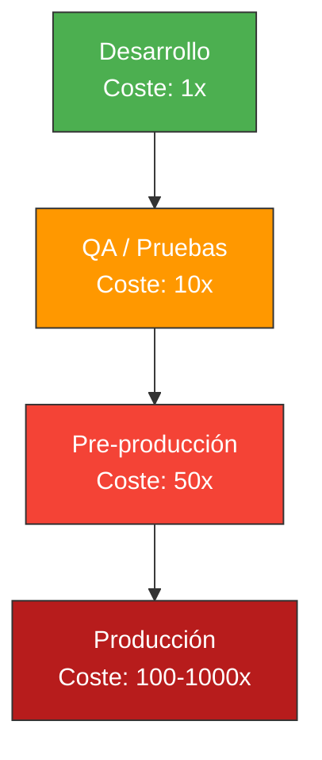

| Fase de Detección | Coste Relativo | Impacto |
|-------------------|----------------|---------|
| **Desarrollo** | 1x | Minutos |
| **Pruebas (QA)** | 10x | Horas |
| **Pre-producción** | 50x | Días + Regression |
| **Producción** | 100x-1000x | Semanas + Daño reputacional |

### ¿Por qué las pruebas ahorran dinero?

Las pruebas no son un coste, son una **inversión** que:

1. **Detectan errores temprano:** Cuanto antes, más barato corregir
2. **Previenen regresiones:** Evitan romper funcionalidad existente
3. **Documentan el código:** Los tests describen cómo funciona el sistema
4. **Permiten refactorizar con confianza:** Puedes mejorar el código sin miedo
5. **Mejoran el diseño:** Para probar algo, primero debes entenderlo

> 💡 **Analogía del Seguro:** Las pruebas son como el seguro del coche. Pagas una cantidad fija (tiempo escribiendo tests) para evitar un posible gasto enorme (bug en producción).

---

## 5.2. La Pirámide de Pruebas: El Modelo Fundamental

La **Pirámide de Pruebas** es un modelo que muestra la proporción recomendada de diferentes tipos de pruebas:

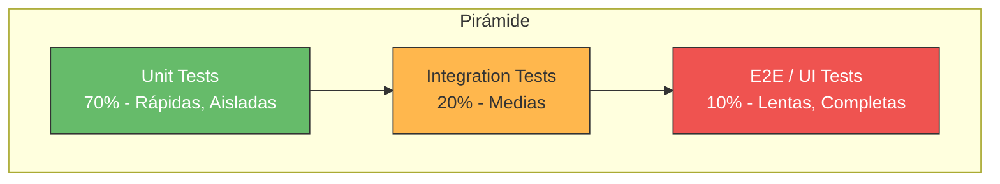

### ¿Por qué una pirámide?

La forma de pirámide no es arbitraria. Se basa en:

1. **Velocidad:** Las pruebas unitarias son rápidas (milisegundos), las E2E son lentas (minutos)
2. **Coste:** Ejecutar 1000 tests unitarios cuesta segundos; ejecutar 100 E2E puede costar horas
3. **Aislamiento:** Las unitarias no dependen de sistemas externos; las E2E sí
4. **Feedback:** Cuanto más rápido el feedback, antes puedes corregir

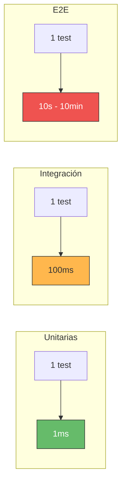

### La Distribución Ideal: 70-20-10

| Nivel | Porcentaje | Velocidad | Aislamiento | Costo por test |
|-------|------------|-----------|-------------|----------------|
| **Unitarias** | 70% | < 1ms | Total | Bajo |
| **Integración** | 20% | ~100ms | Parcial | Medio |
| **E2E** | 10% | Segundos-Minutos | Ninguno | Alto |

> ⚠️ **Error Común:** Muchos proyectos tienen una pirámide invertida: muchas pruebas E2E y pocas unitarias. Esto resulta en:
> - Tests lentos (minutos/horas para ejecutar)
> - Tests frágiles (frecuentemente fallan por razones no relacionadas)
> - Feedback lento (tardas horas en saber que algo está roto)

---

## 5.3. Nivel Inferior: Pruebas Unitarias

### ¿Qué son?

Las **pruebas unitarias** verifican que una unidad individual de código funciona correctamente. Una "unidad" suele ser:

- Un método
- Una clase
- Una función

### Características

- **Rápidas:** Se ejecutan en milisegundos
- **Aisladas:** No dependen de sistemas externos (BD, archivos, red)
- **Determinísticas:** Siempre dan el mismo resultado
- **Independientes:** Se pueden ejecutar en cualquier orden

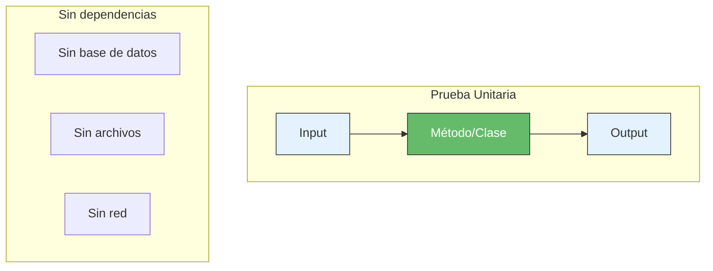

### Ejemplo en C# (con NUnit)

```csharp
public class Calculadora
{
    public int Sumar(int a, int b)
    {
        return a + b;
    }

    public int Dividir(int dividendo, int divisor)
    {
        if (divisor == 0)
            throw new DivideByZeroException("El divisor no puede ser cero");
        
        return dividendo / divisor;
    }
}

// Prueba Unitaria con NUnit
public class CalculadoraTests
{
    [Test]
    public void Sumar_DosNumerosPositivos_RetornaSuma()
    {
        // Arrange
        var calculadora = new Calculadora();
        
        // Act
        var resultado = calculadora.Sumar(5, 3);
        
        // Assert
        Assert.That(resultado, Is.EqualTo(8));
    }

    [Test]
    [TestCase(5, 3, 8)]
    [TestCase(0, 0, 0)]
    [TestCase(-5, 5, 0)]
    public void Sumar_VariosCasos_RetornaSumaCorrecta(int a, int b, int esperado)
    {
        var calculadora = new Calculadora();
        var resultado = calculadora.Sumar(a, b);
        Assert.That(resultado, Is.EqualTo(esperado));
    }

    [Test]
    public void Dividir_PorCero_LanzaExcepcion()
    {
        var calculadora = new Calculadora();
        
        var ex = Assert.Throws<DivideByZeroException>(() => 
            calculadora.Dividir(10, 0));
        
        Assert.That(ex.Message, Is.EqualTo("El divisor no puede ser cero"));
    }
}
```

### Cuando se hacen

- **Durante el desarrollo:** Mientras escribes el código
- **Antes del commit:** Siempre, como mínimo
- **En CI:** En cada push/pull request

### Frameworks de Pruebas

| Framework | Descripción |
|-----------|-------------|
| **NUnit** | El más popular en .NET para pruebas unitarias |
| **MSTest** | De Microsoft, incluido en Visual Studio |
| **xUnit** | Moderno y flexible |

```xml
<!-- Paquetes necesarios para NUnit -->
<PackageReference Include="NUnit" Version="4.2.2" />
<PackageReference Include="NUnit3TestAdapter" Version="4.6.0" />
<PackageReference Include="Microsoft.NET.Test.Sdk" Version="17.11.1" />

<!-- Para dobles de prueba (Mocks) -->
<PackageReference Include="Moq" Version="4.20.72" />
```

---

## 5.4. Nivel Medio: Pruebas de Integración

### ¿Qué son?

Las **pruebas de integración** verifican que diferentes componentes del sistema funcionan correctamente juntos:

- Módulo A + Módulo B
- Tu código + Base de datos
- Tu código + API externa
- Tu código + Sistema de archivos

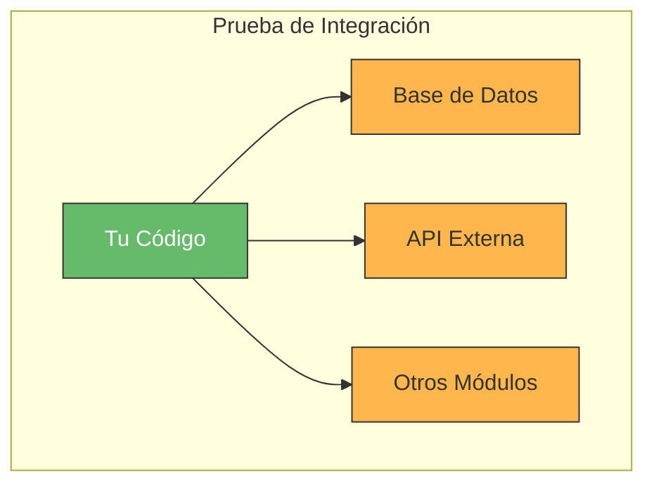

### Tipos de Pruebas de Integración

| Tipo | Descripción | Ejemplo |
|------|-------------|---------|
| **Integración de datos** | Tu código + Base de datos | CRUD operations |
| **Integración de API** | Tu código + APIs externas | Pagos, autenticación |
| **Integración de componentes** | Módulos internos | Servicios que se comunican |

### Ejemplo en C# (con NUnit)

```csharp
public class PedidoRepository
{
    private readonly ApplicationDbContext _context;

    public PedidoRepository(ApplicationDbContext context)
    {
        _context = context;
    }

    public Pedido ObtenerPorId(int id)
    {
        return _context.Pedidos.Find(id);
    }

    public Pedido Crear(Pedido pedido)
    {
        _context.Pedidos.Add(pedido);
        _context.SaveChanges();
        return pedido;
    }
}

// Prueba de Integración con NUnit
public class PedidoRepositoryTests
{
    private readonly ApplicationDbContext _context;

    public PedidoRepositoryTests()
    {
        // Configuración de la base de datos de prueba
        var options = new DbContextOptionsBuilder<ApplicationDbContext>()
            .UseInMemoryDatabase(databaseName: "TestDb")
            .Options;
        _context = new ApplicationDbContext(options);
    }

    [Test]
    public void Crear_PedidoValido_GuardaEnBaseDeDatos()
    {
        // Arrange
        var repository = new PedidoRepository(_context);
        var pedido = new Pedido 
        { 
            Cliente = "Juan", 
            Total = 100m 
        };

        // Act
        var resultado = repository.Crear(pedido);

        // Assert
        Assert.That(resultado.Id, Is.GreaterThan(0));
        var pedidoGuardado = repository.ObtenerPorId(resultado.Id);
        Assert.That(pedidoGuardado, Is.Not.Null);
        Assert.That(pedidoGuardado.Cliente, Is.EqualTo("Juan"));
    }
}
```

### Cuando se hacen

- **Después de las unitarias:** Una vez que los componentes individuales funcionan
- **Antes del merge:** En el pipeline de CI
- **En entornos de staging:** Antes de producción

> 💡 **Tip del Examinador:** Las pruebas de integración son más lentas que las unitarias, por eso las ejecutamos con menos frecuencia. Pero son necesarias porque algunas cosas solo se pueden probar con sistemas reales.

---

## 5.5. Nivel Superior: Pruebas End-to-End (E2E)

### ¿Qué son?

Las **pruebas E2E** (End-to-End) verifican que todo el sistema funciona desde la perspectiva del usuario:

- Desde la interfaz de usuario
- A través de toda la aplicación
- Hasta la base de datos y servicios externos

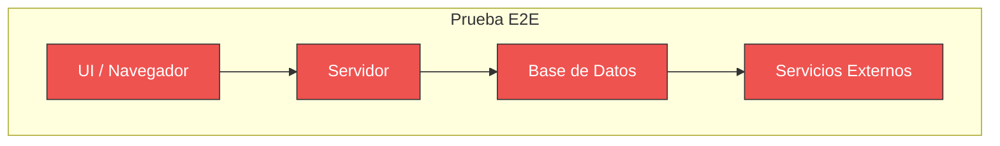

### Tipos de Pruebas E2E

| Tipo | Herramientas | Descripción |
|------|--------------|-------------|
| **UI Tests** | Selenium, Playwright, Cypress | Automatizan el navegador |
| **API Tests** | Postman, RestSharp | Prueban endpoints |
| **Mobile Tests** | Appium, Xamarin.UITest | Prueban apps móviles |

### Ejemplo en C# (con Playwright y NUnit)

```csharp
// Prueba E2E con Playwright
public class E2ETests
{
    [Test]
    public async Task Usuario_PuedeRegistrarse_Exitosamente()
    {
        // Arrange
        using var playwright = await Playwright.CreateAsync();
        await using var browser = await playwright.Chromium.LaunchAsync();
        var page = await browser.NewPageAsync();

        // Act
        await page.GotoAsync("https://miapp.com/registro");
        await page.FillAsync("#nombre", "Juan");
        await page.FillAsync("#email", "juan@test.com");
        await page.FillAsync("#password", "Password123!");
        await page.ClickAsync("#btn-registrar");

        // Assert
        await page.WaitForSelectorAsync("#bienvenida");
        var mensaje = await page.InnerTextAsync("#bienvenida");
        Assert.That(mensaje, Does.Contain("Juan"));
    }
}
```

### Cuando se hacen

- **Antes de release:** Para verificar que todo funciona
- **En staging:** Antes de producción
- **Regresión crítica:** Antes de desplegar cambios grandes

> ⚠️ **Importante:** Las pruebas E2E son las más lentas y frágiles. Deben ser las menos numerosas y solo cubrir los flujos críticos.

---

## 5.6. Comparativa de los Tres Niveles

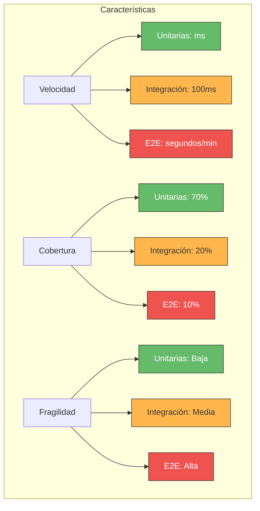

| Característica | Unitarias | Integración | E2E |
|----------------|-----------|-------------|-----|
| **Velocidad** | < 1ms | ~100ms | Segundos-minutos |
| **Cantidad** | Hundreds | Decenas | Pocas |
| **Coste** | Bajo | Medio | Alto |
| **Dependencias** | Ninguna | Algunas | Todas |
| **Debugging** | Fácil | Medio | Difícil |
| **¿Cuándo ejecutarlas?** | Cada commit | Cada merge | Antes de release |

---

## 5.7. Filosofías de Desarrollo Centradas en Pruebas

### TDD: Test Driven Development

**TDD** (Desarrollo Guiado por Pruebas) es una metodología que invierte el orden tradicional:

1. **Primero escribes el test** (que falla)
2. **Luego escribes el código** (que hace pasar el test)
3. **Refactorizas** (mejoras el código manteniendo los tests)

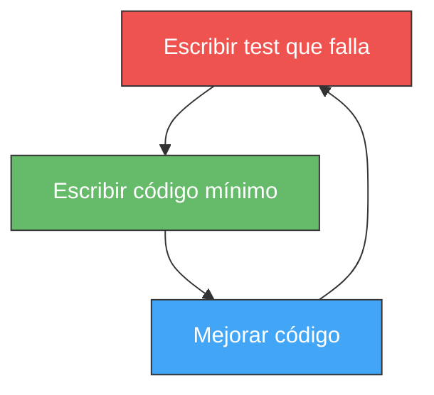

**Ciclo Red-Green-Refactor:**

```csharp
// 1. ROJO: Escribimos el test que FALLA
[Fact]
public void Calculadora_Multiplicar_DosNumeros_RetornaProducto()
{
    var calc = new Calculadora();
    var resultado = calc.Multiplicar(3, 4);
    Assert.Equal(12, resultado);  // FALLA: Método no existe
}

// 2. VERDE: Escribimos el código mínimo para que pase
public int Multiplicar(int a, int b)
{
    return a * b;  // Implementación mínima
}

// 3. REFACTORIZAR: Mejoramos manteniendo los tests
public int Multiplicar(int a, int b)
{
    // ¿Hay alguna optimización que podamos hacer?
    // Los tests siguen pasando
    return a * b;
}
```

**Beneficios de TDD:**

- Código con alta cobertura de tests
- Diseño orientado a prueba
- Feedback inmediato
- Documentación ejecutable

> 💡 **Analogía del Arquitecto:** TDD es como construir una casa primero con los planos (tests) y luego construir (código). Si el plano no funciona, lo descubres antes de construir.

### BDD: Behavior Driven Development

**BDD** (Desarrollo Guiado por Comportamiento) es una evolución de TDD que se centra en el comportamiento del sistema desde la perspectiva del usuario.

**Características:**

- Lenguaje natural (Gherkin)
- Descripciones basadas en escenarios
- Enfocado en el "qué" no en el "cómo"

```gherkin
# Feature: Login
Scenario: Usuario inicia sesión exitosamente
  Given el usuario está en la página de login
  And ingresa "juan@email.com" en el campo email
  And ingresa "password123" en el campo contraseña
  When hace clic en el botón "Iniciar sesión"
  Then debería ver la página principal
  And debería ver "Bienvenido Juan"
```

```csharp
// SpecFlow (BDD para .NET)
[Given(@"el usuario está en la página de login")]
public void GivenElUsuarioEstaEnLaPaginaDeLogin()
{
    _page.NavigateToLogin();
}

[When(@"hace clic en el botón ""Iniciar sesión""")]
public void WhenHaceClicEnElBotonIniciarSesion()
{
    _page.ClickLogin();
}

[Then(@"debería ver la página principal")]
public void ThenDeberiaVerLaPaginaPrincipal()
{
    Assert.True(_page.IsOnHomePage());
}
```

### ATDD: Acceptance Test Driven Development

**ATDD** (Desarrollo Guiado por Pruebas de Aceptación) es similar a BDD pero con foco en los criterios de aceptación:

1. **Definir criterios de aceptación** (qué debe hacer el sistema)
2. **Escribir pruebas de aceptación** (basadas en criterios)
3. **Desarrollar** hasta que las pruebas pasen

```csharp
// Criterio de aceptación
[AcceptanceTest]
public void Pedido_ConStockDisponible_SeProcesaExitosamente()
{
    // Given: Un producto con stock
    var producto = new Producto { Stock = 10 };
    
    // When: El usuario compra el producto
    var resultado = _servicio.ProcesarPedido(producto, 5);
    
    // Then: El pedido se procesa correctamente
    Assert.True(resultado.EsExitoso);
    Assert.Equal(5, producto.Stock);  // Stock reducido
}
```

### Comparativa TDD vs BDD vs ATDD

| Aspecto | TDD | BDD | ATDD |
|---------|-----|-----|------|
| **Foco** | Código | Comportamiento | Requisitos/Aceptación |
| **Lenguaje** | Técnico | Natural (Gherkin) | Mixto |
| **Quién escribe** | Desarrolladores | Desarrolladores + QA + Negocio | Equipo completo |
| **Cuándo** | Durante desarrollo | Antes del desarrollo | Antes del desarrollo |
| **Ejemplo de herramienta** | NUnit | SpecFlow | NUnit + SpecFlow |

```mermaid
flowchart TD
    subgraph TDD
        A[Developer] --> B[Test First]
        B --> C[Código]
    end
    
    subgraph BDD
        D[Equipo] --> E[Behavior]
        E --> F[Especificación]
    end
    
    subgraph ATDD
        G[Stakeholders] --> H[Criterios]
        H --> I[Acceptance Tests]
    end
    
    style A fill:#66bb6a,stroke:#333,color:#fff
    style B fill:#66bb6a,stroke:#333,color:#fff
    style C fill:#66bb6a,stroke:#333,color:#fff
    style D fill:#42a5f5,stroke:#333,color:#fff
    style E fill:#42a5f5,stroke:#333,color:#fff
    style F fill:#42a5f5,stroke:#333,color:#fff
    style G fill:#ffb74d,stroke:#333,color:#333
    style H fill:#ffb74d,stroke:#333,color:#333
    style I fill:#ffb74d,stroke:#333,color:#333
```

---

## 5.8. Testing en las Etapas del Desarrollo

### Desarrollo Local

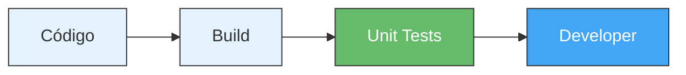

- **Unit tests:** Se ejecutan constantemente (en cada guardado o compilación)
- **Feedback:** Inmediato (segundos)
- **Herramientas:** dotnet test, Rider test runner

```bash
# Ejecutar tests en desarrollo
dotnet test --filter "Category=Unit"
dotnet watch test
```

### Integración Continua (CI)

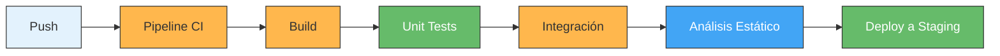

- **Unit tests + Integración:** Se ejecutan en cada PR
- **Análisis estático:** SonarLint, cobertura
- **Feedback:** Minutos

```yaml
# Ejemplo de pipeline
- script: dotnet test --configuration Release --verbosity normal
  displayName: 'Run Unit Tests'
  
- script: dotnet test --configuration Release --filter "Category=Integration"
  displayName: 'Run Integration Tests'
  
- script: dotnet sonarscanner begin...
  displayName: 'SonarQube Analysis'
```

### Entrega Continua (CD)

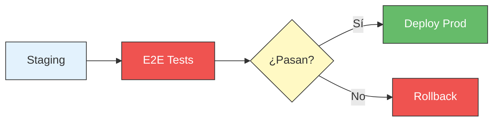

- **E2E tests:** Solo los críticos
- **Feedback:** Pre-deployment
- **Quality Gates:** Deben pasar para producción

```yaml
# Stage de E2E
- stage: E2E_Tests
  jobs:
    - job: Playwright_Tests
      steps:
        - script: npm test
          displayName: 'Run E2E Tests'
```

---

## 5.9. El Diseño de Pruebas: Las Pruebas Son Software

Uno de los errores más comunes en el desarrollo de software es pensar que las pruebas son algo que se hace "después" de escribir el código. **Las pruebas son parte integral del desarrollo de software**, no un añadido opcional.

### Las Pruebas Se Diseñan, No Se Dejan Para el Final

> 📝 **Nota del Profesor:** Muchos estudiantes esperan a tener todo el código escrito para "hacer las pruebas". Esto es un error grave. Las pruebas deben diseñarse desde el inicio del proyecto, igual que diseñas la arquitectura de tu aplicación.

**El problema de dejar las pruebas para el final:**

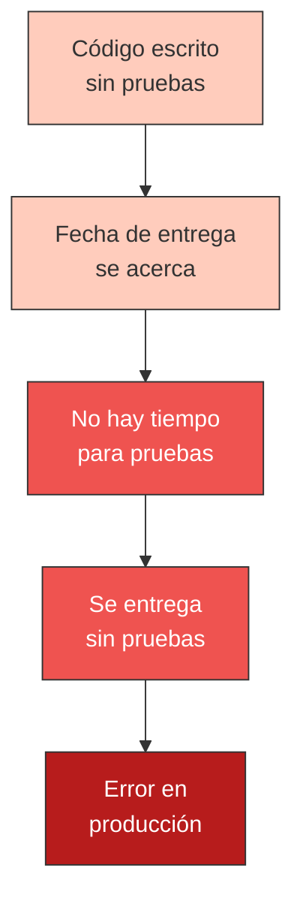

**El enfoque correcto:**

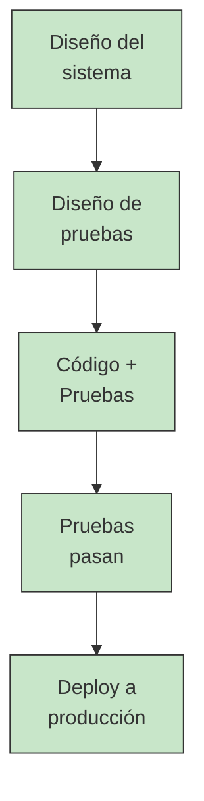

### El Plan de Pruebas

Un **Plan de Pruebas** es un documento (o sección del proyecto) que define:

1. **Qué se va a probar:** Funcionalidades, módulos, componentes
2. **Cómo se va a probar:** Técnicas, herramientas, niveles
3. **Cuándo se va a probar:** En qué fase del desarrollo
4. **Quién lo va a probar:** Responsabilidades del equipo
5. **Criterios de aceptación:** Qué significa que "pase"

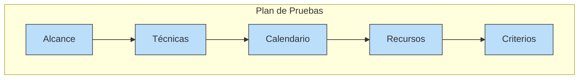

### Pasos para Diseñar Pruebas

Diseñar pruebas es un proceso sistemático:

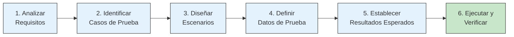

**Paso 1: Analizar los Requisitos**
- Lee las especificaciones del sistema
- Identifica funcionalidades a probar
- Entiende los casos de uso

**Paso 2: Identificar Casos de Prueba**
- Para cada requisito, define qué casos pueden ocurrir
- Casos válidos (happy path)
- Casos inválidos (error handling)

**Paso 3: Diseñar Escenarios de Prueba**
- Define el flujo de cada prueba
- Precondiciones necesarias
- Secuencia de acciones

**Paso 4: Definir Datos de Prueba**
- Qué entradas usaremos
- Valores válidos y no válidos
- Datos de frontera

**Paso 5: Establecer Resultados Esperados**
- Qué salida se espera
- Comportamiento esperado
- Criterios de éxito

**Paso 6: Ejecutar y Verificar**
- Ejecutar la prueba
- Comparar resultado con esperado
- Documentar defectos

### Diseño de Casos de Prueba: Caso Correcto vs Caso Incorrecto

Un **caso de prueba** bien diseñado sigue el patrón **AAA** (Arrange-Act-Assert):

> 📝 **Nota del Profesor:** El patrón AAA es fundamental en las pruebas unitarias. Lo usaremos en todos los ejemplos de esta unidad y en las siguientes:
> - **Arrange (Preparar):** Configurar el escenario, inicializar objetos, preparar datos de entrada
> - **Act (Actuar):** Ejecutar la acción o método que se está probando
> - **Assert (Verificar):** Comprobar que el resultado es el esperado
>
> En pruebas más avanzadas con mocks, veremos también **Verify** para verificar que se llamaron los métodos esperados.

Un **caso de prueba** bien diseñado incluye:

```csharp
// Ejemplo: Caso de prueba para login
public class LoginTests
{
    // ✓ CASO CORRECTO (Happy Path)
    [Test]
    public void Login_CredencialesValidas_RetornaExito()
    {
        // Arrange: Configurar datos válidos
        var credenciales = new Credenciales("juan@email.com", "Password123!");
        
        // Act: Ejecutar la acción
        var resultado = _authService.Login(credenciales);
        
        // Assert: Verificar resultado esperado
        Assert.That(resultado.EsExitoso, Is.True);
        Assert.That(resultado.Token, Is.Not.Empty);
    }
    
    // ✓ CASOS INCORRECTOS (Negative Tests)
    [Test]
    [TestCase(null, "password", "Email no puede ser null")]
    [TestCase("", "password", "Email no puede estar vacío")]
    [TestCase("juan@email.com", null, "Password no puede ser null")]
    [TestCase("juan@email.com", "", "Password no puede estar vacío")]
    [TestCase("no-es-email", "password", "Email debe tener formato válido")]
    public void Login_CredencialesInvalidas_RetornaError(string email, string password, string motivo)
    {
        var credenciales = new Credenciales(email, password);
        
        var resultado = _authService.Login(credenciales);
        
        Assert.That(resultado.EsExitoso, Is.False);
        Assert.That(resultado.MensajeError, Does.Contain(motivo));
    }
    
    // ✓ CASOS LÍMITE (Boundary Tests)
    [Test]
    public void Login_PasswordEnLongitudMinima_Valido()
    {
        var credenciales = new Credenciales("juan@email.com", "12345678"); // 8 caracteres
        var resultado = _authService.Login(credenciales);
        Assert.That(resultado.EsExitoso, Is.True);
    }
}
```

### Criterios de Éxito (Definition of Done)

Las pruebas deben tener criterios claros:

| Criterio | Descripción |
|----------|-------------|
| **Coverage** | % de código cubierto por tests |
| **Pass Rate** | % de tests que pasan |
| **Performance** | Los tests se ejecutan en < X tiempo |
| **Stability** | Los tests no fallan aleatoriamente |
| **Maintainability** | Los tests son fáciles de mantener |

### Las Pruebas Son Documentación

Los tests bien diseñados sirven como **documentación ejecutable** del sistema:

```csharp
/// <summary>
/// Este test documenta el comportamiento esperado
/// </summary>
[Test]
public void Pedido_ConStockSuficiente_CreaExitosamente()
{
    // Given: Un cliente con un producto en stock
    // When: El cliente realiza un pedido
    // Then: El pedido se crea exitosamente y el stock se reduce
}
```

> 💡 **Analogía del Manual de Usuario:** Los tests son como el manual de usuario pero para desarrolladores. Si alguien quiere saber cómo funciona el sistema, puede leer los tests.

> ⚠️ **Error Común:** "Ya tengo el código, ahora hago los tests". Esto es al revés. En TDD primero se escribe el test, luego el código.

---

## 5.10. Enfoques de Diseño de Pruebas: Caja Blanca vs Caja Negra

Además de clasificar las pruebas por su nivel en la pirámide (unitarias, integración, E2E), también podemos clasificarlas según **cómo diseñamos los tests**:

### Pruebas de Caja Blanca

Las **pruebas de caja blanca** (White Box Testing) se diseñan conocimiento de la estructura interna del código. El tester conoce cómo funciona el sistema por dentro.

**Características:**
- Se basa en el código fuente
- Conoce la implementación interna
- Diseña pruebas para cubrir rutas específicas
- Mide la cobertura de código

**Ejemplos de técnicas:**
- **Cobertura de código:** ¿Qué porcentaje del código se ejecuta?
- **Análisis de complejidad ciclomática:** ¿Cuántas rutas de ejecución hay?
- **Pruebas de camino básico:** Probar cada camino posible

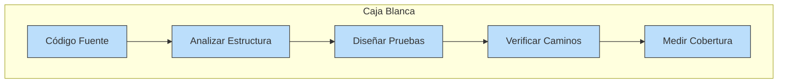

> 📝 **Profundizaremos en el siguiente tema:** En el punto 6 veremos en detalle las **Pruebas de Caja Blanca**, incluyendo el **análisis de complejidad ciclomática** y cómo medir la cobertura de código.

### Pruebas de Caja Negra

Las **pruebas de caja negra** (Black Box Testing) se diseñan sin conocer la implementación interna. Solo nos importa qué hace el sistema, no cómo lo hace.

**Características:**
- Se basa en requisitos y especificaciones
- No requiere conocer el código
- Prueba desde la perspectiva del usuario
- Verifica funcionalidad

**Ejemplos de técnicas:**
- **Particiones de equivalencia:** Dividir inputs en clases equivalentes
- **Análisis de valores límite:** Probar los extremos
- **Tablas de decisión:** Probar combinaciones de condiciones

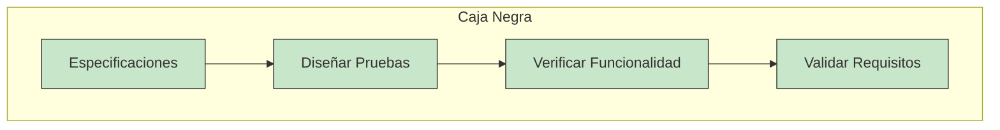

> 📝 **Profundizaremos en el siguiente tema:** En el punto 7 veremos en detalle las **Pruebas de Caja Negra**, incluyendo **clases de equivalencia** y **valores límite**.

### Comparativa: Caja Blanca vs Caja Negra

| Aspecto | Caja Blanca | Caja Negra |
|---------|-------------|------------|
| **Conocimiento requerido** | Código fuente | Requisitos/especificaciones |
| **Enfoque** | Implementación interna | Funcionalidad externa |
| **Quién ejecuta** | Desarrolladores | Probadores/QA |
| **Cuándo** | Durante desarrollo | Durante testing |
| **Ventaja** | Mayor cobertura, encuentra bugs difíciles | Simula al usuario final |
| **Desventaja** | No verifica requisitos | Puede perder casos límite |

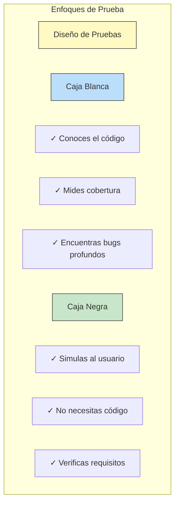

> 📝 **Nota del Profesor:** En la práctica, se usan ambos enfoques. Las pruebas unitarias suelen diseñarse con enfoque de caja blanca (para cubrir el código), mientras que las pruebas de aceptación y E2E se diseñan con enfoque de caja negra (desde la perspectiva del usuario).

---

> 💡 **Resumen del Tema:** La pirámide de pruebas es fundamental para una estrategia de testing efectiva:
> - **70% Unitarias:** Rápidas, fiables, económicas (NUnit + Moq)
> - **20% Integración:** Verifican componentes juntos
> - **10% E2E:** Simulan al usuario final (Playwright)
> - **TDD/BDD/ATDD:** Metodologías que usan tests como guía
> - **Caja Blanca:** Diseño basado en el código (complejidad ciclomática)
> - **Caja Negra:** Diseño basado en requisitos (equivalencia, límites)

> 📝 **Del Profesor:** En las siguientes secciones profundizaremos en:
> - **Punto 6: Pruebas de Caja Blanca** → Análisis de complejidad ciclomática, cobertura de código
> - **Punto 7: Pruebas de Caja Negra** → Clases de equivalencia, valores límite

> ⚠️ **Warning del Examinador:** En el examen espera preguntas sobre la pirámide de pruebas, la diferencia entre unitarias, integración y E2E, y las filosofías TDD/BDD. Saber explicar por qué existe la distribución 70-20-10 es fundamental.
