- [6. Pruebas de Caja Blanca](#6-pruebas-de-caja-blanca)
  - [6.1. Introducción](#61-introducción)
  - [6.2. Conceptos Fundamentales](#62-conceptos-fundamentales)
    - [¿Qué es un Nodo?](#qué-es-un-nodo)
    - [¿Qué es un Nodo Predicado?](#qué-es-un-nodo-predicado)
    - [¿Qué es una Arista?](#qué-es-una-arista)
    - [¿Qué es un Camino?](#qué-es-un-camino)
    - [¿Qué es una Región?](#qué-es-una-región)
  - [6.3. Complejidad Ciclomática de McCabe](#63-complejidad-ciclomática-de-mccabe)
    - [¿Por qué son tan importantes estas fórmulas?](#por-qué-son-tan-importantes-estas-fórmulas)
    - [Las Tres Fórmulas](#las-tres-fórmulas)
    - [Elementos que Incrementan la Complejidad](#elementos-que-incrementan-la-complejidad)
    - [Límites Recomendados](#límites-recomendados)
  - [6.4. Estructuras de Control Básicas](#64-estructuras-de-control-básicas)
    - [If Simple (sin else)](#if-simple-sin-else)
    - [If-Else (dos ramas)](#if-else-dos-ramas)
    - [If Anidado (dos decisiones)](#if-anidado-dos-decisiones)
    - [Bucle While](#bucle-while)
    - [Switch (múltiples casos)](#switch-múltiples-casos)
    - [Do-While (bucle con post-condición)](#do-while-bucle-con-post-condición)
  - [6.5. Ejemplos Completos con Tests](#65-ejemplos-completos-con-tests)
    - [Ejemplo 1: Año Bisiesto](#ejemplo-1-año-bisiesto)
    - [Ejemplo 2: Validar DNI Español](#ejemplo-2-validar-dni-español)
    - [Ejemplo 3: EsPrimo](#ejemplo-3-esprimo)
    - [Ejemplo 4: Calculadora](#ejemplo-4-calculadora)
    - [Ejemplo 5: Tipo de Triángulo](#ejemplo-5-tipo-de-triángulo)
    - [Ejemplo 6: Palíndromo](#ejemplo-6-palíndromo)
  - [6.6. Técnicas Adicionales de Caja Blanca](#66-técnicas-adicionales-de-caja-blanca)
    - [Cobertura de Código](#cobertura-de-código)
    - [Informes de Cobertura](#informes-de-cobertura)
    - [¿Por qué se Exige una Cobertura Mínima?](#por-qué-se-exige-una-cobertura-mínima)
    - [Caminos Independientes](#caminos-independientes)
  - [6.7. Implementación de Tests con NUnit](#67-implementación-de-tests-con-nunit)


# 6. Pruebas de Caja Blanca

Las pruebas de caja blanca son un enfoque de diseño de pruebas que se basa en conocer la estructura interna del código.

---

## 6.1. Introducción

Las pruebas de caja blanca requieren conocer el código fuente para diseñar pruebas que cubran todos los caminos posibles de ejecución.

**Objetivos:**
1. Verificar la estructura interna del código
2. Ejecutar todos los caminos posibles
3. Medir la complejidad del código
4. Asegurar la cobertura de código
5. Identificar código muerto

---

## 6.2. Conceptos Fundamentales

### ¿Qué es un Nodo?

Un **nodo** representa un bloque de código secuencial sin bifurcaciones. Cada instrucción o grupo de instrucciones simples forma un nodo.

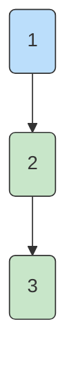

### ¿Qué es un Nodo Predicado?

Un **nodo predicado** es un nodo que contiene una decisión (if, while, for, etc.). Representa un punto donde el flujo puede tomar diferentes caminos.

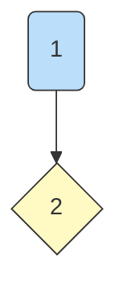

### ¿Qué es una Arista?

Una **arista** representa el flujo de ejecución entre nodos. Conecta nodos indicando hacia dónde va la ejecución.

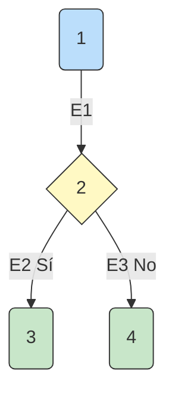

### ¿Qué es un Camino?

Un **camino** es una ruta específica desde el nodo inicial hasta el nodo final del grafo.

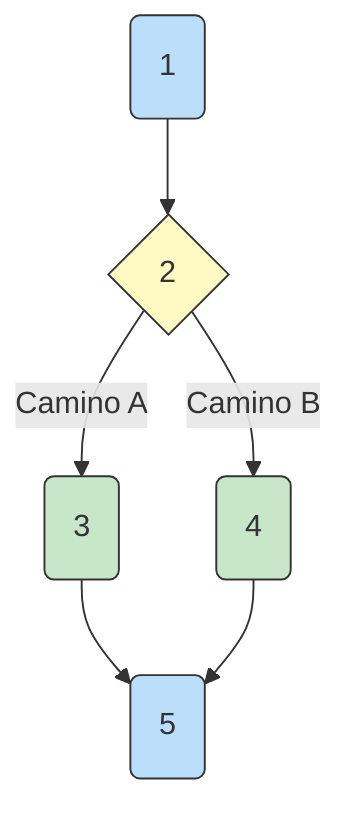

- **Camino A:** 1 → 2(Sí) → 3 → 5
- **Camino B:** 1 → 2(No) → 4 → 5

### ¿Qué es una Región?

Una **región** es un área cerrada del grafo, delimitada por nodos predicado y aristas. La **región exterior** siempre cuenta como 1.

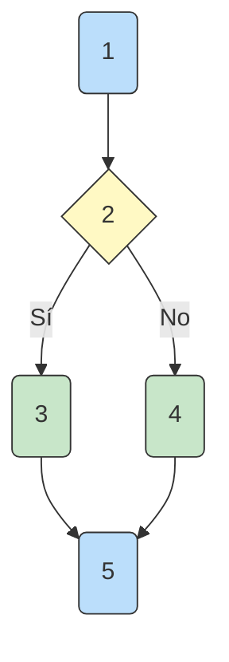

- **Región 1 (Exterior):** Todo el grafo
- **Región 2 (Interior):** Dentro del if

> 📝 **Importante:** La región exterior SIEMPRE cuenta como 1. Cada nodo predicado añade una región interior.

---

## 6.3. Complejidad Ciclomática de McCabe

La complejidad ciclomática (V(G)) es una métrica software desarrollada por **Thomas J. McCabe** en 1976 en el laboratorio de investigación del NIST (National Institute of Standards and Technology, Estados Unidos). McCabe publicó su trabajo en un artículo llamado "A Complexity Measure" que se convirtió en una de las métricas más influyentes en la ingeniería del software.

> 📝 **Historia:** McCabe desarrolló esta métrica porque necesitaba una forma objetiva de medir la complejidad del código. Su idea era que un código más complejo tiene más probabilidades de contener errores y es más difícil de mantener.

La complejidad ciclomática mide la complejidad de un programa basándose en el número de rutas linealmente independientes.

### ¿Por qué son tan importantes estas fórmulas?

Estas fórmulas son importantes porque:

1. **Nos dan el número mínimo de tests** que necesitamos para asegurar que nuestro código funciona correctamente
2. **Nos ayudan a identificar código complejo** que debe ser refactorizado
3. **Son un estándar de la industria** usado en todo el mundo
4. **Se integran en herramientas** como Visual Studio, Rider, SonarQube, etc.

### Las Tres Fórmulas

**Fórmula 1: Basada en nodos predicado**
```
V(G) = P + 1
```
P = número de nodos predicado (decisiones)

**Fórmula 2: Basada en aristas y nodos**
```
V(G) = E - N + 2P
```
E = número de aristas, N = número de nodos, P = número de componentes conectados

**Fórmula 3: Basada en regiones**
```
V(G) = R + 1
```
R = número de regiones (incluyendo la exterior)

> 📝 **Importante:** Nos centraremos y usaremos **exclusivamente** la fórmula **`V(G) = P + 1`**. Las otras fórmulas (E-N+2P y R+1) pueden dar resultados incorrectos cuando hay if anidados o condiciones compuestas. Por eso, las herramientas profesionales como SonarQube, Visual Studio y Rider utilizan `V(G) = P + 1`.

### Elementos que Incrementan la Complejidad

| Elemento | Incrementa | Ejemplo |
|----------|------------|---------|
| `if` | +1 | `if (x > 0)` |
| `while` | +1 | `while (x > 0)` |
| `for` | +1 | `for (int i = 0; i < n; i++)` |
| `case` | +1 | `case 1:` en switch |
| `catch` | +1 | `catch (Exception ex)` |

**NO incrementan:** `else`, `do`, `switch`, `try`, `using`, `throw`, `finally`, `return`

> 📝 **Importante:** La fórmula que **usaremos siempre** es:
> ```
> V(G) = P + 1
> ```
> Las otras fórmulas se mencionan por conocimiento general, pero solo utilizaremos `V(G) = P + 1`.

### Cómo Contar Predicados en Condiciones Compuestas

Un **predicado** es cada decisión booleana individual. Cuando hay condiciones compuestas con `&&` u `||`, cada operando cuenta como un predicado adicional:

```csharp
if (x > 0)                    // 1 predicado (simple)
if (a && b)                   // 2 predicados (a, b)
if (a || b)                   // 2 predicados (a, b)
if (a && b || c)              // 3 predicados (a, b, c)
if (a <= 0 || b <= 0 || c <= 0) // 3 predicados (a<=0, b<=0, c<=0)
```

> 📝 **Regla:** Se cuentan los **operandos booleanos separados por `&&`/`||`**, no los operadores.

**Esta regla aplica a TODAS las estructuras de control** (`if`, `while`, `for`, `do-while`, `case`, `catch`). Cada operando booleano cuenta como un predicado adicional.

**Ejemplos con while y do-while:**

| Código | Predicados | Explicación |
|--------|------------|-------------|
| `while (x > 0)` | 1 | Condición simple |
| `while (x > 0 && y > 0)` | 2 | Dos operandos: (x>0), (y>0) |
| `while (i < n && j < m)` | 2 | Dos operandos |
| `do { ... } while (x > 0 && y > 0)` | 2 | do-while con condición compuesta |
| `for (int i = 0; i < n && j < m; i++)` | 2 | for con condición compuesta |

**Ejemplos generales:**

| Código | Predicados | Explicación |
|--------|------------|-------------|
| `if (x > 0)` | 1 | Condición simple |
| `if (x > 0 && y > 0)` | 2 | Dos operandos: (x>0), (y>0) |
| `if (x > 0 && y > 0 && z > 0)` | 3 | Tres operandos: x>0, y>0, z>0 |
| `if (x > 0 \|\| y > 0)` | 2 | Dos operandos |
| `if (a == null \|\| b == null \|\| c == null)` | 3 | Tres operandos |
| `if (a == b && b == c)` | 2 | Dos operandos: (a==b), (b==c) |

### Límites Recomendados

| Valor     | Evaluación               | Testabilidad |
| --------- | ------------------------ | ------------ |
| **1-10**  | Código bien estructurado | Alta         |
| **10-20** | Código moderado          | Media        |
| **20-40** | Código muy complejo      | Baja         |
| **>40**   | Código no testeable      | Muy Baja     |

---

## 6.4. Estructuras de Control Básicas

### If Simple (sin else)

```csharp
public string M(int x)  // 1
{                        // 1
    if (x >= 18)        // 2 PREDICADO
    {                    // 3
        return "Mayor"; // 3
    }                    // 3
    return "Menor";     // 4
}                        // 5
```


**Recuento:**
- N = 5 nodos
- E = 4 aristas
- P = 1 nodo predicado (if simple)
- R = 2 regiones (exterior + interior del if)

**Cálculo:**
```
V(G) = P + 1 = 1 + 1 = 2
```

**Tests (2):**

| Test | Entrada | Camino      | Nodos   | Resultado |
| ---- | ------- | ----------- | ------- | --------- |
| T1   | x=20    | 1→2(Sí)→3→5 | 1,2,3,5 | "Mayor"   |
| T2   | x=15    | 1→2(No)→4→5 | 1,2,4,5 | "Menor"   |

---

### If-Else (dos ramas)

```csharp
public string M(int x)  // 1
{                        // 1
    if (x % 2 == 0)     // 2 PREDICADO
    {                    // 3
        return "Par";   // 3
    }                    // 3
    else                 // 4
    {                    // 4
        return "Impar"; // 4
    }                    // 4
}                        // 5
```


**Recuento:**
- N = 5 nodos
- E = 4 aristas
- P = 1 nodo predicado
- R = 2 regiones (exterior + interior del if-else)

**Cálculo:**
```
V(G) = P + 1 = 1 + 1 = 2
```

**Tests (2):**

| Test | Entrada | Camino      | Nodos   | Resultado |
| ---- | ------- | ----------- | ------- | --------- |
| T1   | x=4     | 1→2(Sí)→3→5 | 1,2,3,5 | "Par"     |
| T2   | x=3     | 1→2(No)→4→5 | 1,2,4,5 | "Impar"   |

---

### If Anidado (dos decisiones)

```csharp
public string M(int x, int y)  // 1
{                                 // 1
    if (x > 0)                   // 2 PREDICADO
    {                             // 3
        if (y > 0)               // 3 PREDICADO
        {                         // 4
            return "Ambos";      // 4
        }                         // 4
        else                      // 5
        {                         // 5
            return "Solo X";      // 5
        }                         // 5
    }                             // 3
    else                          // 6
    {                             // 6
        return "Ninguno";         // 6
    }                             // 6
}                                 // 7
```

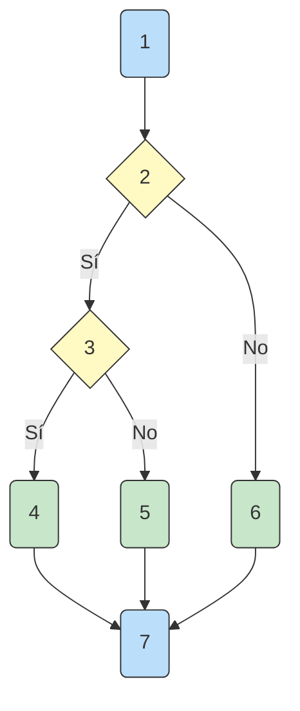

**Recuento:**
- N = 7 nodos
- E = 7 aristas
- P = 2 nodos predicado (if x>0, if y>0)
- R = 3 regiones (exterior + 2 interiores)

**Cálculo:**
```
V(G) = P + 1 = 2 + 1 = 3
```

**Tests (3):**

| Test | Entrada   | Camino            | Nodos     | Resultado |
| ---- | --------- | ----------------- | --------- | --------- |
| T1   | x=5, y=5  | 1→2(Sí)→3(Sí)→4→7 | 1,2,3,4,7 | "Ambos"   |
| T2   | x=5, y=-1 | 1→2(Sí)→3(No)→5→7 | 1,2,3,5,7 | "Solo X"  |
| T3   | x=-1, y=5 | 1→2(No)→6→7       | 1,2,6,7   | "Ninguno" |

---

### Bucle While

```csharp
public int M(int x)  // 1
{                     // 1
    int c = 0;       // 2
    while (x > 0)    // 3 PREDICADO
    {                 // 4
        x = x / 10; // 4
        c = c + 1;  // 4
    }                 // 4
    return c;        // 5
}                     // 6
```

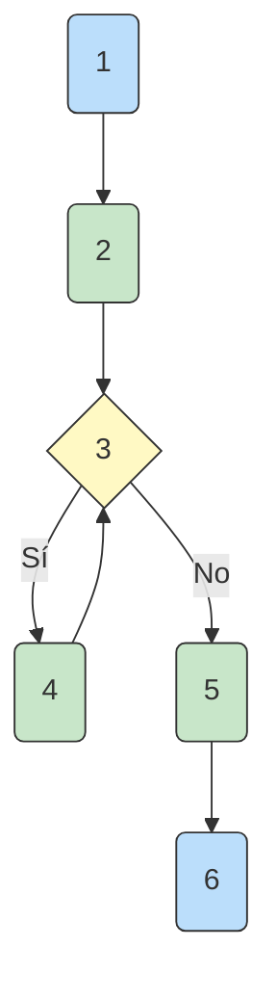

**Recuento:**
- N = 6 nodos
- E = 6 aristas
- P = 1 nodo predicado (while)
- R = 2 regiones (exterior + interior del while)

**Cálculo:**
```
V(G) = P + 1 = 1 + 1 = 2
```

**Tests (2):**

| Test | Entrada | Camino                                | Nodos       | Resultado |
| ---- | ------- | ------------------------------------- | ----------- | --------- |
| T1   | x=123   | 1→2→3(Sí)→4→3(Sí)→4→3(Sí)→4→3(No)→5→6 | 1,2,3,4,5,6 | 3         |
| T2   | x=0     | 1→2→3(No)→5→6                         | 1,2,3,5,6   | 0         |

---

### Switch (múltiples casos)

Un switch es equivalente a if-else anidados. Cada caso cuenta como una rama.

```csharp
public string M(int x)  // 1
{                        // 1
    switch(x)            // 2 PREDICADO
    {                    // 2
        case 1: return "Lunes";  // 3
        case 2: return "Martes"; // 4
        case 3: return "Mierc";  // 5
        default: return "Otro";    // 6
    }                    // 6
}                        // 7
```

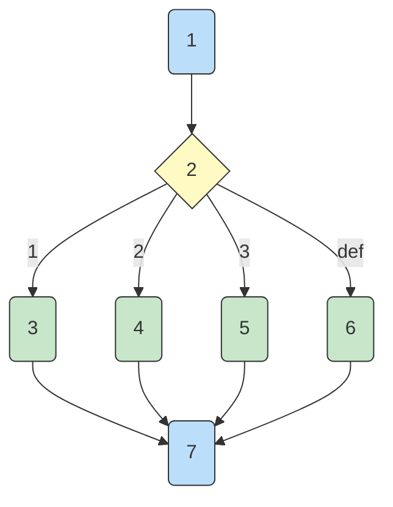

**Recuento:**
- N = 7 nodos
- E = 6 aristas
- P = 4 nodos predicado (4 casos: case 1, case 2, case 3, default)
- R = 5 regiones (exterior + 4 interiores)

**Cálculo:**
```
V(G) = P + 1 = 4 + 1 = 5
```

> 📝 **Explicación:** El switch tiene 4 ramas (case 1, case 2, case 3, default). Cada `case` cuenta como un predicado según la tabla de elementos.

**Tests (5):**

| Test | Entrada | Camino  | Nodos   | Resultado |
| ---- | ------- | ------- | ------- | --------- |
| T1   | x=1     | 1→2→3→7 | 1,2,3,7 | "Lunes"   |
| T2   | x=2     | 1→2→4→7 | 1,2,4,7 | "Martes"  |
| T3   | x=3     | 1→2→5→7 | 1,2,5,7 | "Mierc"   |
| T4   | x=5     | 1→2→6→7 | 1,2,6,7 | "Otro"    |
| T5   | x=0     | 1→2→6→7 | 1,2,6,7 | "Otro"    |

---

### Do-While (bucle con post-condición)

```csharp
public int M(int x)  // 1
{                     // 1
    int c = 0;       // 2
    do                // 3
    {                 // 4
        x = x / 10; // 4
        c = c + 1;  // 4
    } while (x > 0); // 3 PREDICADO
    return c;        // 5
}                     // 6
```

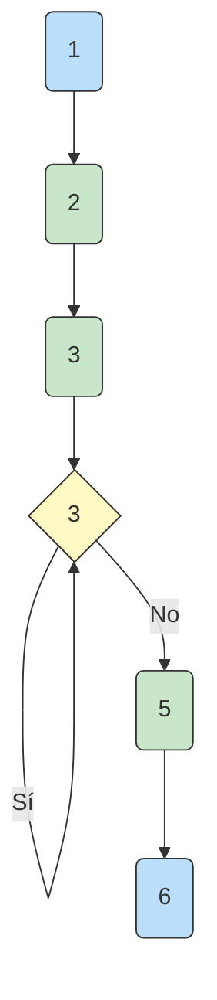

**Recuento:**
- P = 1 nodo predicado (while al final)

**Cálculo:**
```
V(G) = P + 1 = 1 + 1 = 2
```

**Tests (2):**

| Test | Entrada | Resultado |
| ---- | ------- | --------- |
| T1   | x=123   | 3         |
| T2   | x=0     | 1         |

---

### Ejemplo Adicional: Bucle While con Condición Compuesta

Veamos un ejemplo donde `while` tiene una condición compuesta:

```csharp
public int M(int[] a, int n, int m)  // 1
{                                       // 1
    int i = 0;                         // 2
    int c = 0;                         // 2
    while (i < n && a[i] != 0)        // 3 PREDICADO (2 operandos)
    {                                  // 4
        c = c + 1;                     // 4
        i = i + 1;                     // 4
    }                                  // 4
    return c;                          // 5
}                                      // 6
```


**Recuento:**
- P = 2 nodos predicado (i < n, a[i] != 0)
- **Total P = 2**

**Cálculo:**
```
V(G) = P + 1 = 2 + 1 = 3
```

> 📝 **Explicación:** La condición `while (i < n && a[i] != 0)` tiene **2 operandos** (i < n, a[i] != 0), por lo que P = 2.

**Tests (3):** Se necesitan 3 tests para cubrir los 3 caminos independientes.

| Test | Entrada | Camino | Resultado |
| ---- | ------- | ------ | --------- |
| T1 | a=[1,2,0], n=3 | Entra al bucle, luego sale por a[i]==0 | c=2 |
| T2 | a=[1,2,3], n=2 | Entra al bucle, luego sale por i>=n | c=2 |
| T3 | a=[], n=0 | Sale inmediatamente sin entrar al bucle | c=0 |

---

## 6.5. Ejemplos Completos con Tests

### Ejemplo 1: Año Bisiesto

```csharp
public static bool Bisiesto(int a) // 1
{                                      // 1
    if (a % 4 == 0)                 // 2 PREDICADO
    {                                  // 3
        if (a % 100 == 0)           // 3 PREDICADO
        {                              // 4
            if (a % 400 == 0)       // 4 PREDICADO
            {                          // 5
                return true;          // 5
            }                          // 5
            else                       // 6
            {                          // 6
                return false;         // 6
            }                          // 6
        }                            // 4
        else                          // 7
        {                             // 7
            return true;              // 7
        }                            // 7
    }                                // 3
    else                             // 8
    {                                // 8
        return false;                 // 8
    }                                // 8
}                                   // 9
```

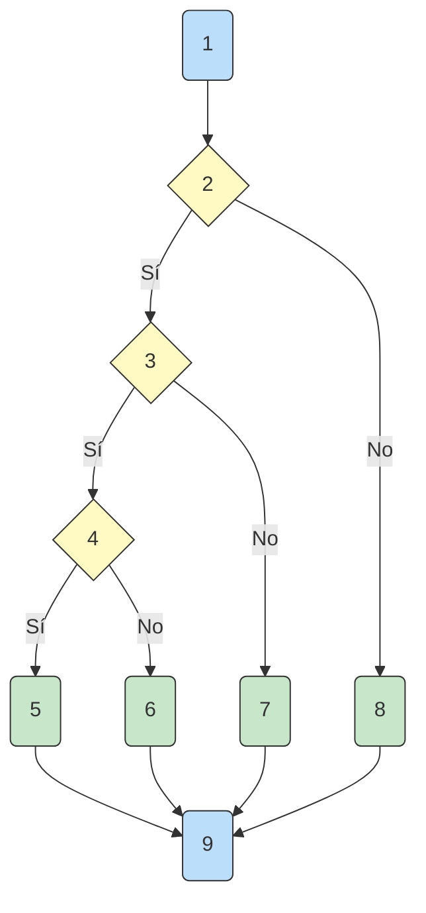

**Recuento:**
- N = 9 nodos
- E = 10 aristas
- P = 3 nodos predicado (a%4==0, a%100==0, a%400==0)
- R = 4 regiones (exterior + 3 interiores)

**Cálculo:**
```
V(G) = P + 1 = 3 + 1 = 4
```

**Tests (4):**

| Test | Entrada | Camino                  | Nodos       | Resultado |
| ---- | ------- | ----------------------- | ----------- | --------- |
| T1   | 2000    | 1→2(Sí)→3(Sí)→4(Sí)→5→9 | 1,2,3,4,5,9 | true      |
| T2   | 1900    | 1→2(Sí)→3(Sí)→4(No)→6→9 | 1,2,3,4,6,9 | false     |
| T3   | 2024    | 1→2(Sí)→3(No)→7→9       | 1,2,3,7,9   | true      |
| T4   | 2023    | 1→2(No)→8→9             | 1,2,8,9     | false     |

---

### Ejemplo 2: Validar DNI Español

```csharp
public static bool DNI(string d) // 1
{                                   // 1
    if (d == null || d.Length != 9) // 2 PREDICADO
    {                                 // 3
        return false;                 // 3
    }                                 // 3
    string n = d.Substring(0,8);    // 4
    string l = d.Substring(8,1).ToUpper(); // 5
    if (!int.TryParse(n, out int x)) // 6 PREDICADO
    {                                 // 7
        return false;                 // 7
    }                                 // 7
    string letras = "TRWAGMYFPDXBNJZSQVHLCKE"; // 8
    int p = x % 23;                 // 9
    char lc = letras[p];            // 10
    if (l == lc.ToString())        // 11 PREDICADO
    {                               // 12
        return true;                 // 12
    }                               // 12
    else                            // 13
    {                               // 13
        return false;               // 13
    }                               // 13
}                                   // 14
```

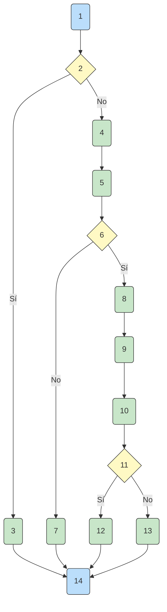

**Recuento:**
- N = 14 nodos
- E = 14 aristas
- P = 4 nodos predicado:
  - if `d == null || d.Length != 9` → 2 operandos (d==null, d.Length!=9)
  - if `int.TryParse(n, out int x)` → 1
  - if `l == lc.ToString()` → 1
- R = 5 regiones (exterior + 4 interiores)

**Cálculo:**
```
V(G) = P + 1 = 4 + 1 = 5
```

**Tests (5):** Se necesitan 5 tests para cubrir todos los caminos independientes.

| Test | Entrada | Descripción | Camino | Resultado |
| ---- | ------- | ----------- | ------ | --------- |
| T1 | null | d == null es true | 1→2(Sí)→3→14 | false |
| T2 | "" | d == null es false, d.Length != 9 es true | 1→2(No)→4→5→6(No)→7→14 | false |
| T3 | "ABCDEFGH" | d == null es false, d.Length != 9 es false, TryParse falla | 1→2(No)→4→5→6(No)→7→14 | false |
| T4 | "12345678A" | Todos los operandos previos false, letra incorrecta | 1→2(No)→4→5→6(Sí)→8→9→10→11(No)→13→14 | false |
| T5 | "12345678Z" | Todos true, letra correcta | 1→2(No)→4→5→6(Sí)→8→9→10→11(Sí)→12→14 | true |

> 📝 **Justificación del cortocircuito:** El primer `if (d == null || d.Length != 9)` tiene **2 operandos booleanos** (d==null, d.Length!=9). Con el operador `||` (OR), si el **primer operando es true**, el segundo **no se evalúa** (cortocircuito). Por eso:
> - Si `d == null` es true → sale sin evaluar `d.Length != 9`
> - Si `d == null` es false → evalúa `d.Length != 9`
> - Si ambos son false → continúa al resto del código
>
> En total hay **3 combinaciones posibles** (no 4), por eso necesitamos 5 tests, no 6. El cálculo correcto es P = 2+1+1 = 4, V(G) = 5. |

---

### Ejemplo 3: EsPrimo

```csharp
public static bool EsPrimo(int n) // 1
{                                   // 1
    if (n <= 1)                   // 2 PREDICADO
    {                               // 3
        return false;             // 3
    }                               // 3
    for (int i = 2; i <= Math.Sqrt(n); i++) // 4 PREDICADO
    {                               // 5
        if (n % i == 0)           // 5 PREDICADO
        {                          // 6
            return false;         // 6
        }                          // 6
    }                               // 5
    return true;                  // 7
}                                   // 8
```

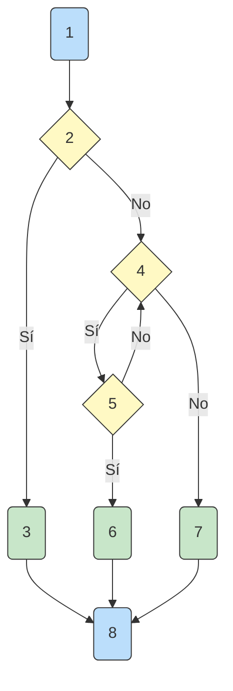

**Recuento:**
- P = 3 nodos predicado (if n<=1, for, if n%i==0)

**Cálculo:**
```
V(G) = P + 1 = 3 + 1 = 4
```

> 📝 **Nota sobre el for:** El grafo simplifica el `for` como un único nodo predicado. En realidad, el for tiene tres partes (inicialización, condición, incremento), pero a efectos de V(G) solo cuenta la **condición** (`i <= Math.Sqrt(n)`). Los nodos de inicialización e incremento forman parte del flujo secuencial, no del flujo de decisión.

**Tests (4):**

| Test | Entrada | Camino                            | Nodos       | Resultado |
| ---- | ------- | --------------------------------- | ----------- | --------- |
| T1   | 1       | 1→2(Sí)→3→8                       | 1,2,3,8     | false     |
| T2   | 4       | 1→2(No)→4(Sí)→5(Sí)→6→8           | 1,2,4,5,6,8 | false     |
| T3   | 7       | 1→2(No)→4(Sí)→5(No)→4(No)→7→8     | 1,2,4,5,7,8 | true      |
| T4   | 17      | 1→2(No)→4(Sí)→5(No)→4(Sí)→...→7→8 | 1,2,4,5,7,8 | true      |

---

### Ejemplo 4: Calculadora

```csharp
public static string Op(int a, int b, string o) // 1
{                                                  // 1
    if (o == "sumar")                           // 2 PREDICADO
    {                                            // 3
        return (a + b).ToString();               // 3
    }                                            // 3
    else if (o == "restar")                     // 4 PREDICADO
    {                                            // 5
        return (a - b).ToString();               // 5
    }                                            // 5
    else if (o == "multiplicar")                // 6 PREDICADO
    {                                            // 7
        return (a * b).ToString();               // 7
    }                                            // 7
    else if (o == "dividir")                    // 8 PREDICADO
    {                                            // 9
        if (b != 0)                             // 9 PREDICADO
        {                                        // 10
            return (a / b).ToString();           // 10
        }                                        // 10
        else                                     // 11
        {                                        // 11
            return "Error";                      // 11
        }                                        // 11
    }                                            // 9
    else                                        // 12
    {                                            // 12
        return "Unknown";                        // 12
    }                                            // 12
}                                                // 13
```

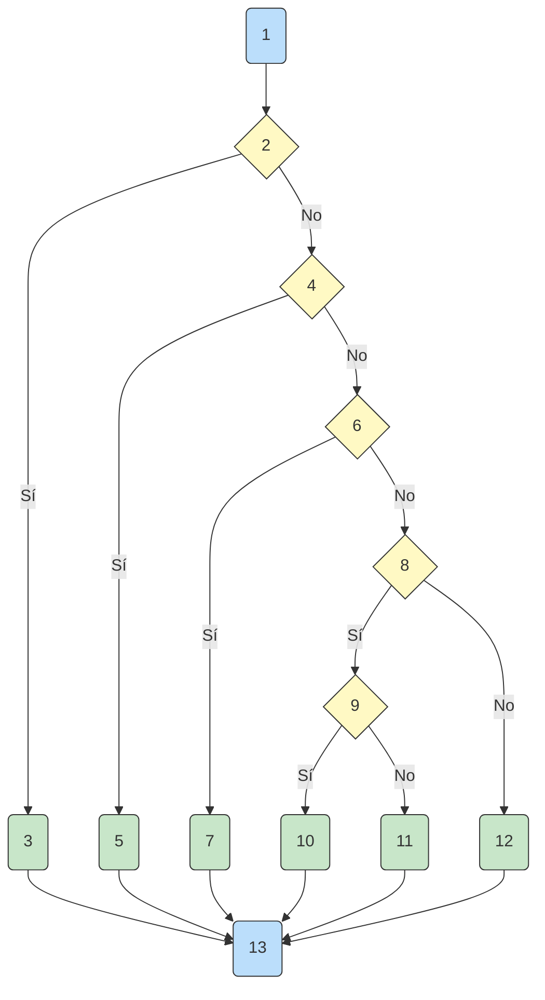

**Recuento:**
- P = 5 nodos predicado (if sumar, if restar, if multiplicar, if dividir, if b!=0)

**Cálculo:**
```
V(G) = P + 1 = 5 + 1 = 6
```

**Tests (6):**

| Test | a   | b   | operación     | Camino                                | Resultado |
| ---- | --- | --- | ------------- | ------------------------------------- | --------- |
| T1   | 5   | 3   | "sumar"       | 1→2(Sí)→3→13                          | "8"       |
| T2   | 5   | 3   | "restar"      | 1→2(No)→4(Sí)→5→13                    | "2"       |
| T3   | 5   | 3   | "multiplicar" | 1→2(No)→4(No)→6(Sí)→7→13              | "15"      |
| T4   | 6   | 2   | "dividir"     | 1→2(No)→4(No)→6(No)→8(Sí)→9(Sí)→10→13 | "3"       |
| T5   | 6   | 0   | "dividir"     | 1→2(No)→4(No)→6(No)→8(Sí)→9(No)→11→13 | "Error"   |
| T6   | 5   | 3   | "otro"        | 1→2(No)→4(No)→6(No)→8(No)→12→13       | "Unknown" |

---

### Ejemplo 5: Tipo de Triángulo

```csharp
public static string Triangulo(int a, int b, int c) // 1
{                                                    // 1
    if (a <= 0 || b <= 0 || c <= 0)                // 2 PREDICADO
    {                                                // 3
        return "Invalido";                          // 3
    }                                                // 3
    if (a + b <= c || a + c <= b || b + c <= a)   // 4 PREDICADO
    {                                                // 5
        return "No triangulo";                      // 5
    }                                                // 5
    if (a == b && b == c)                          // 6 PREDICADO
    {                                                // 7
        return "Equilatero";                       // 7
    }                                                // 7
    else if (a == b || a == c || b == c)          // 8 PREDICADO
    {                                                // 9
        return "Isosceles";                         // 9
    }                                                // 9
    else                                           // 10
    {                                               // 10
        return "Escaleno";                         // 10
    }                                               // 10
}                                                   // 11
```

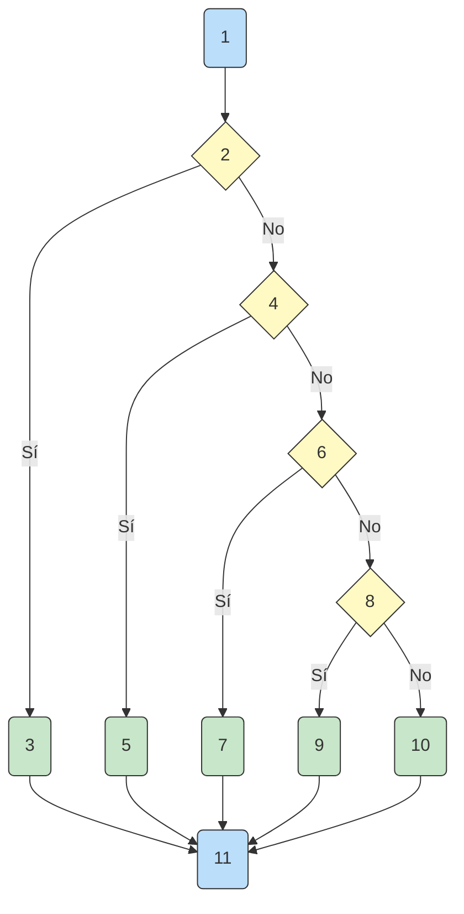

**Recuento:**
- P = 4 nodos predicado:
  - if `a <= 0 || b <= 0 || c <= 0` → 3 operandos (a<=0, b<=0, c<=0)
  - if `a + b <= c || a + c <= b || b + c <= a` → 3 operandos
  - if `a == b && b == c` → 2 operandos
  - if `a == b || a == c || b == c` → 3 operandos
- **Total P = 11**

**Cálculo:**
```
V(G) = P + 1 = 11 + 1 = 12
```

> 📝 **Explicación:** Las condiciones compuestas con `||` y `&&` tienen múltiples operandos booleanos que cuentan como predicados independientes.

**Tests (12):** Se necesitan 12 tests para cubrir todos los caminos independientes.

| Test | a | b | c | Camino | Resultado |
| ---- | --- | --- | --- | ------------------------------- | -------------- |
| T1 | 0 | 3 | 4 | 1→2(Sí)→3→11 | "Invalido" |
| T2 | 3 | 0 | 4 | 1→2(Sí)→3→11 | "Invalido" |
| T3 | 3 | 4 | 0 | 1→2(Sí)→3→11 | "Invalido" |
| T4 | 1 | 2 | 5 | 1→2(No)→4(Sí)→5→11 | "No triangulo" |
| T5 | 5 | 2 | 1 | 1→2(No)→4(Sí)→5→11 | "No triangulo" |
| T6 | 5 | 1 | 2 | 1→2(No)→4(Sí)→5→11 | "No triangulo" |
| T7 | 3 | 3 | 3 | 1→2(No)→4(No)→6(Sí)→7→11 | "Equilatero" |
| T8 | 3 | 3 | 4 | 1→2(No)→4(No)→6(No)→8(Sí)→9→11 | "Isosceles" |
| T9 | 3 | 4 | 3 | 1→2(No)→4(No)→6(No)→8(Sí)→9→11 | "Isosceles" |
| T10 | 4 | 3 | 3 | 1→2(No)→4(No)→6(No)→8(Sí)→9→11 | "Isosceles" |
| T11 | 3 | 4 | 5 | 1→2(No)→4(No)→6(No)→8(No)→10→11 | "Escaleno" |

---

### Ejemplo 6: Palíndromo

```csharp
public static bool Palindromo(string s) // 1
{                                          // 1
    if (s == null || s.Length == 0)     // 2 PREDICADO
    {                                      // 3
        return false;                     // 3
    }                                      // 3
    string inv = "";                     // 4
    for (int i = s.Length - 1; i >= 0; i--) // 5 PREDICADO
    {                                      // 6
        inv = inv + s[i];                 // 6
    }                                      // 6
    if (s == inv)                        // 7 PREDICADO
    {                                      // 8
        return true;                      // 8
    }                                      // 8
    else                                 // 9
    {                                      // 9
        return false;                     // 9
    }                                      // 9
}                                         // 10
```

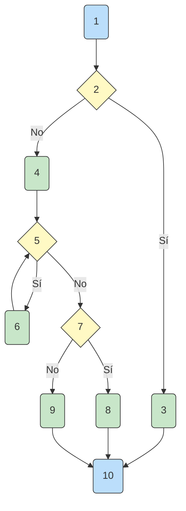

**Recuento:**
- P = 3 nodos predicado:
  - if `s == null || s.Length == 0` → 2 operandos (s==null, s.Length==0)
  - for → 1
  - if `s == inv` → 1
- **Total P = 4**

**Cálculo:**
```
V(G) = P + 1 = 4 + 1 = 5
```

**Tests (5):** Se necesitan 5 tests para cubrir todos los caminos independientes.

| Test | Entrada | Descripción | Camino | Resultado |
| ---- | ------- | ----------- | ------ | --------- |
| T1 | null | d == null es true | 1→2(Sí)→3→10 | false |
| T2 | "" | d == null es false, d.Length != 9 es true | 1→2(No)→4→5→6→7(Sí)→8→10 | false |
| T3 | "a" | Un carácter, palíndromo | 1→2(No)→4→5→6→7(No)→9→10 | true |
| T4 | "radar" | Palíndromo | 1→2(No)→4→5→6→7(No)→9→10 | true |
| T5 | "hola" | No palíndromo | 1→2(No)→4→5→6→7(No)→9→10 | false |

> 📝 **Justificación del cortocircuito:** El primer `if (s == null || s.Length == 0)` tiene **2 operandos booleanos** (s==null, s.Length==0). Con el operador `||` (OR), si el **primer operando es true**, el segundo **no se evalúa** (cortocircuito). Por eso:
> - Si `s == null` es true → sale sin evaluar `s.Length == 0`
> - Si `s == null` es false → evalúa `s.Length == 0`
> - Si ambos son false → continúa al resto del código
>
> En total hay **3 combinaciones posibles** (no 4), por eso necesitamos 5 tests, no 6. El cálculo correcto es P = 2+1+1 = 4, V(G) = 5.

---

## 6.6. Técnicas Adicionales de Caja Blanca

### Cobertura de Código

La complejidad ciclomática nos da el número mínimo de tests, pero también podemos medir qué porcentaje de nuestro código está siendo probado:

| Técnica                     | Descripción                                             |
| --------------------------- | ------------------------------------------------------- |
| **Cobertura de líneas**     | Porcentaje de líneas de código ejecutadas por los tests |
| **Cobertura de ramas**      | Porcentaje de ramas ejecutadas (cada if, while, etc.)   |
| **Cobertura de decisiones** | Porcentaje de decisiones probadas                       |
| **Cobertura de caminos**    | Porcentaje de caminos independientes ejecutados         |

### Informes de Cobertura

Los **informes de cobertura** son documentos generados por herramientas que muestran qué partes del código han sido ejecutadas durante las pruebas. Estos informes son fundamentales para:

1. **Identificar código no probado:** Saber qué líneas no se han ejecutado
2. **Cumplir requisitos de calidad:** Muchas empresas exigen una cobertura mínima
3. **Mejorar la calidad:** Cuanto más código esté cubierto, menos bugs pasará a producción

> 📝 **Nota del Profesor:** Los informes de cobertura los generaremos más adelante con herramientas como:
> - **Visual Studio** o **Rider**: Generan informes de cobertura integrados
> - **Coverlet**: Herramienta específica para .NET
> - **SonarQube**: Combina análisis estático con cobertura de código

### ¿Por qué se Exige una Cobertura Mínima?

En muchos proyectos profesionales se exige una cobertura mínima (típicamente 70-80%) por varias razones:

1. **Calidad del software:** Código sin probar es código con posibles errores
2. **Mantenibilidad:** Los tests facilitan los cambios futuros
3. **Regresión:** Los tests detectan cuando un cambio rompe funcionalidad existente
4. **Documentación:** Los tests documentan cómo funciona el código
5. **Confianza:** Permite refactorizar con seguridad

> ⚠️ **Precaución:** Una cobertura del 100% no garantiza ausencia de errores. Se puede tener coverage del 100% pero probar mal. Lo importante es probar bien, no solo probar mucho.

| Técnica                     | Descripción              |
| --------------------------- | ------------------------ |
| **Cobertura de líneas**     | % de líneas ejecutadas   |
| **Cobertura de ramas**      | % de ramas ejecutadas    |
| **Cobertura de decisiones** | % de decisiones probadas |

### Caminos Independientes

Un camino independiente es aquel que introduce al menos una nueva serie de procesamientos o condiciones.

> 💡 **Regla de oro:** El número de pruebas necesarias = complejidad ciclomática

### Cobertura vs Caminos Independientes

> ⚠️ **Error muy común:** Tener **100% de cobertura de líneas** NO significa haber cubierto todos los **caminos independientes**.

| Métrica | Qué mide | Cuándo es suficiente |
|---------|----------|----------------------|
| **Cobertura de líneas** | % de líneas ejecutadas | Puede tener 100% con solo 1 test |
| **Cobertura de ramas** | % de ramas ejecutadas | Puede tener 100% con pocos tests |
| **Cobertura de caminos** | % de caminos independientes | **Igual a V(G)** = número real de tests |

**Ejemplo:** Un código con V(G) = 6 necesita **6 tests** para cubrir todos los caminos. Podemos tener 100% de cobertura de líneas con solo 2-3 tests, pero **no estaríamos cubriendo todos los caminos independientes**.

> 📝 **En el examen:** Si un código tiene V(G) = 12, necesitas diseñar 12 tests. No basta con cubrir todas las líneas, debes cubrir todos los caminos independientes.

---

## 6.7. Implementación de Tests con NUnit

Ahora veamos cómo implementar los tests para estos ejemplos usando NUnit:

```csharp
// Ejemplo: Tests para Año Bisiesto con NUnit
public class BisiestoTests
{
    // Test 1: Año divisible por 400
    [Test]
    public void Bisiesto_Ano2000_EsBisiesto()
    {
        // Arrange
        int año = 2000;
        
        // Act
        bool resultado = Program.Bisiesto(año);
        
        // Assert
        Assert.That(resultado, Is.True);
    }
    
    // Test 2: Año divisible por 100 pero no por 400
    [Test]
    public void Bisiesto_Ano1900_NoEsBisiesto()
    {
        int año = 1900;
        bool resultado = Program.Bisiesto(año);
        Assert.That(resultado, Is.False);
    }
    
    // Test 3: Año divisible por 4 pero no por 100
    [Test]
    public void Bisiesto_Ano2024_EsBisiesto()
    {
        int año = 2024;
        bool resultado = Program.Bisiesto(año);
        Assert.That(resultado, Is.True);
    }
    
    // Test 4: Año no divisible por 4
    [Test]
    public void Bisiesto_Ano2023_NoEsBisiesto()
    {
        int año = 2023;
        bool resultado = Program.Bisiesto(año);
        Assert.That(resultado, Is.False);
    }
}

// Ejemplo: Tests para DNI con NUnit
public class DNITests
{
    [Test]
    public void DNI_Nulo_EsInvalido()
    {
        Assert.That(Program.DNI(null), Is.False);
    }

    [Test]
    public void DNI_LongitudIncorrecta_EsInvalido()
    {
        Assert.That(Program.DNI(""), Is.False);
    }

    [Test]
    public void DNI_NoNumerico_EsInvalido()
    {
        Assert.That(Program.DNI("ABCDEFGH"), Is.False);
    }

    [Test]
    public void DNI_LetraIncorrecta_EsInvalido()
    {
        Assert.That(Program.DNI("12345678A"), Is.False);
    }

    [Test]
    public void DNI_Valido_EsValido()
    {
        Assert.That(Program.DNI("12345678Z"), Is.True);
    }
}

// Ejemplo: Tests para Calculadora con NUnit
public class CalculadoraTests
{
    [Test]
    [TestCase(5, 3, "sumar", "8")]
    [TestCase(5, 3, "restar", "2")]
    [TestCase(5, 3, "multiplicar", "15")]
    public void Operar_VariasOperaciones_RetornaResultado(int a, int b, string op, string esperado)
    {
        string resultado = Program.Op(a, b, op);
        Assert.That(resultado, Is.EqualTo(esperado));
    }
    
    [Test]
    public void Operar_DivisionPorCero_RetornaError()
    {
        string resultado = Program.Op(6, 0, "dividir");
        Assert.That(resultado, Is.EqualTo("Error"));
    }
    
    [Test]
    public void Operar_OperacionDesconocida_RetornaUnknown()
    {
        string resultado = Program.Op(5, 3, "potencia");
        Assert.That(resultado, Is.EqualTo("Unknown"));
    }
}

// Ejemplo: Tests para EsPrimo con NUnit
public class EsPrimoTests
{
    [Test]
    public void EsPrimo_NumeroMenorOIgualA1_RetornaFalse()
    {
        Assert.That(Program.EsPrimo(1), Is.False);
    }
    
    [Test]
    public void EsPrimo_NumeroNoPrimo_RetornaFalse()
    {
        Assert.That(Program.EsPrimo(4), Is.False);
    }
    
    [Test]
    public void EsPrimo_NumeroPrimo_RetornaTrue()
    {
        Assert.That(Program.EsPrimo(7), Is.True);
    }
    
    [Test]
    public void EsPrimo_NumeroPrimoGrande_RetornaTrue()
    {
        Assert.That(Program.EsPrimo(17), Is.True);
    }
}
```

> 📝 **Nota del Profesor:** En NUnit, cada test debe seguir el patrón AAA:
> - **Arrange:** Preparar los datos de entrada
> - **Act:** Ejecutar la acción a probar
> - **Assert:** Verificar el resultado esperado

---

> 💡 **Resumen del Tema:**
> - La complejidad ciclomática mide el número de caminos independientes
> - Usamos exclusivamente `V(G) = P + 1`
> - Cada operando booleano separado por `&&`/`||` cuenta como un predicado adicional
> - El número de tests = complejidad ciclomática

> ⚠️ **En el examen:** Debéis saber calcular la complejidad ciclomática, dibujar el grafo de control de flujo, y diseñar los tests necesarios para cubrir todos los caminos.
