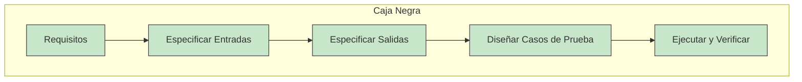
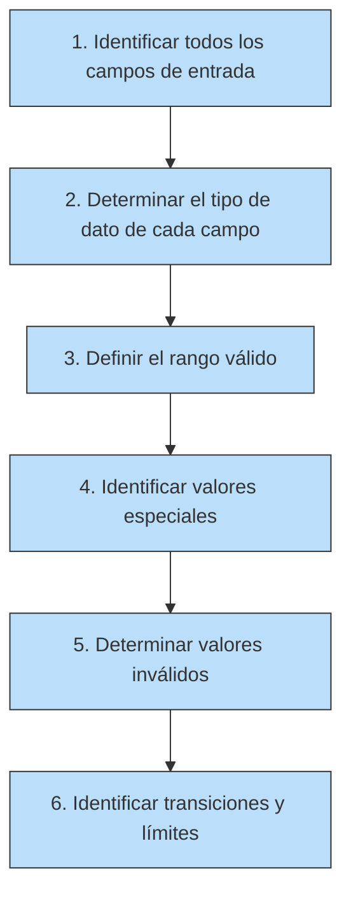
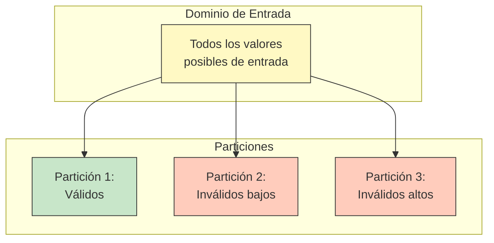
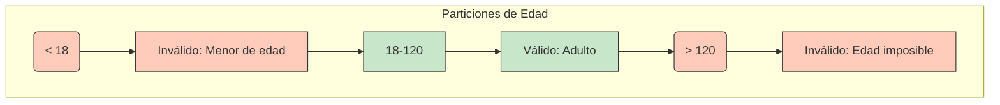
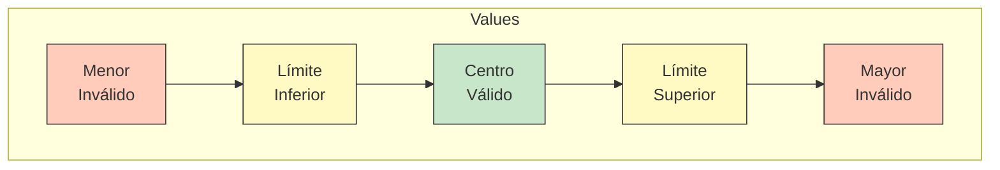
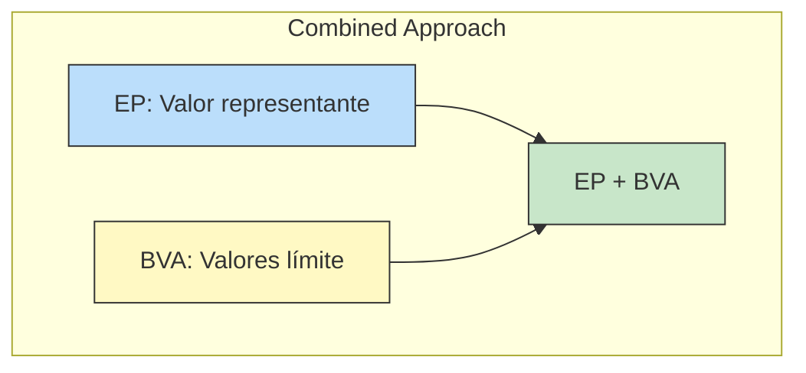
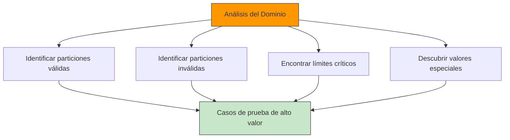
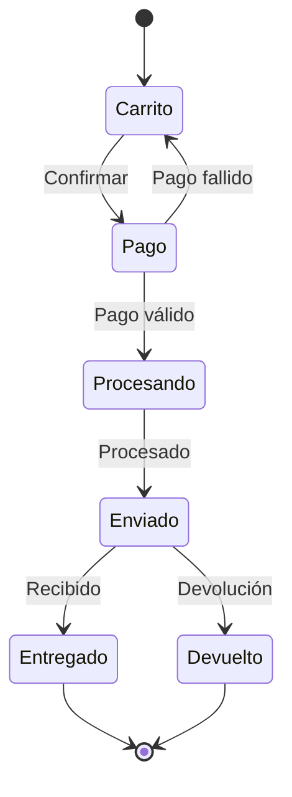
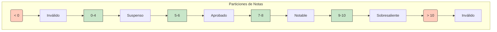
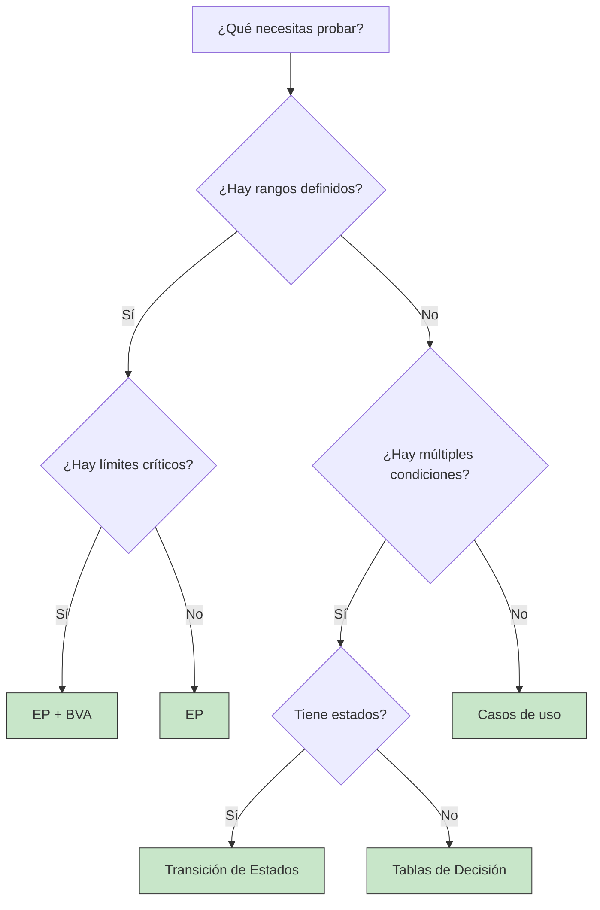

- [7. Pruebas de Caja Negra](#7-pruebas-de-caja-negra)
  - [7.1. Introducción a las Pruebas de Caja Negra](#71-introducción-a-las-pruebas-de-caja-negra)
  - [7.2. Particiones de Equivalencia (Clases de Equivalencia)](#72-particiones-de-equivalencia-clases-de-equivalencia)
  - [7.3. Análisis de Valores Límite](#73-análisis-de-valores-límite)
  - [7.4. Relación entre EP y BVA](#74-relación-entre-ep-y-bva)
  - [7.5. Análisis del Dominio de Datos](#75-análisis-del-dominio-de-datos)
  - [7.6. Técnicas Adicionales de Caja Negra](#76-técnicas-adicionales-de-caja-negra)
  - [7.7. Ejemplos Completos](#77-ejemplos-completos)
  - [7.8. Tabla Comparativa: EP vs BVA vs Tablas de Decisión](#78-tabla-comparativa-ep-vs-bva-vs-tablas-de-decisión)
  - [7.9. Implementación de Tests con NUnit](#79-implementación-de-tests-con-nunit)


# 7. Pruebas de Caja Negra

Las pruebas de caja negra son un enfoque de diseño de pruebas que se basa en los requisitos y especificaciones del sistema, sin conocer la implementación interna.

---

## 7.1. Introducción a las Pruebas de Caja Negra

Las pruebas de caja negra (Black Box Testing) son aquellas que se diseñan **sin conocer la estructura interna del código**. Solo nos interesa qué hace el sistema, no cómo lo hace.



**Características:**
- Se basa en requisitos y especificaciones
- No requiere conocer el código fuente
- Prueba desde la perspectiva del usuario
- Verifica la funcionalidad

### La Importancia de Analizar el Dominio de los Datos

Antes de diseñar cualquier prueba, debemos analizar exhaustivamente el **dominio de los datos**. Esto significa entender:

1. **Qué datos puede introducir el usuario**
2. **Qué valores son válidos y cuáles no**
3. **Cuáles son los límites de cada campo**
4. **Qué formato debe tener cada dato**
5. **Qué valores especiales existen** (null, vacío, cero, etc.)

> 📝 **Nota del Profesor:** Un error muy común es probar solo los valores "típicos". Los defectos se encuentran principalmente en los bordes, en los valores límite, y en las transiciones entre particiones. Por eso es fundamental analizar bien el dominio antes de diseñar los tests.

### Requisitos Funcionales vs No Funcionales

Para diseñar pruebas de caja negra, necesitamos entender los **requisitos**:

| Tipo | Descripción | Ejemplos |
|------|-------------|----------|
| **Funcionales** | Qué debe hacer el sistema | Validar email, calcular descuento, registrar usuario |
| **No funcionales** | Cómo debe funcionar el sistema | Rendimiento, seguridad, usabilidad |
| **De información** | Datos que maneja el sistema | Formato de datos, rangos válidos, restricciones |

#### Requisitos de Información

Los **requisitos de información** definen los datos que el sistema debe manejar:

- **Tipo de dato:** Entero, decimal, texto, fecha, etc.
- **Rango válido:** Valores mínimos y máximos
- **Formato:** Cómo debe presentarse el dato
- **Restricciones:** Longitud, caracteres permitidos, etc.

**Ejemplo para un campo de edad:**

| Aspecto | Requisito |
|---------|------------|
| Tipo de dato | Entero positivo |
| Rango válido | 16 - 99 años |
| Formato | Número sin decimales |
| Obligatoriedad | Obligatorio |
| Valor especial | No puede ser null |

#### Requisitos Funcionales

Los **requisitos funcionales** definen las funciones del sistema:

- **Qué operaciones realiza:** Crear, modificar, eliminar, calcular
- **Qué reglas de negocio aplican:** Descuentos por importe, validación de datos
- **Qué salidas produce:** Mensajes, cálculos, cambios de estado

**Ejemplo para sistema de descuentos:**

| Función | Regla |
|---------|--------|
| Sin descuento | Importe <= 50€ |
| Descuento 5% | Importe 50,01€ - 100€ |
| Descuento 10% | Importe 100,01€ - 200€ |
| Descuento 15% | Importe 200,01€ - 500€ |
| Descuento 20% | Importe > 500€ |

### Análisis del Dominio de Datos: Pasos

Para analizar correctamente el dominio de datos, debemos seguir estos pasos:



**Paso 1: Identificar campos de entrada**
- Cada dato que el usuario puede introducir
- Cada dato que viene de otro sistema
- Cada dato calculado internamente

**Paso 2: Determinar tipo de dato**
- Numérico (entero, decimal)
- Texto (caracteres, longitud)
- Fecha/Hora
- Booleanos
- Colecciones

**Paso 3: Definir rango válido**
- Valores mínimos y máximos
- Longitud mínima y máxima
- Número de elementos

**Paso 4: Identificar valores especiales**
- Null, vacío, cero
- Valores por defecto
- Casos edge

**Paso 5: Determinar valores inválidos**
- Valores fuera de rango
- Tipos de datos incorrectos
- Formatos no válidos

**Paso 6: Identificar transiciones**
- Puntos donde cambia el comportamiento
- Límites entre particiones

---

## 7.2. Particiones de Equivalencia (Clases de Equivalencia)

### ¿Qué es la Partición de Equivalencia?

La **partición de equivalencia** (o clases de equivalencia) es una técnica que divide el dominio de entrada en grupos (particiones) donde se espera que el sistema se comporte de manera idéntica.

**Principio fundamental:** Si el sistema maneja correctamente un valor de una partición, debería manejar correctamente todos los valores de esa partición.



### ¿Cómo Identificar las Particiones?

Para identificar las particiones de equivalencia, debemos analizar los requisitos y buscar:

1. **Condiciones de entrada:** Valores que el sistema acepta o rechaza
2. **Rangos de valores:** Valores mínimos y máximos
3. **Tipos de datos:** Enteros, cadenas, fechas, etc.
4. **Valores especiales:** Null, vacío, cero, etc.

### Reglas para Definir Particiones

| Regla | Descripción |
|-------|-------------|
| R1 | Si la entrada tiene un rango (ej: 1-100), hay 3 particiones: válido, inválido bajo, inválido alto |
| R2 | Si la entrada requiere un valor específico, hay 2 particiones: válido y cualquier otro valor |
| R3 | Si la entrada es un conjunto de valores, cada valor es una partición válida + "cualquier otro" |
| R4 | Si la entrada NO debe ser nulo, crear partición para null |

### Ejemplo: Campo de Edad

**Requisito:** El sistema acepta edades entre 18 y 120 años



**Particiones identificadas:**

| ID | Partición | Rango | Tipo | Test Representative |
|----|-----------|-------|------|---------------------|
| P1 | Inválido bajo | < 18 | Inválido | 10 |
| P2 | Válido | 18 - 120 | Válido | 25 |
| P3 | Inválido alto | > 120 | Inválido | 150 |

---

## 7.3. Análisis de Valores Límite

### ¿Qué es el Análisis de Valores Límite?

El **análisis de valores límite** (Boundary Value Analysis - BVA) es una técnica que se centra en los valores en los bordes o extremos de las particiones.

> 📝 **Principio:** Los errores tienden a ocurrir más frecuentemente en los límites de los rangos que en el centro.



### Valores a Probar en Cada Límite

Para un rango válido de [Mín, Máx]:

| Tipo de Valor | Valor a Probar |
|--------------|-----------------|
| Mínimo - 1 | Mín - 1 (inválido) |
| Mínimo | Mín (válido) |
| Mínimo + 1 | Mín + 1 (válido) |
| Máximo - 1 | Máx - 1 (válido) |
| Máximo | Máx (válido) |
| Máximo + 1 | Máx + 1 (inválido) |

### Two-Value vs Three-Value BVA

| Método | Valores por límite | Total valores |
|--------|-------------------|---------------|
| **Two-Value** | Mín y Máx | 4 por rango |
| **Three-Value** | Mín-1, Mín, Mín+1 | 6 por rango |

> 📝 **Recomendación:** Usar Three-Value BVA para mayor cobertura.

---

## 7.4. Relación entre EP y BVA

Las dos técnicas son **complementarias**:

| Técnica | Enfoque | Valores seleccionados |
|---------|---------|---------------------|
| **Equivalence Partitioning** | Particiones enteras | Un representante por partición |
| **Boundary Value Analysis** | Bordes de particiones | Valores en los extremos |



**Estrategia combinada:**
1. Aplicar EP para identificar particiones
2. Seleccionar un valor representativo de cada partición
3. Aplicar BVA para probar los límites

---

## 7.5. Análisis del Dominio de Datos

El análisis del dominio de datos es el proceso de entender exhaustivamente todos los datos que el sistema puede manejar. Es el **primer paso fundamental** antes de diseñar cualquier caso de prueba.

### ¿Por Qué es Tan Importante?



> 📝 **Dato clave:** El 80% de los defectos se encuentran en el 20% de los datos, especialmente en los límites y en las transiciones entre particiones.

### Pasos Detallados para el Análisis del Dominio

| Paso | Descripción | Preguntas Clave |
|------|-------------|-----------------|
| 1 | **Identificar campos de entrada** | ¿Qué datos puede introducir el usuario? ¿Qué datos vienen de otros sistemas? |
| 2 | **Determinar tipo de dato** | ¿Es número, texto, fecha? ¿Tiene decimales? |
| 3 | **Definir rango válido** | ¿Cuál es el mínimo y máximo permitido? |
| 4 | **Identificar valores especiales** | ¿Puede ser null? ¿Puede estar vacío? ¿Hay valores por defecto? |
| 5 | **Determinar valores inválidos** | ¿Qué valores deben rechazado? ¿Por qué? |
| 6 | **Mapear transiciones** | ¿Dónde cambia el comportamiento del sistema? |

### Análisis de Valores Especiales

Los valores especiales son aquellos que requieren atención particular:

| Tipo de Valor | Descripción | Ejemplo |
|---------------|-------------|---------|
| **Null** | Ausencia de valor | `null`, `None`, `nil` |
| **Vacío** | Cadena sin caracteres | `""`, `''` |
| **Cero** | Valor numérico cero | `0`, `0.0` |
| **Negativo** | Valor menor que cero | `-1`, `-100` |
| **Máximo positivo** | Límite superior | `int.MaxValue` |
| **Espacios** | Solo espacios en blanco | `"   "` |
| **Caracteres especiales** | Símbolos | `@#$%` |

### Ejemplo: Análisis Completo de un Campo

**Campo:** Teléfono móvil español

| Aspecto | Análisis | Resultado |
|---------|----------|-----------|
| **Tipo de dato** | Numérico entero | Solo dígitos |
| **Longitud** | Exactamente 9 dígitos | No más, no menos |
| **Primer dígito** | Debe ser 6 o 7 | Prefijos válidos: 6xx, 7xx |
| **Obligatoriedad** | Opcional | Puede estar vacío |
| **Valores inválidos** | Letras, símbolos, longitud incorrecta | Error de validación |

**Particiones resultantes:**

| ID | Partición | Valores de Prueba | Resultado Esperado |
|----|-----------|-------------------|-------------------|
| T1 | Vacío | `""` | Válido (opcional) |
| T2 | Longitud corta | `"61234567"` (8 dígitos) | Inválido |
| T3 | Longitud correcta (6) | `"612345678"` | Válido |
| T4 | Longitud correcta (7) | `"712345678"` | Válido |
| T5 | Longitud larga | `"6123456789"` (10 dígitos) | Inválido |
| T6 | Con letras | `"612ABC678"` | Inválido |
| T7 | Con símbolos | `"612-345-678"` | Inválido |
| T8 | Empieza con 5 | `"512345678"` | Inválido |
| T9 | Empieza con 8 | `"812345678"` | Inválido |

---

## 7.6. Técnicas Adicionales de Caja Negra

Además de EP y BVA, existen otras técnicas de caja negra muy útiles en determinados contextos.

### 7.6.1. Tablas de Decisión

Las **tablas de decisión** son ideales cuando el comportamiento del sistema depende de **múltiples condiciones** que se combinan de diferentes formas.

**Estructura:**

| Regla | Condición 1 | Condición 2 | ... | Acción 1 | Acción 2 |
|-------|------------|-------------|-----|----------|----------|
| R1 | Valor A | Valor X | ... | Resultado 1 | - |
| R2 | Valor A | Valor Y | ... | - | Resultado 2 |
| R3 | Valor B | Valor X | ... | Resultado 3 | - |

**Ejemplo: Sistema de Login**

**Requisitos:**
- Si el usuario existe y la contraseña es correcta → Acceso concedido
- Si el usuario existe pero la contraseña es incorrecta → Error de contraseña
- Si el usuario no existe → Error de usuario
- Si el usuario está bloqueado → Cuenta bloqueada

**Tabla de Decisión:**

| Condición | Regla 1 | Regla 2 | Regla 3 | Regla 4 | Regla 5 | Regla 6 |
|-----------|---------|---------|---------|---------|---------|---------|
| Usuario existe | Sí | Sí | Sí | No | No | - |
| Contraseña correcta | Sí | No | No | - | - | - |
| Usuario bloqueado | No | No | Sí | No | - | - |
| **Acción** | | | | | | |
| Acceso concedido | X | | | | | |
| Error contraseña | | X | | | | |
| Error usuario | | | | X | | |
| Cuenta bloqueada | | | X | | X | |

### 7.6.2. Pruebas de Transición de Estados

Las **pruebas de transición de estados** se usan cuando el sistema tiene diferentes **estados** y transiciones bien definidas entre ellos.

**Ejemplo: Pedido Online**



**Tabla de Transiciones:**

| Estado Inicial | Evento | Estado Final | Caso de Prueba |
|----------------|--------|--------------|----------------|
| Carrito | Confirmar pedido | Pago | T1: Ir a pago |
| Pago | Pago exitoso | Procesando | T2: Procesar |
| Pago | Pago fallido | Carrito | T3: Volver al carrito |
| Procesando | Procesamiento OK | Enviado | T4: Enviar |
| Enviado | Recibido | Entregado | T5: Marcar entregado |
| Enviado | Solicitar devolución | Devuelto | T6: Procesar devolución |

### 7.6.3. Pruebas Basadas en Casos de Uso

Los **casos de uso** describen cómo un actor interactúa con el sistema para lograr un objetivo. Son muy útiles para diseñar pruebas de integración.

**Estructura de un Caso de Uso:**

1. **Actor:** Usuario o sistema que interactúa
2. **Precondiciones:** Qué debe cumplirse antes
3. **Flujo principal:** Pasos principales
4. **Flujos alternativos:** Variaciones
5. **Postcondiciones:** Estado después de completar

**Ejemplo: Casos de Uso para Login**

| Caso de Uso | Actor | Flujo Principal | Resultado |
|-------------|-------|-----------------|-----------|
| CU-001: Iniciar sesión | Usuario | 1. Introducir email, 2. Introducir contraseña, 3. Clic en aceptar | Acceso al sistema |
| CU-002: Recuperar contraseña | Usuario | 1. Clic en "Olvidé contraseña", 2. Introducir email, 3. Enviar | Email enviado |

---

## 7.7. Ejemplos Completos

### Ejemplo 1: Calificación de Notas (0-10)

**Requisito:** Un sistema acepta notas entre 0 y 10. Las calificaciones son:
- 0-4: Suspenso
- 5-6: Aprobado
- 7-8: Notable
- 9-10: Sobresaliente

#### Paso 1: Identificar Particiones (EP)



**Particiones de Equivalencia:**

| ID | Partición | Rango | Tipo | Representante |
|----|-----------|-------|------|---------------|
| P1 | Nota inválida muy baja | < 0 | Inválido | -5 |
| P2 | Suspenso | 0 - 4 | Válido | 3 |
| P3 | Aprobado | 5 - 6 | Válido | 5 |
| P4 | Notable | 7 - 8 | Válido | 8 |
| P5 | Sobresaliente | 9 - 10 | Válido | 10 |
| P6 | Nota inválida muy alta | > 10 | Inválido | 15 |

#### Paso 2: Análisis de Valores Límite (BVA)

Para cada partición con rango, probamos los límites:

| Límite | Valores a probar |
|--------|------------------|
| 0 (límite inferior válido) | -1, 0, 1 |
| 4 (límite Suspenso/Aprobado) | 3, 4, 5 |
| 6 (límite Aprobado/Notable) | 5, 6, 7 |
| 8 (límite Notable/Sobresaliente) | 7, 8, 9 |
| 10 (límite superior válido) | 9, 10, 11 |

#### Paso 3: Casos de Prueba Completos

| ID | Caso de Prueba | Entrada | EP | BVA | Resultado Esperado |
|----|---------------|---------|-----|-----|-------------------|
| T1 | Nota muy baja | -5 | P1 | - | Error: "Nota inválida" |
| T2 | Límite inferior -1 | -1 | P1 | BVA | Error: "Nota inválida" |
| T3 | Límite inferior 0 | 0 | P2 | BVA | "Suspenso" |
| T4 | Centro Suspenso | 3 | P2 | - | "Suspenso" |
| T5 | Límite 4 | 4 | P2 | BVA | "Suspenso" |
| T6 | Límite 5 | 5 | P3 | BVA | "Aprobado" |
| T7 | Centro Aprobado | 6 | P3 | - | "Aprobado" |
| T8 | Límite 6 | 6 | P3 | BVA | "Aprobado" |
| T9 | Límite 7 | 7 | P4 | BVA | "Notable" |
| T10 | Centro Notable | 8 | P4 | - | "Notable" |
| T11 | Límite 8 | 8 | P4 | BVA | "Notable" |
| T12 | Límite 9 | 9 | P5 | BVA | "Sobresaliente" |
| T13 | Centro Sobresaliente | 10 | P5 | - | "Sobresaliente" |
| T14 | Límite 10 | 10 | P5 | BVA | "Sobresaliente" |
| T15 | Nota muy alta | 11 | P6 | BVA | Error: "Nota inválida" |
| T16 | Nota muy alta 2 | 15 | P6 | - | Error: "Nota inválida" |

---

### Ejemplo 2: Sistema de Login

**Requisitos:**
- El usuario debe introducir email y contraseña
- El email debe tener formato válido y ser obligatorio
- La contraseña debe tener al menos 8 caracteres
- Si credenciales son correctas → Acceso concedido
- Si el usuario no existe → Error "Usuario no encontrado"
- Si la contraseña es incorrecta → Error "Contraseña incorrecta"
- Si hay 3 intentos fallidos → Cuenta bloqueada

#### Análisis del Dominio

**Campo: Email**

| ID | Partición | Rango | Tipo | Valores de Prueba |
|----|-----------|-------|------|-------------------|
| E1 | Vacío | `""` | Inválido | `""` |
| E2 | Sin formato | Sin @ o dominio | Inválido | `"usuario"`, `"@email.com"` |
| E3 | Formato válido | Con @ y dominio | Válido | `"juan@email.com"` |

**Campo: Contraseña**

| ID | Partición | Rango | Tipo | Valores de Prueba |
|----|-----------|-------|------|-------------------|
| P1 | Vacía | `""` | Inválido | `""` |
| P2 | Muy corta | 1-7 caracteres | Inválido | `"abc"`, `"1234567"` |
| P3 | Longitud mínima | 8+ caracteres | Válido | `"password123"` |

**Intentos fallidos:**

| ID | Partición | Rango | Tipo |
|----|-----------|-------|------|
| I1 | Intentos normales | 0-2 | Válido |
| I2 | Cuenta bloqueada | >= 3 | Inválido |

#### Particiones y Casos de Prueba

| ID | Caso de Prueba | Email | Contraseña | Intentos | EP | BVA | Resultado Esperado |
|----|---------------|-------|------------|----------|-----|-----|-------------------|
| T1 | Login vacío | `""` | `""` | 0 | E1, P1 | - | Error: "Email obligatorio" |
| T2 | Email sin formato | `"usuario"` | `"password123"` | 0 | E2 | - | Error: "Email inválido" |
| T3 | Contraseña corta | `"juan@email.com"` | `"abc"` | 0 | P2 | BVA | Error: "Contraseña muy corta" |
| T4 | Credenciales válidas | `"juan@email.com"` | `"password123"` | 0 | E3, P3, I1 | - | Acceso concedido |
| T5 | Usuario no existe | `"noexiste@email.com"` | `"password123"` | 0 | E3, P3, I1 | - | Error: "Usuario no encontrado" |
| T6 | Contraseña incorrecta | `"juan@email.com"` | `"wrongpass"` | 0 | E3, P3, I1 | - | Error: "Contraseña incorrecta" |
| T7 | Segundo intento fallido | `"juan@email.com"` | `"wrongpass"` | 1 | E3, P3, I1 | - | Error: "Contraseña incorrecta" (1 intento) |
| T8 | Tercer intento fallido | `"juan@email.com"` | `"wrongpass"` | 2 | E3, P3, I1 | - | Error: "Contraseña incorrecta" (2 intentos) |
| T9 | Cuarto intento | `"juan@email.com"` | `"password123"` | 3 | I2 | BVA | Error: "Cuenta bloqueada" |
| T10 | Límite contraseña (7) | `"juan@email.com"` | `"1234567"` | 0 | P2 | BVA | Error: "Contraseña muy corta" |
| T11 | Límite contraseña (8) | `"juan@email.com"` | `"12345678"` | 0 | P3 | BVA | Acceso concedido |

#### Tabla de Decisión

| Condición | R1 | R2 | R3 | R4 | R5 | R6 |
|-----------|----|----|----|----|----|---|
| Email existe | Sí | Sí | Sí | No | - | - |
| Contraseña correcta | Sí | No | No | - | - | - |
| Intentos < 3 | Sí | Sí | No | Sí | - | - |
| **Resultado** | | | | | | |
| Acceso concedido | X | | | | | |
| Error contraseña | | X | X | | | |
| Error usuario | | | | X | | |
| Cuenta bloqueada | | | | | X | |

---

### Ejemplo 3: Carrito de Compra

**Requisitos:**
- El usuario puede añadir productos al carrito
- Cada producto tiene: nombre, precio unitario, cantidad
- La cantidad mínima por producto es 1, máxima 99
- El transporte gratis se aplica si el importe total es >= 50€
- Si el importe es menor a 50€, el transporte cuesta 5,95€
- El descuento por cantidad es: 10+ unidades = 5%, 20+ unidades = 10%

#### Análisis del Dominio

**Campo: Cantidad por producto**

| ID | Partición | Rango | Tipo | Valores de Prueba |
|----|-----------|-------|------|-------------------|
| C1 | Muy baja | < 1 | Inválido | 0, -1 |
| C2 | Mínima válida | 1 - 9 | Válido | 1, 5, 9 |
| C3 | Descuento bajo | 10 - 19 | Válido | 10, 15, 19 |
| C4 | Descuento alto | 20 - 99 | Válido | 20, 50, 99 |
| C5 | Muy alta | > 99 | Inválido | 100, 1000 |

**Campo: Importe total**

| ID | Partición | Rango | Tipo | Descuento | Transporte |
|----|-----------|-------|------|-----------|------------|
| T1 | Muy bajo | < 0 | Inválido | 0% | - |
| T2 | Sin transporte | 0 - 49,99 | Válido | Según cantidad | 5,95€ |
| T3 | Transporte gratis | 50 - 9999 | Válido | Según cantidad | 0€ |

#### Casos de Prueba Completos

| ID | Caso de Prueba | Cantidad | Precio Unit. | Importe | Desc. Cant. | Transporte | Total Esperado |
|----|---------------|----------|--------------|---------|-------------|------------|----------------|
| T1 | Cantidad cero | 0 | 10€ | 0€ | 0% | - | Error: "Cantidad inválida" |
| T2 | Cantidad negativa | -1 | 10€ | -10€ | 0% | - | Error: "Cantidad inválida" |
| T3 | Cantidad mínima | 1 | 10€ | 10€ | 0% | 5,95€ | 15,95€ |
| T4 | Límite transporte (49,99) | 5 | 9,99€ | 49,95€ | 0% | 5,95€ | 55,90€ |
| T5 | Transporte gratis (50) | 5 | 10€ | 50€ | 0% | 0€ | 50€ |
| T6 | Descuento 5% (10 uds) | 10 | 10€ | 100€ | 5% | 0€ | 95€ |
| T7 | Descuento 10% (20 uds) | 20 | 10€ | 200€ | 10% | 0€ | 180€ |
| T8 | Cantidad máxima (99) | 99 | 10€ | 990€ | 10% | 0€ | 891€ |
| T9 | Cantidadoverflow (100) | 100 | 10€ | 1000€ | 10% | 0€ | Error: "Cantidad máxima 99" |
| T10 | Importe alto + desc | 25 | 20€ | 500€ | 10% | 0€ | 450€ |

#### Tabla de Decisión

| Condición | R1 | R2 | R3 | R4 | R5 | R6 |
|-----------|----|----|----|----|----|---|
| Cantidad >= 1 | Sí | Sí | Sí | No | - | - |
| Cantidad <= 99 | Sí | Sí | No | - | - | - |
| Importe >= 50 | Sí | No | - | - | - | - |
| Cantidad >= 20 | Sí | No | - | - | - | - |
| Cantidad >= 10 | Sí | No | - | - | - | - |
| **Resultado** | | | | | | |
| Desc 10% + Transporte 0 | X | | | | | |
| Desc 5% + Transporte 0 | | X | | | | |
| Desc 0% + Transporte 0 | | | X | | | |
| Error cantidad | | | | X | | |

---

### Ejemplo 4: Sistema de Transferencia Bancaria

**Requisitos:**
- El usuario puede transferir dinero entre cuentas
- El importe mínimo es 0,01€ y máximo 5000€ por operación
- La cuenta origen debe tener saldo suficiente
- Si el importe > 1000€, requiere confirmación adicional
- Las comisiones son: 0€ si importe < 100€, 0,5% si importe >= 100€
- No se permiten transferencias a la misma cuenta

#### Análisis del Dominio

**Campo: Importe**

| ID | Partición | Rango | Tipo | Comisión |
|----|-----------|-------|------|----------|
| I1 | Muy bajo | < 0,01 | Inválido | - |
| I2 | Mínimo válido | 0,01 - 99,99 | Válido | 0% |
| I3 | Con comisión | 100 - 5000 | Válido | 0,5% |
| I4 | Máximo válido | 100 - 5000 | Válido | 0,5% |
| I5 | Overflow | > 5000 | Inválido | - |

**Campo: Cuenta origen**

| ID | Partición | Tipo | Valores de Prueba |
|----|-----------|------|-------------------|
| O1 | Con saldo suficiente | Válido | Saldo > importe |
| O2 | Saldo insuficiente | Inválido | Saldo < importe |
| O3 | Misma cuenta | Inválido | Cuenta origen = destino |

#### Casos de Prueba

| ID | Caso de Prueba | Importe | Saldo Origen | Misma Cuenta | Comisión | Resultado |
|----|---------------|---------|--------------|---------------|----------|-----------|
| T1 | Importe muy bajo | 0,00€ | 1000€ | No | - | Error: "Importe mínimo 0,01€" |
| T2 | Importe negativo | -10€ | 1000€ | No | - | Error: "Importe inválido" |
| T3 | Transferencia mínima | 0,01€ | 1000€ | No | 0€ | Transferencia: 0,01€ |
| T4 | Sin comisión (99,99) | 99,99€ | 1000€ | No | 0€ | Transferencia: 99,99€ |
| T5 | Con comisión (100) | 100€ | 1000€ | No | 0,50€ | Transferencia: 100,50€ |
| T6 | Saldo insuficiente | 500€ | 100€ | No | 2,50€ | Error: "Saldo insuficiente" |
| T7 | Límite superior | 5000€ | 6000€ | No | 25€ | Transferencia: 5025€ |
| T8 | Overflow | 5000,01€ | 6000€ | No | - | Error: "Importe máximo 5000€" |
| T9 | Misma cuenta | 100€ | 1000€ | Sí | - | Error: "No puedes transferir a la misma cuenta" |
| T10 | Confirmación grande | 1500€ | 2000€ | No | 7,50€ | Requiere confirmación |

#### Tabla de Decisión

| Condición | R1 | R2 | R3 | R4 | R5 | R6 | R7 |
|-----------|----|----|----|----|----|----|----|
| Importe válido | Sí | Sí | Sí | Sí | No | - | - |
| Saldo suficiente | Sí | Sí | No | - | - | - | - |
| Distintas cuentas | Sí | No | Sí | - | - | - | - |
| Importe >= 1000 | - | - | - | Sí | - | - | - |
| **Resultado** | | | | | | | |
| Transferencia simple | X | | | | | | |
| Requiere confirmación | | | | X | | | |
| Error saldo | | X | | | | | |
| Error misma cuenta | | | X | | | | |
| Error importe | | | | | X | | |

### Ejemplo 5: Formulario de Registro de Estudiante

**Requisitos del formulario:**
- **Nombre:** 2-50 caracteres, solo letras y espacios
- **Edad:** 16-99 años
- **Email:** formato válido obligatorio
- **Teléfono:** 9 dígitos opcional
- **Curso:** 1-8 (obligatorio)

#### Análisis de Cada Campo

**Campo: Nombre (2-50 caracteres)**

| ID | Partición | Rango | Tipo | Representante |
|----|-----------|-------|------|---------------|
| N1 | Muy corto | < 2 | Inválido | "" |
| N2 | Válido | 2 - 50 | Válido | "Juan" |
| N3 | Muy largo | > 50 | Inválido | 51 caracteres |

**Valores Límite (BVA):**
- N1: "", "A" (1 carácter)
- N2: "Juan", "A" + 48 caracteres
- N3: 51 caracteres, 100 caracteres

**Campo: Edad (16-99)**

| ID | Partición | Rango | Tipo | Representante |
|----|-----------|-------|------|---------------|
| E1 | Menor de edad | < 16 | Inválido | 15 |
| E2 |Adulto joven | 16 - 17 | Válido | 17 |
| E3 | Adulto | 18 - 65 | Válido | 25 |
| E4 | Tercera edad | 66 - 99 | Válido | 80 |
| E5 | Inválido alto | > 99 | Inválido | 100 |

**Valores Límite (BVA):**
- E1: 15, 16, 17
- E2/E3: 17, 18, 65, 66
- E4/E5: 99, 100

**Campo: Email (formato válido)**

| ID | Partición | Tipo | Representante |
|----|-----------|------|---------------|
| M1 | Válido | Válido | "juan@email.com" |
| M2 | Sin @ | Inválido | "juanemail.com" |
| M3 | Sin dominio | Inválido | "juan@" |
| M4 | Sin extensión | Inválido | "juan@email" |
| M5 | Vacío | Inválido | "" |
| M6 | Null | Inválido | null |

**Campo: Teléfono (9 dígitos, opcional)**

| ID | Partición | Tipo | Representante |
|----|-----------|------|---------------|
| T1 | Válido | Válido | "612345678" |
| T2 | Muy corto | Inválido | "12345" |
| T3 | Muy largo | Inválido | "6123456789" |
| T4 | Con letras | Inválido | "612ABCDEF" |
| T5 | Vacío | Válido (opcional) | "" |

**Campo: Curso (1-8, obligatorio)**

| ID | Partición | Rango | Tipo | Representante |
|----|-----------|-------|------|---------------|
| C1 | Muy bajo | < 1 | Inválido | 0 |
| C2 | Válido | 1 - 8 | Válido | 5 |
| C3 | Muy alto | > 8 | Inválido | 9 |

#### Casos de Prueba Completos

| ID | Descripción | Nombre | Edad | Email | Teléfono | Curso | Resultado |
|----|------------|--------|------|-------|----------|-------|-----------|
| T1 | Estudiante válido completo | "Juan" | 20 | "juan@test.com" | "612345678" | 3 | Aceptado |
| T2 | Nombre muy corto | "A" | 20 | "juan@test.com" | "612345678" | 3 | Error nombre |
| T3 | Nombre vacío | "" | 20 | "juan@test.com" | "612345678" | 3 | Error nombre |
| T4 | Nombre muy largo | 51 caracteres | 20 | "juan@test.com" | "612345678" | 3 | Error nombre |
| T5 | Edad mínima válida | "Juan" | 16 | "juan@test.com" | "612345678" | 3 | Aceptado |
| T6 | Edad límite inferior -1 | "Juan" | 15 | "juan@test.com" | "612345678" | 3 | Error edad |
| T7 | Edad máxima válida | "Juan" | 99 | "juan@test.com" | "612345678" | 3 | Aceptado |
| T8 | Edad límite superior +1 | "Juan" | 100 | "juan@test.com" | "612345678" | 3 | Error edad |
| T9 | Email sin @ | "Juan" | 20 | "juanemail.com" | "612345678" | 3 | Error email |
| T10 | Email vacío | "Juan" | 20 | "" | "612345678" | 3 | Error email |
| T11 | Teléfono muy corto | "Juan" | 20 | "juan@test.com" | "12345" | 3 | Error teléfono |
| T12 | Teléfono válido vacío | "Juan" | 20 | "juan@test.com" | "" | 3 | Aceptado |
| T13 | Teléfono con letras | "Juan" | 20 | "juan@test.com" | "612ABCDEF" | 3 | Error teléfono |
| T14 | Curso mínimo válido | "Juan" | 20 | "juan@test.com" | "612345678" | 1 | Aceptado |
| T15 | Curso límite -1 | "Juan" | 20 | "juan@test.com" | "612345678" | 0 | Error curso |
| T16 | Curso máximo válido | "Juan" | 20 | "juan@test.com" | "612345678" | 8 | Aceptado |
| T17 | Curso límite +1 | "Juan" | 20 | "juan@test.com" | "612345678" | 9 | Error curso |

---

### Ejemplo 6: Sistema de Calculadora de Descuentos

**Requisito:** Una tienda aplica descuentos según el importe de compra:
- 0-50€: Sin descuento
- 50,01-100€: 5% descuento
- 100,01-200€: 10% descuento
- 200,01-500€: 15% descuento
- > 500€: 20% descuento

#### Particiones de Equivalencia

| ID | Partición | Rango | Tipo | Descuento | Rep |
|----|-----------|-------|------|-----------|-----|
| P1 | Compra muy baja | < 0 | Inválido | - | - |
| P2 | Sin descuento | 0 - 50 | Válido | 0% | 25 |
| P3 | Descuento bajo | 50,01 - 100 | Válido | 5% | 75 |
| P4 | Descuento medio | 100,01 - 200 | Válido | 10% | 150 |
| P5 | Descuento alto | 200,01 - 500 | Válido | 15% | 350 |
| P6 | Descuento máximo | > 500 | Válido | 20% | 600 |

#### Análisis de Valores Límite

| Límite | Valores |
|--------|---------|
| 0 | -0,01, 0, 0,01 |
| 50 | 49,99, 50, 50,01 |
| 100 | 99,99, 100, 100,01 |
| 200 | 199,99, 200, 200,01 |
| 500 | 499,99, 500, 500,01 |

#### Casos de Prueba

| ID | Importe | EP | BVA | Descuento Esperado | Precio Final |
|----|---------|-----|-----|-------------------|--------------|
| T1 | -10 | P1 | BVA | Error | - |
| T2 | 0 | P2 | BVA | 0% | 0€ |
| T3 | 0,01 | P2 | BVA | 0% | 0,01€ |
| T4 | 25 | P2 | - | 0% | 25€ |
| T5 | 49,99 | P2 | BVA | 0% | 49,99€ |
| T6 | 50 | P2/P3 | BVA | 0% | 50€ |
| T7 | 50,01 | P3 | BVA | 5% | 47,51€ |
| T8 | 75 | P3 | - | 5% | 71,25€ |
| T9 | 100 | P3/P4 | BVA | 5% | 95€ |
| T10 | 100,01 | P4 | BVA | 10% | 90,01€ |
| T11 | 150 | P4 | - | 10% | 135€ |
| T12 | 200 | P4/P5 | BVA | 10% | 180€ |
| T13 | 200,01 | P5 | BVA | 15% | 170,01€ |
| T14 | 350 | P5 | - | 15% | 297,50€ |
| T15 | 500 | P5/P6 | BVA | 15% | 425€ |
| T16 | 500,01 | P6 | BVA | 20% | 400,01€ |
| T17 | 600 | P6 | - | 20% | 480€ |
| T18 | 1000 | P6 | - | 20% | 800€ |

---

## 7.8. Tabla Comparativa: EP vs BVA vs Tablas de Decisión

Cada técnica de caja negra tiene sus fortalezas y se adapta mejor a diferentes situaciones:

| Técnica | Cuándo Usarla | Fortalezas | Limitaciones |
|---------|---------------|------------|--------------|
| **Particiones de Equivalencia (EP)** | Cuando hay rangos de valores o tipos de datos definidos | Reduce drásticamente el número de pruebas, fácil de aplicar | No detecta errores en límites |
| **Análisis de Valores Límite (BVA)** | Cuando los errores ocurren en los bordes de los rangos | Detecta errores en transiciones críticas | Complementa EP, no la sustituye |
| **Tablas de Decisión** | Cuando hay múltiples condiciones que se combinan | Captura combinaciones complejas de condiciones | Puede generar muchas reglas |
| **Transición de Estados** | Cuando el sistema tiene estados definidos | Ideal para flujos de trabajo y procesos | Requiere diagrama de estados |
| **Casos de Uso** | Para pruebas de integración y flujos de usuario | Basado en requisitos reales | Puede requerir más análisis |

### Recomendaciones de Uso



**Guía rápida:**

| Escenario | Técnica Recomendada |
|-----------|---------------------|
| Validar edad (18-99) | EP + BVA |
| Login con email y contraseña | EP + Tabla de Decisión |
| Carrito de compra con descuentos | EP + BVA + Tabla de Decisión |
| Flujo de pedido (carrito → pago → envío) | Transición de Estados |
| Registro con múltiples campos | EP + BVA |
| Cálculo de comisiones por rangos | EP + BVA |
| Permisos de usuario por rol | Tablas de Decisión |

---

## 7.9. Implementación de Tests con NUnit

### Tests para el Sistema de Notas

```csharp
public class CalificacionTests
{
    // Test: Nota inválida muy baja
    [Test]
    public void CalcularNota_NotaNegativa_RetornaError()
    {
        // Arrange
        int nota = -5;
        
        // Act
        string resultado = Calificacion.Calcular(nota);
        
        // Assert
        Assert.That(resultado, Is.EqualTo("Error: Nota inválida"));
    }
    
    // Test: Límite inferior 0
    [Test]
    public void CalcularNota_Cero_RetornaSuspenso()
    {
        Assert.That(Calificacion.Calcular(0), Is.EqualTo("Suspenso"));
    }
    
    // Test: Centro Suspenso
    [Test]
    public void CalcularNota_tres_RetornaSuspenso()
    {
        Assert.That(Calificacion.Calcular(3), Is.EqualTo("Suspenso"));
    }
    
    // Test: Límite 4 (transición Suspenso/Aprobado)
    [Test]
    public void CalcularNota_cuatro_RetornaSuspenso()
    {
        Assert.That(Calificacion.Calcular(4), Is.EqualTo("Suspenso"));
    }
    
    // Test: Límite 5 (transición Aprobado)
    [Test]
    public void CalcularNota_cinco_RetornaAprobado()
    {
        Assert.That(Calificacion.Calcular(5), Is.EqualTo("Aprobado"));
    }
    
    // Test: Centro Aprobado
    [Test]
    public void CalcularNota_seis_RetornaAprobado()
    {
        Assert.That(Calificacion.Calcular(6), Is.EqualTo("Aprobado"));
    }
    
    // Test: Límite Notable
    [Test]
    public void CalcularNota_siete_RetornaNotable()
    {
        Assert.That(Calificacion.Calcular(7), Is.EqualTo("Notable"));
    }
    
    // Test: Centro Notable
    [Test]
    public void CalcularNota_ocho_RetornaNotable()
    {
        Assert.That(Calificacion.Calcular(8), Is.EqualTo("Notable"));
    }
    
    // Test: Límite Sobresaliente
    [Test]
    public void CalcularNota_nueve_RetornaSobresaliente()
    {
        Assert.That(Calificacion.Calcular(9), Is.EqualTo("Sobresaliente"));
    }
    
    // Test: Centro Sobresaliente
    [Test]
    public void CalcularNota_diez_RetornaSobresaliente()
    {
        Assert.That(Calificacion.Calcular(10), Is.EqualTo("Sobresaliente"));
    }
    
    // Test: Nota muy alta
    [Test]
    public void CalcularNota_quince_RetornaError()
    {
        Assert.That(Calificacion.Calcular(15), Is.EqualTo("Error: Nota inválida"));
    }
}

// Método a probar
public static class Calificacion
{
    public static string Calcular(int nota)
    {
        if (nota < 0 || nota > 10)
            return "Error: Nota inválida";
        else if (nota <= 4)
            return "Suspenso";
        else if (nota <= 6)
            return "Aprobado";
        else if (nota <= 8)
            return "Notable";
        else
            return "Sobresaliente";
    }
}
```

### Tests para Descuentos

```csharp
public class DescuentoTests
{
    // Test: Compra negativa
    [Test]
    public void CalcularDescuento_Negativo_RetornaCero()
    {
        Assert.That(Descuento.Calcular(-10), Is.EqualTo(0));
    }
    
    // Test: Sin descuento (límite 0)
    [Test]
    public void CalcularDescuento_Cero_RetornaCero()
    {
        Assert.That(Descuento.Calcular(0), Is.EqualTo(0));
    }
    
    // Test: Sin descuento (centro)
    [Test]
    public void CalcularDescuento_Venticinco_RetornaCero()
    {
        Assert.That(Descuento.Calcular(25), Is.EqualTo(0));
    }
    
    // Test: Límite 50 (transición)
    [Test]
    public void CalcularDescuento_Cincuenta_RetornaCero()
    {
        Assert.That(Descuento.Calcular(50), Is.EqualTo(0));
    }
    
    // Test: Descuento 5% (límite)
    [Test]
    public void CalcularDescuento_CincuentaYUno_RetornaDescuento5()
    {
        Assert.That(Descuento.Calcular(50.01m), Is.EqualTo(0.05m));
    }
    
    // Test: Descuento 5% (centro)
    [Test]
    public void CalcularDescuento_SetentaYCinco_RetornaDescuento5()
    {
        Assert.That(Descuento.Calcular(75), Is.EqualTo(0.05m));
    }
    
    // Test: Límite 100 (transición)
    [Test]
    public void CalcularDescuento_Cien_RetornaDescuento5()
    {
        Assert.That(Descuento.Calcular(100), Is.EqualTo(0.05m));
    }
    
    // Test: Descuento 10% (límite)
    [Test]
    public void CalcularDescuento_CienYUno_RetornaDescuento10()
    {
        Assert.That(Descuento.Calcular(100.01m), Is.EqualTo(0.10m));
    }
    
    // Test: Límite 200 (transición)
    [Test]
    public void CalcularDescuento_Doscientos_RetornaDescuento10()
    {
        Assert.That(Descuento.Calcular(200), Is.EqualTo(0.10m));
    }
    
    // Test: Descuento 15% (límite)
    [Test]
    public void CalcularDescuento_DoscientosYUno_RetornaDescuento15()
    {
        Assert.That(Descuento.Calcular(200.01m), Is.EqualTo(0.15m));
    }
    
    // Test: Límite 500 (transición)
    [Test]
    public void CalcularDescuento_Quinientos_RetornaDescuento15()
    {
        Assert.That(Descuento.Calcular(500), Is.EqualTo(0.15m));
    }
    
    // Test: Descuento 20% (límite)
    [Test]
    public void CalcularDescuento_QuinientosYUno_RetornaDescuento20()
    {
        Assert.That(Descuento.Calcular(500.01m), Is.EqualTo(0.20m));
    }
    
    // Test: Descuento 20% (centro)
    [Test]
    public void CalcularDescuento_Seiscientos_RetornaDescuento20()
    {
        Assert.That(Descuento.Calcular(600), Is.EqualTo(0.20m));
    }
}

// Método a probar
public static class Descuento
{
    public static decimal Calcular(decimal importe)
    {
        if (importe <= 0) return 0;
        else if (importe <= 50) return 0;
        else if (importe <= 100) return 0.05m;
        else if (importe <= 200) return 0.10m;
        else if (importe <= 500) return 0.15m;
        else return 0.20m;
    }
}
```

### Tests para Formulario de Estudiante

```csharp
public class RegistroEstudianteTests
{
    [Test]
    public void Registro_EstudianteCompleto_EsValido()
    {
        var estudiante = new Estudiante
        {
            Nombre = "Juan García",
            Edad = 20,
            Email = "juan@email.com",
            Telefono = "612345678",
            Curso = 3
        };
        
        var resultado = EstudianteValidator.Validar(estudiante);
        
        Assert.That(resultado.EsValido, Is.True);
    }
    
    [Test]
    public void Registro_NombreMuyCorto_EsInvalido()
    {
        var estudiante = new Estudiante
        {
            Nombre = "A",
            Edad = 20,
            Email = "juan@email.com",
            Telefono = "612345678",
            Curso = 3
        };
        
        var resultado = EstudianteValidator.Validar(estudiante);
        
        Assert.That(resultado.EsValido, Is.False);
        Assert.That(resultado.Errores, Does.Contain("El nombre debe tener entre 2 y 50 caracteres"));
    }
    
    [Test]
    public void Registro_EdadMenorDe16_EsInvalido()
    {
        var estudiante = new Estudiante
        {
            Nombre = "Juan",
            Edad = 15,
            Email = "juan@email.com",
            Telefono = "612345678",
            Curso = 3
        };
        
        var resultado = EstudianteValidator.Validar(estudiante);
        
        Assert.That(resultado.EsValido, Is.False);
        Assert.That(resultado.Errores, Does.Contain("La edad debe estar entre 16 y 99 años"));
    }
    
    [Test]
    public void Registro_EmailInvalido_EsInvalido()
    {
        var estudiante = new Estudiante
        {
            Nombre = "Juan",
            Edad = 20,
            Email = "juanemail.com",
            Telefono = "612345678",
            Curso = 3
        };
        
        var resultado = EstudianteValidator.Validar(estudiante);
        
        Assert.That(resultado.EsValido, Is.False);
        Assert.That(resultado.Errores, Does.Contain("El email debe tener un formato válido"));
    }
    
    [Test]
    public void Registro_TelefonoInvalido_EsInvalido()
    {
        var estudiante = new Estudiante
        {
            Nombre = "Juan",
            Edad = 20,
            Email = "juan@email.com",
            Telefono = "12345",
            Curso = 3
        };
        
        var resultado = EstudianteValidator.Validar(estudiante);
        
        Assert.That(resultado.EsValido, Is.False);
        Assert.That(resultado.Errores, Does.Contain("El teléfono debe tener 9 dígitos"));
    }
    
    [Test]
    public void Registro_CursoCero_EsInvalido()
    {
        var estudiante = new Estudiante
        {
            Nombre = "Juan",
            Edad = 20,
            Email = "juan@email.com",
            Telefono = "612345678",
            Curso = 0
        };
        
        var resultado = EstudianteValidator.Validar(estudiante);
        
        Assert.That(resultado.EsValido, Is.False);
        Assert.That(resultado.Errores, Does.Contain("El curso debe estar entre 1 y 8"));
    }
    
    // Tests con valores límite
    [Test]
    [TestCase(16, true, Description = "Edad mínima válida")]
    [TestCase(15, false, Description = "Edad mínima -1")]
    [TestCase(99, true, Description = "Edad máxima válida")]
    [TestCase(100, false, Description = "Edad máxima +1")]
    [TestCase(1, true, Description = "Curso mínimo válido")]
    [TestCase(0, false, Description = "Curso mínimo -1")]
    [TestCase(8, true, Description = "Curso máximo válido")]
    [TestCase(9, false, Description = "Curso máximo +1")]
    public void Registro_ValoresLimite_EdadYCurso(int edad, int curso, bool esperado)
    {
        var estudiante = new Estudiante
        {
            Nombre = "Juan",
            Edad = edad,
            Email = "juan@email.com",
            Telefono = "612345678",
            Curso = curso
        };
        
        var resultado = EstudianteValidator.Validar(estudiante);
        
        Assert.That(resultado.EsValido, Is.EqualTo(esperado));
    }
}
```

---

> 💡 **Resumen del Tema:** Las pruebas de caja negra se basan en los requisitos. Las técnicas principales son:
> - **Particiones de Equivalencia (EP):** Dividir el dominio en grupos donde el comportamiento es igual
> - **Análisis de Valores Límite (BVA):** Probar los bordes de las particiones
> - **Tablas de Decisión:** Para múltiples condiciones combinadas
> - **Transiciones de Estados:** Para flujos de trabajo con estados definidos
> - Combinar EP + BVA para máxima cobertura con mínimo número de tests
> - Usar la técnica adecuada según el tipo de requisito

> ⚠️ **En el examen:** Debéis saber identificar particiones de equivalencia, calcular valores límite, diseñar casos de prueba combinando ambas técnicas, y reconocer cuándo usar cada técnica de caja negra.
