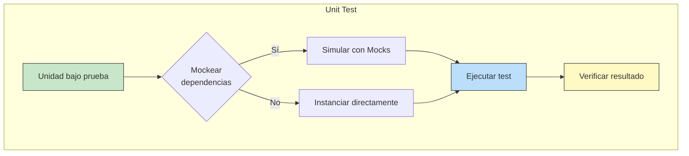
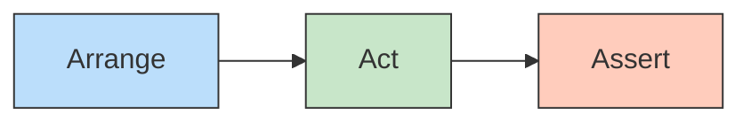
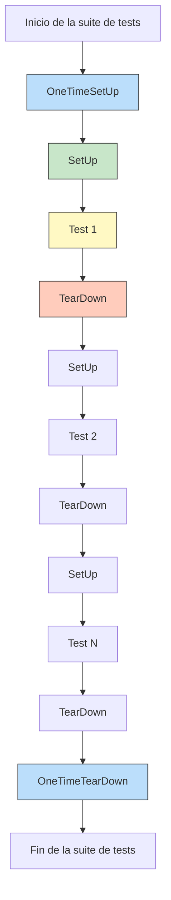
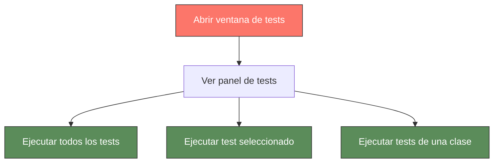

- [8. Pruebas Unitarias](#8-pruebas-unitarias)
  - [8.1. Fundamentos del Testing Unitario](#81-fundamentos-del-testing-unitario)
    - [8.1.1. ¿Qué es una Prueba Unitaria?](#811-qué-es-una-prueba-unitaria)
    - [8.1.2. Los Principios F.I.R.S.T.](#812-los-principios-first)
    - [8.1.3. Estructura de un Test: Patrón AAA](#813-estructura-de-un-test-patrón-aaa)
  - [8.2. NUnit: El Framework de Testing](#82-nunit-el-framework-de-testing)
    - [8.2.1. Instalación de NUnit](#821-instalación-de-nunit)
    - [8.2.2. Atributos de NUnit](#822-atributos-de-nunit)
    - [8.2.3. Ciclo de Vida de un Test](#823-ciclo-de-vida-de-un-test)
  - [8.3. Partes de un Test: SetUp y TearDown](#83-partes-de-un-test-setup-y-teardown)
    - [8.3.1. OneTimeSetUp y OneTimeTearDown](#831-onetimesetup-y-oneteardown)
    - [8.3.2. SetUp y TearDown](#832-setup-y-teardown)
    - [8.3.3. Diferencias Clave](#833-diferencias-clave)
  - [8.4. Organización de Tests](#84-organización-de-tests)
    - [8.4.1. Clases de Test](#841-clases-de-test)
    - [8.4.2. Agrupación por Casos Válidos e Inválidos](#842-agrupación-por-casos-válidos-e-inválidos)
    - [8.4.3. Tests Anidados con NUnit](#843-tests-anidados-con-nunit)
  - [8.5. Tests Parametrizados](#85-tests-parametrizados)
    - [8.5.1. Atributo TestCase](#851-atributo-testcase)
    - [8.5.2. Atributo TestCaseSource](#852-atributo-testcasesource)
    - [8.5.3. Valores Secuenciales con Range](#853-valores-secuenciales-con-range)
  - [8.6. Aserciones con NUnit](#86-aserciones-con-nunit)
    - [8.6.1. Aserciones Básicas](#861-aserciones-básicas)
    - [8.6.2. Aserciones de Colecciones](#862-aserciones-de-colecciones)
    - [8.6.3. Aserciones de Excepciones](#863-aserciones-de-excepciones)
  - [8.7. FluentAssertions](#87-fluentassertions)
    - [8.7.1. Instalación](#871-instalación)
    - [8.7.2. Aserciones de Cadenas](#872-aserciones-de-cadenas)
    - [8.7.3. Aserciones Numéricas](#873-aserciones-numéricas)
    - [8.7.4. Aserciones de Colecciones](#874-aserciones-de-colecciones)
    - [8.7.5. Aserciones de Objetos](#875-aserciones-de-objetos)
    - [8.7.6. Aserciones de Excepciones](#876-aserciones-de-excepciones)
    - [8.7.7. Aserciones Encadenadas](#877-aserciones-encadenadas)
    - [8.7.8. Aserciones de Fechas, Diccionarios y Tipos](#878-aserciones-de-fechas-diccionarios-y-tipos)
    - [8.7.9. Tabla Comparativa: NUnit vs FluentAssertions](#879-tabla-comparativa-nunit-vs-fluentassertions)
    - [8.7.10. Ejemplos Completos con NUnit y FluentAssertions](#8710-ejemplos-completos-con-nunit-y-fluentassertions)
  - [8.8. Ejecutar Tests](#88-ejecutar-tests)
    - [8.8.1. Ejecutar Tests desde la Línea de Comandos](#881-ejecutar-tests-desde-la-línea-de-comandos)
    - [8.8.2. Ejecutar Tests en JetBrains Rider](#882-ejecutar-tests-en-jetbrains-rider)
    - [8.8.3. Opciones de Ejecución](#883-opciones-de-ejecución)
  - [8.9. Configuración Avanzada de Tests](#89-configuración-avanzada-de-tests)
    - [8.9.1. Ignorar Tests](#891-ignorar-tests)
    - [8.9.2. Ordenar Tests](#892-ordenar-tests)
    - [8.9.3. Ejecutar Tests en Paralelo](#893-ejecutar-tests-en-paralelo)
    - [8.9.4. Tests Secuenciales](#894-tests-secuenciales)
  - [8.10. Convenciones de Nomenclatura](#810-convenciones-de-nomenclatura)
  - [8.11. Estructura de Proyecto de Tests Profesional](#811-estructura-de-proyecto-de-tests-profesional)
  - [8.12. Vincular Caja Negra con Tests Unitarios](#812-vincular-caja-negra-con-tests-unitarios)
  - [8.13. TestCaseSource Avanzado](#813-testcasesource-avanzado)
  - [8.14. Atributos Property y Description](#814-atributos-property-y-description)


# 8. Pruebas Unitarias

Las pruebas unitarias son la base de una estrategia de testing efectiva. Permiten verificar que cada unidad de código funciona correctamente de forma aislada, detectando errores tempranamente y facilitando el mantenimiento del software.

---

## 8.1. Fundamentos del Testing Unitario

### 8.1.1. ¿Qué es una Prueba Unitaria?

Una **prueba unitaria** (o unit test) es un tipo de prueba automatizada que verifica el comportamiento de una única unidad de código de forma aislada. Esta unidad suele ser un método o una clase pequeña.

**Características:**
- **Aislamiento:** No depende de bases de datos, archivos, servicios externos ni de otras unidades
- **Automatización:** Se ejecuta sin intervención humana
- **Rapidez:** Se completa en milisegundos
- **Fiabilidad:** Produce el mismo resultado en cualquier entorno



### 8.1.2. Los Principios F.I.R.S.T.

Un test unitario de calidad debe cumplir cinco reglas fundamentales:

| Principio | Significado | Descripción |
|----------|-------------|-------------|
| **F (Fast)** | Rápido | Los tests deben ejecutarse en milisegundos. Si tardan demasiado, el programador deixará de ejecutarlos. |
| **I (Independent)** | Independiente | Un test no depende de otro. Cada test prepara su propio estado y lo limpia al terminar. |
| **R (Repeatable)** | Repetible | Debe devolver el mismo resultado en cualquier entorno (desarrollo, CI, servidor). |
| **S (Self-Validating)** | Auto-validable | El test pasa o falla solo. No requiere intervención humana para verificar el resultado. |
| **T (Timely)** | Oportuno | Se escriben en el momento adecuado. En TDD, se escriben antes que el código de producción. |

#### Profundizando en cada Principio

**F - Fast (Rápido)**

Los tests lentos generan rechazo en el equipo. Un test debe ejecutarse en milisegundos.

```csharp
// ❌ MALO: Test lento que consulta base de datos real
[Test]
public void ObtenerUsuario_UsuarioExistente_RetornaUsuario()
{
    var repo = new SqlUsuarioRepository(); // Conexión real a BD
    var usuario = repo.GetById(1); // Puede tardar segundos
    Assert.That(usuario, Is.Not.Null);
}

// ✅ BUENO: Test rápido con mock
[Test]
public void ObtenerUsuario_UsuarioExistente_RetornaUsuario()
{
    var mockRepo = new Mock<IUsuarioRepository>();
    mockRepo.Setup(r => r.GetById(1)).Returns(new Usuario { Id = 1, Nombre = "Juan" });
    
    var service = new UsuarioService(mockRepo.Object);
    var usuario = service.GetById(1);
    
    Assert.That(usuario.Nombre, Is.EqualTo("Juan")); // Milisegundos
}
```

**I - Independent (Independiente)**

Cada test debe poder ejecutarse de forma aislada, sin importar el orden.

```csharp
// ❌ MALO: Tests que dependen unos de otros
private static int contador = 0;

[Test]
public void TestUno_IncrementaContador()
{
    contador++;
    Assert.That(contador, Is.EqualTo(1));
}

[Test]
public void TestDos_IncrementaContador()
{
    contador++; // Depende de que TestUno se ejecute primero
    Assert.That(contador, Is.EqualTo(2));
}

// ✅ BUENO: Cada test es independiente
private int contador = 0; // Instancia por test

[Test]
public void TestUno_IncrementaContador()
{
    contador++;
    Assert.That(contador, Is.EqualTo(1));
}

[Test]
public void TestDos_IncrementaContador()
{
    contador++; // Cada test tiene su propio contador
    Assert.That(contador, Is.EqualTo(1));
}
```

**R - Repeatable (Repetible)**

El test debe producir el mismo resultado en cualquier momento y lugar.

```csharp
// ❌ MALO: Test que depende de la fecha actual
[Test]
public void EsNuevo_UsuarioCreadoHoy_RetornaTrue()
{
    var usuario = new Usuario { FechaCreacion = DateTime.Now };
    Assert.That(usuario.EsNuevo(), Is.True);
}

// ✅ BUENO: Test que usa fecha fija o configurable
[Test]
public void EsNuevo_UsuarioCreadoHace30Dias_RetornaFalse()
{
    var fechaFija = new DateTime(2024, 1, 1);
    var usuario = new Usuario { FechaCreacion = fechaFija.AddDays(-30) };
    Assert.That(usuario.EsNuevo(), Is.False);
}
```

**S - Self-Validating (Auto-validable)**

El test debe decidir por sí mismo si pasó o falló.

```csharp
// ❌ MALO: Test que requiere verificación manual
[Test]
public void GenerarReporte_GeneraFichero()
{
    var generador = new GeneradorReportes();
    generador.Generar("reporte.pdf");
    
    // ❌ Necesita que alguien verifique el contenido del PDF manualmente
    Assert.Pass("Verificar manualmente que el PDF contiene los datos correctos");
}

// ✅ BUENO: El test se valida solo
[Test]
public void GenerarReporte_GeneraFicheroConDatos()
{
    var generador = new GeneradorReportes();
    string ruta = generador.Generar("reporte.pdf");
    
    Assert.That(File.Exists(ruta), Is.True);
    var contenido = File.ReadAllText(ruta);
    Assert.That(contenido, Does.Contain("Fecha:"));
}
```

**T - Timely (Oportuno)**

Los tests se escriben en el momento adecuado.

- **TDD (Test Driven Development)**: Tests antes del código de producción
- **Post-desarrollo**: Tests después de implementar la funcionalidad

### 8.1.3. Estructura de un Test: Patrón AAA

El patrón **AAA (Arrange, Act, Assert)** estructura cada test en tres bloques claramente diferenciados:



**Ejemplo práctico:**

```csharp
[Test]
public void Sumar_DosNumerosPositivos_RetornaSuma()
{
    // Arrange: Preparar el escenario
    var calculadora = new Calculadora();
    int a = 5;
    int b = 3;
    
    // Act: Ejecutar la acción a probar
    int resultado = calculadora.Sumar(a, b);
    
    // Assert: Verificar el resultado
    Assert.That(resultado, Is.EqualTo(8));
}
```

| Fase | Propósito | Ejemplo |
|------|-----------|---------|
| **Arrange** | Configurar objetos, variables, mocks | `var calculadora = new Calculadora();` |
| **Act** | Ejecutar el método bajo prueba | `int resultado = calculadora.Sumar(a, b);` |
| **Assert** | Verificar que el resultado es el esperado | `Assert.That(resultado, Is.EqualTo(8));` |

> 📝 **Nota:** En BDD (Behavior Driven Development), este patrón se conoce como **Given / When / Then**.

---

## 8.2. NUnit: El Framework de Testing

**NUnit** es un framework de testing ampliamente utilizado en .NET. Es open source y proporciona un conjunto completo de atributos y aserciones para escribir tests de calidad.

### 8.2.1. Instalación de NUnit

Para usar NUnit en un proyecto .NET, necesitamos instalar los siguientes paquetes NuGet:

```bash
# Paquete principal de NUnit
dotnet add package NUnit

# Adaptador para ejecutar tests desde dotnet test
dotnet add package NUnit3TestAdapter

# SDK de testing de Microsoft
dotnet add package Microsoft.NET.Test.Sdk
```

### 8.2.2. Atributos de NUnit

NUnit utiliza **atributos** para marcar y configurar tests:

| Atributo | Descripción |
|----------|-------------|
| `[TestFixture]` | Marca una clase como contiene tests |
| `[Test]` | Marca un método como un caso de prueba |
| `[SetUp]` | Se ejecuta antes de cada test |
| `[TearDown]` | Se ejecuta después de cada test |
| `[OneTimeSetUp]` | Se ejecuta una sola vez antes de todos los tests |
| `[OneTimeTearDown]` | Se ejecuta una sola vez después de todos los tests |
| `[TestCase]` | Define un caso de prueba parametrizado |
| `[TestCaseSource]` | Define casos de prueba desde una fuente externa |
| `[Ignore]` | Ignora un test |
| `[Order]` | Define el orden de ejecución de los tests |
| `[Property]` | Añade propiedades personalizadas al test |

### 8.2.3. Ciclo de Vida de un Test



---

## 8.3. Partes de un Test: SetUp y TearDown

### 8.3.1. OneTimeSetUp y OneTimeTearDown

Se ejecutan **una sola vez** al principio y al final de todos los tests de la clase.

```csharp
[TestFixture]
public class CalculadoraTests
{
    private Calculadora calculadora;
    
    [OneTimeSetUp]
    public void OneTimeSetUp()
    {
        // Se ejecuta UNA VEZ al inicio
        // Útil para inicializar recursos costosos
        Console.WriteLine("Inicializando recursos...");
        calculadora = new Calculadora();
    }
    
    [OneTimeTearDown]
    public void OneTimeTearDown()
    {
        // Se ejecuta UNA VEZ al final
        // Útil para limpiar recursos globales
        Console.WriteLine("Limpiando recursos...");
    }
    
    [Test]
    public void Sumar_DosNumeros_RetornaSuma()
    {
        Assert.That(calculadora.Sumar(2, 3), Is.EqualTo(5));
    }
}
```

**Casos de uso típicos:**
- Inicializar conexiones a bases de datos
- Configurar servicios compartidos
- Cargar archivos de configuración globales
- Limpiar recursos externos al finalizar

### 8.3.2. SetUp y TearDown

Se ejecutan **antes y después de cada test**.

```csharp
[TestFixture]
public class CalculadoraTests
{
    private Calculadora calculadora;
    
    [SetUp]
    public void SetUp()
    {
        // Se ejecuta ANTES de CADA test
        // Prepara el estado para cada test individual
        calculadora = new Calculadora();
    }
    
    [TearDown]
    public void TearDown()
    {
        // Se ejecuta DESPUÉS de CADA test
        // Limpia el estado después de cada test
        calculadora = null;
    }
    
    [Test]
    public void Sumar_DosNumeros_RetornaSuma()
    {
        Assert.That(calculadora.Sumar(2, 3), Is.EqualTo(5));
    }
    
    [Test]
    public void Restar_DosNumeros_RetornaResta()
    {
        Assert.That(calculadora.Restar(5, 3), Is.EqualTo(2));
    }
}
```

**Casos de uso típicos:**
- Crear nuevas instancias para cada test
- Reiniciar estado entre tests
- Inicializar mocks antes de cada test

### 8.3.3. Diferencias Clave

| Característica | OneTimeSetUp/OneTimeTearDown | SetUp/TearDown |
|----------------|------------------------------|----------------|
| **Ejecuciones** | Una vez por clase | Una vez por test |
| **Uso principal** | Recursos costosos/compartidos | Estado individual por test |
| **Acceso a test** | No sabe qué test se ejecuta | Sabe cuál test se ejecuta |
| **Seguridad** | Más riesgo de interdependencia | Mayor aislamiento |

> ⚠️ **Advertencia:** Evita usar `OneTimeSetUp` para compartir estado entre tests. Esto puede crear interdependencias que violan el principio **I (Independent)** de F.I.R.S.T.

---

## 8.4. Organización de Tests

### 8.4.1. Clases de Test

NUnit utiliza el atributo `[TestFixture]` para marcar clases que contienen tests:

```csharp
[TestFixture]
public class CalculadoraTests
{
    [Test]
    public void Sumar_DosNumeros_RetornaSuma() { }
    
    [Test]
    public void Restar_DosNumeros_RetornaResta() { }
}
```

### 8.4.2. Agrupación por Casos Válidos e Inválidos

Es una buena práctica organizar los tests en clases separadas para casos válidos e inválidos:

```csharp
// Tests para casos VÁLIDOS
[TestFixture]
public class CalculadoraTests_CasosValidos
{
    private Calculadora calculadora;
    
    [SetUp]
    public void SetUp() => calculadora = new Calculadora();
    
    [Test]
    public void Sumar_DosNumerosPositivos_RetornaSuma() { }
    
    [Test]
    public void Restar_NumeroMayorMenosMenor_RetornaPositivo() { }
    
    [Test]
    public void Dividir_DosNumeros_RetornaCociente() { }
}

// Tests para casos INVÁLIDOS
[TestFixture]
public class CalculadoraTests_CasosInvalidos
{
    private Calculadora calculadora;
    
    [SetUp]
    public void SetUp() => calculadora = new Calculadora();
    
    [Test]
    public void Dividir_PorCero_ThrowsException() { }
    
    [Test]
    public void Sumar_NumerosNegativos_RetornaNegativo() { }
}
```

### 8.4.3. Tests Anidados con NUnit

NUnit soporta clases anidadas para organizar tests lógicamente:

```csharp
[TestFixture]
public class CalculadoraTests
{
    private Calculadora calculadora;
    
    [SetUp]
    public void SetUp() => calculadora = new Calculadora();
    
    [TestFixture]
    public class TestsDeSuma
    {
        private Calculadora calculadora;
        
        [SetUp]
        public void SetUp() => calculadora = new Calculadora();
        
        [Test]
        public void Sumar_DosNumerosPositivos_RetornaSuma() { }
        
        [Test]
        public void Sumar_NumeroNegativo_RetornaDiferencia() { }
    }
    
    [TestFixture]
    public class TestsDeResta
    {
        private Calculadora calculadora;
        
        [SetUp]
        public void SetUp() => calculadora = new Calculadora();
        
        [Test]
        public void Restar_DosNumeros_RetornaResta() { }
    }
}
```

---

## 8.5. Tests Parametrizados

Los tests parametrizados permiten ejecutar el mismo test con diferentes valores, evitando duplicar código.

### 8.5.1. Atributo TestCase

Permite definir casos de prueba directamente en el atributo:

```csharp
[TestFixture]
public class CalculadoraTests
{
    private Calculadora calculadora;
    
    [SetUp]
    public void SetUp() => calculadora = new Calculadora();
    
    [TestCase(2, 3, 5)]
    [TestCase(10, 5, 15)]
    [TestCase(-5, 5, 0)]
    [TestCase(0, 0, 0)]
    public void Sumar_DosNumeros_RetornaSuma(int a, int b, int esperado)
    {
        int resultado = calculadora.Sumar(a, b);
        Assert.That(resultado, Is.EqualTo(esperado));
    }
    
    // TestCase con descripción
    [TestCase(10, 2, 5, Description = "División exacta")]
    [TestCase(9, 2, 4.5, Description = "División con decimales")]
    [TestCase(-10, 2, -5, Description = "División negativa")]
    public void Dividir_DosNumeros_RetornaCociente(int a, int b, decimal esperado)
    {
        decimal resultado = calculadora.Dividir(a, b);
        Assert.That(resultado, Is.EqualTo(esperado));
    }
}
```

### 8.5.2. Atributo TestCaseSource

Permite definir casos de prueba desde una fuente externa (método, propiedad, etc.):

```csharp
[TestFixture]
public class CalculadoraTests
{
    private Calculadora calculadora;
    
    [SetUp]
    public void SetUp() => calculadora = new Calculadora();
    
    // Fuente de casos de prueba
    private static object[] CasosDeSuma =>
    {
        new object[] { 2, 3, 5 },
        new object[] { 10, 5, 15 },
        new object[] { -5, 5, 0 },
        new object[] { 0, 0, 0 },
        new object[] { 100, 200, 300 }
    };
    
    [TestCaseSource(nameof(CasosDeSuma))]
    public void Sumar_DosNumeros_RetornaSuma(int a, int b, int esperado)
    {
        Assert.That(calculadora.Sumar(a, b), Is.EqualTo(esperado));
    }
    
    // También puede usar un enumerador
    public static IEnumerable<TestCaseData> CasosDeDivision
    {
        get
        {
            yield return new TestCaseData(10, 2, 5).SetName("División exacta");
            yield return new TestCaseData(9, 2, 4.5).SetName("División con decimales");
            yield return new TestCaseData(-10, 2, -5).SetName("División negativa");
        }
    }
    
    [TestCaseSource(nameof(CasosDeDivision))]
    public void Dividir_DosNumeros_RetornaCociente(int a, int b, decimal esperado)
    {
        Assert.That(calculadora.Dividir(a, b), Is.EqualTo(esperado));
    }
}
```

### 8.5.3. Valores Secuenciales con Range

NUnit incluye una forma práctica de generar valores secuenciales:

```csharp
[TestFixture]
public class CalculadoraTests
{
    [Test]
    [TestCaseSource(nameof(GenerateRangeCases))]
    public void Sumar_ConValoresSecuenciales_RetornaSuma(int a, int b)
    {
        var calculadora = new Calculadora();
        int resultado = calculadora.Sumar(a, b);
        Assert.That(resultado, Is.EqualTo(a + b));
    }
    
    private static IEnumerable<int[]> GenerateRangeCases()
    {
        for (int i = 0; i <= 100; i += 10)
        {
            yield return new[] { i, i };
        }
    }
}
```

---

## 8.6. Aserciones con NUnit

Las **aserciones** son las condiciones que verifican que el resultado obtenido es el esperado.

### 8.6.1. Aserciones Básicas

```csharp
[Test]
public void AsercionesBasicas()
{
    int numero = 10;
    string texto = "Hola";
    object objeto = new object();
    
    // Igualdad
    Assert.That(numero, Is.EqualTo(10));
    Assert.That(texto, Is.EqualTo("Hola"));
    
    // Desigualdad
    Assert.That(numero, Is.Not.EqualTo(20));
    
    // Mayor/Menor
    Assert.That(numero, Is.GreaterThan(5));
    Assert.That(numero, Is.LessThan(20));
    Assert.That(numero, Is.GreaterThanOrEqualTo(10));
    Assert.That(numero, Is.LessThanOrEqualTo(10));
    
    // Null
    string cadenaNull = null;
    Assert.That(cadenaNull, Is.Null);
    Assert.That(texto, Is.Not.Null);
    
    // Rangos
    Assert.That(numero, Is.InRange(1, 100));
    
    // Tipo
    Assert.That(objeto, Is.TypeOf<object>());
}
```

### 8.6.2. Aserciones de Colecciones

```csharp
[Test]
public void AsercionesDeColecciones()
{
    var lista = new List<int> { 1, 2, 3, 4, 5 };
    var nombres = new List<string> { "Juan", "Ana", "Carlos" };
    
    // Contains
    Assert.That(lista, Does.Contain(3));
    Assert.That(nombres, Does.Contain("Juan"));
    
    // No Contains
    Assert.That(lista, Does.Not.Contain(10));
    
    // Cantidad
    Assert.That(lista, Is.Empty);
    Assert.That(nombres, Is.Not.Empty);
    Assert.That(lista, Has.Count.EqualTo(5));
    
    // Contains con condición
    Assert.That(nombres, Has.All.Not.Empty);
    Assert.That(lista, Has.Some.GreaterThan(3));
    
    // Orden
    Assert.That(lista, Is.Ordered);
    Assert.That(nombres, Is.Ordered);
    
    // Subconjunto
    Assert.That(lista, Is.EquivalentTo(new[] { 1, 2, 3, 4, 5 }));
}
```

### 8.6.3. Aserciones de Excepciones

```csharp
[Test]
public void AsercionesDeExcepciones()
{
    var calculadora = new Calculadora();
    
    // Verificar que se lanza una excepción específica
    Assert.Throws<DivideByZeroException>(() => calculadora.Dividir(10, 0));
    
    // Verificar que no se lanza excepción
    Assert.DoesNotThrow(() => calculadora.Sumar(5, 3));
    
    // Capturar y verificar la excepción
    var ex = Assert.Throws<ArgumentException>(() => calculadora.Dividir(-5, 0));
    Assert.That(ex.Message, Does.Contain("negativo"));
    
    // Verificar excepción asíncrona
    Assert.ThrowsAsync<InvalidOperationException>(async () => await MetodoAsincrono());
}
```

---

## 8.7. FluentAssertions

**FluentAssertions** es una librería que proporciona aserciones más legibles y expresivas. Su sintaxis fluida hace que los tests se lean como frases en inglés natural.

### 8.7.1. Instalación

```bash
dotnet add package FluentAssertions
```

### 8.7.2. Aserciones de Cadenas

```csharp
[Test]
public void StringAssertions()
{
    string nombre = "Juan García";
    
    // Verificaciones básicas
    nombre.Should().NotBeNull();
    nombre.Should().NotBeEmpty();
    nombre.Should().Be("Juan García");
    nombre.Should().NotBe("Pedro");
    
    // Verificaciones de contenido
    nombre.Should().StartWith("Juan");
    nombre.Should().EndWith("García");
    nombre.Should().Contain("García");
    nombre.Should().NotContain("López");
    nombre.Should().Contain("Juan","Because it's the first name");
    
    // Longitud
    nombre.Should().HaveLength(11);
    nombre.Should().NotBeEmpty();
    
    // Patrones
    nombre.Should().Match("* *"); // Espacios en blanco
    nombre.Should().MatchRegex(@"^[A-Z][a-z]+\s[A-Z][a-z]+$");
}
```

### 8.7.3. Aserciones Numéricas

```csharp
[Test]
public void NumericAssertions()
{
    int edad = 25;
    decimal precio = 19.99m;
    
    // Verificaciones básicas
    edad.Should().Be(25);
    edad.Should().NotBe(0);
    
    // Comparaciones
    edad.Should().BePositive();
    edad.Should().BeGreaterThan(18);
    edad.Should().BeLessThan(100);
    edad.Should().BeGreaterThanOrEqualTo(25);
    edad.Should().BeLessThanOrEqualTo(25);
    
    // Rangos
    edad.Should().BeInRange(18, 65);
    precio.Should().BeApproximately(20.0m, 0.01m);
    
    // Múltiplos
    edad.Should().BeInRange(0, 120);
}
```

### 8.7.4. Aserciones de Colecciones

```csharp
[Test]
public void CollectionAssertions()
{
    var personas = new List<Persona>
    {
        new Persona("Juan", 25),
        new Persona("Ana", 30),
        new Persona("Carlos", 25)
    };
    
    // Verificaciones básicas
    personas.Should().NotBeEmpty();
    personas.Should().HaveCount(3);
    personas.Should().HaveCountGreaterThan(1);
    personas.Should().HaveCountLessThan(10);
    
    // Contenido
    personas.Should().Contain(p => p.Nombre == "Juan");
    personas.Should().ContainSingle(p => p.Edad == 30);
    personas.Should().OnlyContain(p => p.Edad > 0);
    personas.Should().NotContain(p => p.Edad < 0);
    
    // Orden
    personas.Should().BeInAscendingOrder(p => p.Nombre);
    personas.Should().BeInDescendingOrder(p => p.Edad);
    
    // Subconjuntos
    var subLista = new List<Persona> { personas[0] };
    personas.Should().Contain(subLista);
}
```

### 8.7.5. Aserciones de Objetos

```csharp
[Test]
public void ObjectAssertions()
{
    var persona1 = new Persona("Juan", 25);
    var persona2 = new Persona("Juan", 25);
    var persona3 = new Persona("Ana", 30);
    
    // Verificaciones básicas
    persona1.Should().NotBeNull();
    persona1.Should().BeOfType<Persona>();
    persona1.Should().NotBeOfType<string>();
    
    // Equivalencia
    persona1.Should().BeEquivalentTo(persona2);
    persona1.Should().NotBeEquivalentTo(persona3);
    
    // Propiedades
    persona1.Should().HaveProperty<string>("Nombre");
    persona1.Should().HaveProperty<int>("Edad");
    persona1.Nombre.Should().Be("Juan");
    persona1.Edad.Should().Be(25);
}

public class Persona
{
    public string Nombre { get; set; }
    public int Edad { get; set; }
}
```

### 8.7.6. Aserciones de Excepciones

```csharp
[Test]
public void ExceptionAssertions()
{
    var calculadora = new Calculadora();
    
    // Verificar que se lanza excepción
    Action accion = () => calculadora.Dividir(10, 0);
    accion.Should().Throw<DivideByZeroException>();
    
    // Verificar mensaje de excepción
    accion.Should()
        .Throw<DivideByZeroException>()
        .WithMessage("No se puede dividir por cero");
    
    // Verificar que no se lanza excepción
    Action accionValida = () => calculadora.Sumar(5, 3);
    accionValida.Should().NotThrow();
    
    // Excepciones anidadas
    Action accionAnidada = () => throw new InvalidOperationException("Error interno");
    accionAnidada.Should()
        .Throw<InvalidOperationException>()
        .WithMessage("Error interno");
}
```

### 8.7.7. Aserciones Encadenadas

Una de las ventajas de FluentAssertions es la posibilidad de encadenar aserciones:

```csharp
[Test]
public void ChainedAssertions()
{
    var resultado = new Resultado
    {
        Success = true,
        Data = new List<string> { "a", "b" },
        Message = "OK"
    };
    
    // Encadenar aserciones
    resultado.Should()
        .NotBeNull()
        .And
        .HaveProperty<bool>("Success")
        .Which.Should().BeTrue();
    
    resultado.Data.Should()
        .NotBeEmpty()
        .And
        .HaveCount(2)
        .And
        .Contain("a");
    
    resultado.Should()
        .Match(r => r.Success == true && r.Data.Count > 0);
}
```

---

## 8.8. Ejecutar Tests

### 8.8.1. Ejecutar Tests desde la Línea de Comandos

```bash
# Ejecutar todos los tests
dotnet test

# Ejecutar un proyecto específico
dotnet test /ruta/al/proyecto/Tests.csproj

# Ejecutar un test específico por nombre
dotnet test --filter "FullyQualifiedName~CalculadoraTests"

# Ejecutar con cobertura
dotnet test --collect:"XPlat Code Coverage"

# Ejecutar en paralelo
dotnet test --parallel

# Ver información detallada
dotnet test --verbosity normal

# Generar reporte de cobertura
dotnet test --collect:"XPlat Code Coverage" -p:CollectCoverage=true
```

### 8.8.2. Ejecutar Tests en JetBrains Rider

Rider proporciona una integración excelente con NUnit:



**Atajos de teclado:**
- **Ctrl + F5**: Ejecutar todos los tests
- **Shift + F10**: Ejecutar el test bajo el cursor
- **Ctrl + Shift + F10**: Ejecutar tests de la clase actual

**Pasos en Rider:**
1. Abrir el panel de Tests: `Alt + 2` (Windows/Linux) o `Cmd + 2` (Mac)
2. Navegar por la estructura de tests
3. Hacer clic derecho para ejecutar:
   - Run All Tests
   - Run Selected Tests
   - Debug Tests

### 8.8.3. Opciones de Ejecución

| Opción | Comando | Descripción |
|--------|---------|-------------|
| Ejecutar todos | `dotnet test` | Ejecuta toda la suite de tests |
| Filtrar por nombre | `--filter "Name=Sumar"` | Ejecuta solo tests cuyo nombre contenga "Sumar" |
| Filtrar por clase | `--filter "FullyQualifiedName~CalculadoraTests"` | Ejecuta tests de una clase específica |
| Modo verbose | `--verbosity detailed` | Muestra salida detallada |
| Stop on fail | `--stop-on-failure` | Detiene la ejecución al primer fallo |

---

## 8.9. Configuración Avanzada de Tests

### 8.9.1. Ignorar Tests

```csharp
// Ignorar un test específico
[Ignore("Razón por la que se ignora")]
[Test]
public void TestIgnorado()
{
    Assert.Pass();
}

// Ignorar con condición
[Test]
[Ignore("No implementado aún")]
public void TestNoImplementado()
{
    // Este test no se ejecutará
}

// Ignorar dinámicamente (durante ejecución)
[Test]
public void TestCondicional()
{
    if (!System.Diagnostics.Debugger.IsAttached)
    {
        Assert.Ignore("Solo se ejecuta en modo depuración");
    }
}
```

### 8.9.2. Ordenar Tests

```csharp
[TestFixture]
[Order(1)] // Se ejecuta primero que la clase sin Order
public class PrimerTest
{
    [Test, Order(1)]
    public void TestUno() { }
    
    [Test, Order(2)]
    public void TestDos() { }
}

[TestFixture]
[Order(2)] // Se ejecuta después
public class SegundoTest
{
    [Test]
    public void TestTres() { }
}
```

### 8.9.3. Ejecutar Tests en Paralelo

NUnit permite ejecutar tests en paralelo para mejorar el rendimiento:

```csharp
// A nivel de ensamblado (AssemblyInfo.cs)
[assembly: Parallelizable(ParallelScope.Fixtures)]

// A nivel de clase
[TestFixture, Parallelizable(ParallelScope.All)]
public class CalculadoraTests
{
    [Test]
    public void Test1() { }
    
    [Test]
    public void Test2() { }
}

// A nivel de test individual
[Test, Parallelizable(ParallelScope.None)]
public void TestSecuencial()
{
    // Este test no se ejecutará en paralelo
}
```

**Niveles de paralelismo:**

| Nivel | Descripción |
|-------|-------------|
| `ParallelScope.None` | No ejecutar en paralelo |
| `ParallelScope.Self` | Solo este test en paralelo con otros |
| `ParallelScope.Fixtures` | Tests de diferentes fixtures en paralelo |
| `ParallelScope.All` | Máximo paralelismo |

### 8.9.4. Tests Secuenciales

Para casos donde los tests deben ejecutarse en orden:

```csharp
[TestFixture]
[Parallelizable(ParallelScope.None)] // Desactivar paralelismo
[Sequence]
public class TestsSecuenciales
{
    private static int contador = 0;
    
    [Test]
    public void TestUno()
    {
        contador++;
        Assert.That(contador, Is.EqualTo(1));
    }
    
    [Test]
    public void TestDos()
    {
        contador++;
        Assert.That(contador, Is.EqualTo(2));
    }
}
```

> ⚠️ **Advertencia:** Los tests secuenciales pueden generar dependencias implícitas. Es preferible diseñar tests independientes.

---

## 8.10. Convenciones de Nomenclatura

Una buena nomenclatura hace que los tests sean auto-documentados:

```csharp
// Formato recomendado: Metodo_Escenario_ResultadoEsperado

[TestFixture]
public class CalculadoraTests
{
    [Test]
    public void Sumar_DosNumerosPositivos_RetornaSumaCorrecta() { }
    
    [Test]
    public void Sumar_NumeroPositivoYNegativo_RetornaDiferencia() { }
    
    [Test]
    public void Dividir_PorCero_ThrowsDivideByZeroException() { }
    
    [Test]
    public void Dividir_NumeroValido_RetornaCocienteCorrecto() { }
    
    [Test]
    public void ObtenerEstudiante_IdExistente_RetornaEstudiante() { }
    
    [Test]
    public void ObtenerEstudiante_IdNoExistente_RetornaNull() { }
}
```

**Componentes del nombre:**
1. **Método**: Nombre del método bajo prueba
2. **Escenario**: Condición o entrada específica
3. **Resultado**: Salida o comportamiento esperado

---

## 8.11. Estructura de Proyecto de Tests Profesional

Un proyecto de tests bien organizado facilita el mantenimiento y la navegación. Aquí tienes una estructura profesional:

```
MiProyecto/
├── src/
│   └── MiProyecto/
│       ├── Services/
│       │   └── UsuarioService.cs
│       ├── Models/
│       │   └── Usuario.cs
│       └── ...
├── tests/
│   └── MiProyecto.Tests/
│       ├── Usings.cs
│       ├── MiProyecto.Tests.csproj
│       ├── Services/
│       │   ├── UsuarioServiceTests.cs
│       │   └── PedidoServiceTests.cs
│       ├── Models/
│       │   └── UsuarioTests.cs
│       └── Fixtures/
│           └── TestFixtures.cs
└── README.md
```

### Archivo Usings.cs

```csharp
global using NUnit.Framework;
global using FluentAssertions;
global using Moq;
```

### Nombre del Proyecto

Convention: `[ProyectoOriginal].Tests`

| Proyecto | Proyecto de Tests |
|----------|-------------------|
| `MiProyecto.Domain` | `MiProyecto.Domain.Tests` |
| `MiProyecto.Services` | `MiProyecto.Services.Tests` |
| `MiProyecto.Api` | `MiProyecto.Api.Tests` |

### Referencias entre Proyectos

```xml
<!-- MiProyecto.Tests.csproj -->
<Project Sdk="Microsoft.NET.Sdk">
  <PropertyGroup>
    <TargetFramework>net10.0</TargetFramework>
    <ImplicitUsings>enable</ImplicitUsings>
    <Nullable>enable</Nullable>
    <IsPackable>false</IsPackable>
  </PropertyGroup>

  <ItemGroup>
    <PackageReference Include="Microsoft.NET.Test.Sdk" Version="17.8.0" />
    <PackageReference Include="NUnit" Version="3.14.0" />
    <PackageReference Include="NUnit3TestAdapter" Version="4.5.0" />
    <PackageReference Include="FluentAssertions" Version="6.12.0" />
    <PackageReference Include="Moq" Version="4.20.70" />
    <PackageReference Include="coverlet.collector" Version="6.0.0" />
  </ItemGroup>

  <ItemGroup>
    <ProjectReference Include="..\..\src\MiProyecto.Domain\MiProyecto.Domain.csproj" />
  </ItemGroup>
</Project>
```

### Carpeta Fixtures

Los **Fixtures** son clases que proporcionan datos o configuración reusable para múltiples tests:

```csharp
namespace MiProyecto.Tests.Fixtures;

public class UsuarioFixtures
{
    public static Usuario UsuarioValido() => new Usuario
    {
        Id = 1,
        Nombre = "Juan",
        Email = "juan@email.com",
        Activo = true
    };
    
    public static Usuario UsuarioInactivo() => new Usuario
    {
        Id = 2,
        Nombre = "Ana",
        Email = "ana@email.com",
        Activo = false
    };
    
    public static IEnumerable<Usuario> ListaUsuarios() => new List<Usuario>
    {
        UsuarioValido(),
        UsuarioInactivo(),
        new Usuario { Id = 3, Nombre = "Carlos", Email = "carlos@email.com" }
    };
}
```

### Uso de Fixtures en Tests

```csharp
[TestFixture]
public class UsuarioServiceTests
{
    [Test]
    public void ObtenerUsuarios_ExistenUsuarios_RetornaLista()
    {
        // Arrange
        var usuarios = UsuarioFixtures.ListaUsuarios();
        
        // Act & Assert
        usuarios.Should().HaveCount(3);
    }
}
```

---

## 8.12. Vincular Caja Negra con Tests Unitarios

En el tema anterior (Caja Negra) aprendimos a diseñar casos de prueba desde los requisitos. Ahora veamos cómo convertir esas tablas de casos de prueba en tests NUnit reales.

### Ejemplo: Sistema de Notas

Del tema de Caja Negra, teníamos la siguiente tabla de casos de prueba:

| ID | Caso de Prueba | Entrada | Resultado Esperado |
|----|---------------|---------|-------------------|
| T1 | Nota muy baja | -5 | Error: "Nota inválida" |
| T3 | Límite inferior 0 | 0 | "Suspenso" |
| T6 | Límite 5 | 5 | "Aprobado" |
| T9 | Límite 7 | 7 | "Notable" |
| T12 | Límite 9 | 9 | "Sobresaliente" |
| T14 | Límite 10 | 10 | "Sobresaliente" |
| T15 | Nota muy alta | 11 | Error: "Nota inválida" |

**Conversión a Tests NUnit:**

```csharp
// Clase a probar (del tema de Caja Negra)
public static class Calificacion
{
    public static string Calcular(int nota)
    {
        if (nota < 0 || nota > 10)
            return "Error: Nota inválida";
        else if (nota <= 4)
            return "Suspenso";
        else if (nota <= 6)
            return "Aprobado";
        else if (nota <= 8)
            return "Notable";
        else
            return "Sobresaliente";
    }
}

// Tests generados desde la tabla de Caja Negra
[TestFixture]
public class CalificacionTests_CajaNegra
{
    // Tests paramétricos basados en la tabla de casos de prueba
    [TestCase(-5, "Error: Nota inválida", Description = "T1: Nota muy baja")]
    [TestCase(-1, "Error: Nota inválida", Description = "T2: Nota negativa")]
    [TestCase(0, "Suspenso", Description = "T3: Límite inferior 0")]
    [TestCase(1, "Suspenso", Description = "T4: Centro Suspenso")]
    [TestCase(4, "Suspenso", Description = "T5: Límite 4")]
    [TestCase(5, "Aprobado", Description = "T6: Límite 5")]
    [TestCase(6, "Aprobado", Description = "T7: Centro Aprobado")]
    [TestCase(7, "Notable", Description = "T8: Límite 7")]
    [TestCase(8, "Notable", Description = "T9: Centro Notable")]
    [TestCase(9, "Sobresaliente", Description = "T10: Límite 9")]
    [TestCase(10, "Sobresaliente", Description = "T11: Límite 10")]
    [TestCase(11, "Error: Nota inválida", Description = "T12: Nota muy alta")]
    public void Calcular_Nota_RetornaCalificacion(int nota, string esperado)
    {
        string resultado = Calificacion.Calcular(nota);
        Assert.That(resultado, Is.EqualTo(esperado));
    }
}
```

### Ejemplo: Sistema de Descuentos

Del tema de Caja Negra, teníamos el sistema de descuentos:

| Importe | Descuento Esperado |
|---------|-------------------|
| 0 - 50€ | 0% |
| 50,01 - 100€ | 5% |
| 100,01 - 200€ | 10% |
| 200,01 - 500€ | 15% |
| > 500€ | 20% |

**Conversión a Tests:**

```csharp
public static class Descuento
{
    public static decimal Calcular(decimal importe)
    {
        if (importe <= 0) return 0;
        else if (importe <= 50) return 0;
        else if (importe <= 100) return 0.05m;
        else if (importe <= 200) return 0.10m;
        else if (importe <= 500) return 0.15m;
        else return 0.20m;
    }
}

[TestFixture]
public class DescuentoTests_CajaNegra
{
    // Casos válidos - valores representante de cada partición
    [TestCase(0, 0m, Description = "Límite inferior válido")]
    [TestCase(25, 0m, Description = "Centro: sin descuento")]
    [TestCase(50, 0m, Description = "Límite: sin descuento")]
    [TestCase(50.01m, 0.05m, Description = "Límite: descuento 5%")]
    [TestCase(75, 0.05m, Description = "Centro: descuento 5%")]
    [TestCase(100, 0.05m, Description = "Límite: descuento 5%")]
    [TestCase(100.01m, 0.10m, Description = "Límite: descuento 10%")]
    [TestCase(150, 0.10m, Description = "Centro: descuento 10%")]
    [TestCase(200, 0.10m, Description = "Límite: descuento 10%")]
    [TestCase(200.01m, 0.15m, Description = "Límite: descuento 15%")]
    [TestCase(350, 0.15m, Description = "Centro: descuento 15%")]
    [TestCase(500, 0.15m, Description = "Límite: descuento 15%")]
    [TestCase(500.01m, 0.20m, Description = "Límite: descuento 20%")]
    [TestCase(1000, 0.20m, Description = "Centro: descuento 20%")]
    
    // Casos inválidos - valores fuera de rango
    [TestCase(-10, 0m, Description = "Importe negativo")]
    [TestCase(-0.01m, 0m, Description = "Importe casi negativo")]
    
    public void Calcular_Importe_RetornaDescuento(decimal importe, decimal esperado)
    {
        decimal resultado = Descuento.Calcular(importe);
        Assert.That(resultado, Is.EqualTo(esperado));
    }
}
```

### Ejemplo: Sistema de Login

**Conversión de la tabla de decisión a tests:**

```csharp
public class ResultadoLogin
{
    public bool Exito { get; set; }
    public string Mensaje { get; set; } = "";
}

public class LoginService
{
    private readonly Dictionary<string, string> _usuarios = new()
    {
        { "juan@email.com", "password123" }
    };
    
    private int _intentosFallidos = 0;
    
    public ResultadoLogin Autenticar(string email, string password)
    {
        if (_intentosFallidos >= 3)
            return new ResultadoLogin { Exito = false, Mensaje = "Cuenta bloqueada" };
            
        if (!_usuarios.ContainsKey(email))
            return new ResultadoLogin { Exito = false, Mensaje = "Usuario no encontrado" };
            
        if (_usuarios[email] != password)
        {
            _intentosFallidos++;
            return new ResultadoLogin { Exito = false, Mensaje = "Contraseña incorrecta" };
        }
        
        _intentosFallidos = 0;
        return new ResultadoLogin { Exito = true, Mensaje = "Acceso concedido" };
    }
}

[TestFixture]
public class LoginServiceTests_CajaNegra
{
    private LoginService _service;
    
    [SetUp]
    public void SetUp() => _service = new LoginService();
    
    // Tabla de decisión: Credenciales válidas
    [TestCase("juan@email.com", "password123", true, "Acceso concedido")]
    [TestCase("noexiste@email.com", "password123", false, "Usuario no encontrado")]
    [TestCase("juan@email.com", "wrongpass", false, "Contraseña incorrecta")]
    
    public void Autenticar_SegunCredenciales_RetornaResultado(
        string email, string password, bool esperadoExito, string esperadoMensaje)
    {
        var resultado = _service.Autenticar(email, password);
        
        Assert.That(resultado.Exito, Is.EqualTo(esperadoExito));
        Assert.That(resultado.Mensaje, Is.EqualTo(esperadoMensaje));
    }
}
```

---

## 8.13. TestCaseSource Avanzado

El atributo `TestCaseSource` permite definir casos de prueba desde fuentes externas más complejas.

### Usar un Método Estático

```csharp
public static class DatosPrueba
{
    public static IEnumerable<TestCaseData> CasosSuma()
    {
        yield return new TestCaseData(2, 3, 5).SetName("Positivos pequeños");
        yield return new TestCaseData(100, 200, 300).SetName("Positivos grandes");
        yield return new TestCaseData(-5, 5, 0).SetName("Opuestos");
        yield return new TestCaseData(0, 0, 0).SetName("Ceros");
        yield return new TestCaseData(int.MaxValue, 1, (long)int.MaxValue + 1)
            .SetName("Límite overflow");
    }
}

[TestFixture]
public class CalculadoraTests_Avanzado
{
    [TestCaseSource(typeof(DatosPrueba), nameof(DatosPrueba.CasosSuma))]
    public void Sumar_Casos_RetornaSuma(int a, int b, long esperado)
    {
        var calc = new Calculadora();
        long resultado = calc.Sumar(a, b);
        Assert.That(resultado, Is.EqualTo(esperado));
    }
}
```

### Generación Dinámica de Casos

```csharp
public static class GeneradorCasos
{
    // Generar casos desde un rango
    public static IEnumerable<TestCaseData> CasosRangoEntero(int inicio, int fin)
    {
        for (int i = inicio; i <= fin; i++)
        {
            yield return new TestCaseData(i, i * 2)
                .SetName($"Doble de {i}");
        }
    }
    
    // Generar casos desde una colección
    public static IEnumerable<TestCaseData> CasosDivision =>
        new List<TestCaseData>
        {
            new(10, 2, 5),
            new(9, 2, 4.5m),
            new(100, 4, 25),
            new(7, 3, 2.333m)
        };
    
    // Casos con atributos complejos
    public static IEnumerable<TestCaseData> CasosEmail()
    {
        yield return new TestCaseData("test@email.com", true)
            .SetName("Email válido")
            .SetCategory("Email");
            
        yield return new TestCaseData("invalid", false)
            .SetName("Email sin @")
            .SetCategory("Email");
            
        yield return new TestCaseData("", false)
            .SetName("Email vacío")
            .SetCategory("Email");
    }
}

[TestFixture]
public class GeneradorCasosTests
{
    [TestCaseSource(typeof(GeneradorCasos), nameof(GeneradorCasos.CasosRangoEntero), 
        new object[] { 1, 10 })]
    public void Double_Generado_RetornaDouble(int input, int esperado)
    {
        var calc = new Calculadora();
        Assert.That(calc.Multiplicar(input, 2), Is.EqualTo(esperado));
    }
    
    [TestCaseSource(typeof(GeneradorCasos), nameof(GeneradorCasos.CasosDivision))]
    public void Dividir_Casos_RetornaCociente(decimal a, decimal b, decimal esperado)
    {
        var calc = new Calculadora();
        Assert.That(calc.Dividir(a, b), Is.EqualTo(esperado));
    }
    
    [TestCaseSource(typeof(GeneradorCasos), nameof(GeneradorCasos.CasosEmail))]
    public void ValidarEmail_Casos_RetornaBool(string email, bool esperado)
    {
        var validador = new Validador();
        Assert.That(validador.ValidarEmail(email), Is.EqualTo(esperado));
    }
}
```

### Combinar Múltiples Fuentes

```csharp
public static class FuentesCombinadas
{
    public static IEnumerable<TestCaseData> CasosValidos => new[]
    {
        new TestCaseData(1, 2, 3).SetName("Valido: 1+2=3"),
        new TestCaseData(10, 20, 30).SetName("Valido: 10+20=30"),
    };
    
    public static IEnumerable<TestCaseData> CasosInvalidos => new[]
    {
        new TestCaseData(-1, 2, 0).SetName("Invalido: negativo"),
        new TestCaseData(int.MaxValue, 1, 0).SetName("Invalido: overflow"),
    };
}

[TestFixture]
public class TestsCombinados
{
    [TestCaseSource(typeof(FuentesCombinadas), nameof(FuentesCombinadas.CasosValidos))]
    [TestCaseSource(typeof(FuentesCombinadas), nameof(FuentesCombinadas.CasosInvalidos))]
    public void Sumar_CasosCombinados_RetornaResultado(int a, int b, int esperado)
    {
        var calc = new Calculadora();
        Assert.That(calc.Sumar(a, b), Is.EqualTo(esperado));
    }
}
```

### Usar Propiedades Estáticas

```csharp
public static class Datos
{
    public static IEnumerable<string> NombresValidos => new[]
    {
        "Juan",
        "María José",
        "123" // Nombres válidos según ciertos criterios
    };
    
    public static IEnumerable<string> EmailsPrueba => new[]
    {
        "a@b.com",
        "test@domain.org"
    };
}

[TestFixture]
public class TestsPropiedades
{
    [Test, TestCaseSource(typeof(Datos), nameof(Datos.NombresValidos))]
    public void ValidarNombre_Valido_RetornaTrue(string nombre)
    {
        // Test
    }
    
    [Test, TestCaseSource(typeof(Datos), nameof(Datos.EmailsPrueba))]
    public void ValidarEmail_Datos_RetornaBool(string email)
    {
        // Test
    }
}
```

---

## 8.14. Atributos Property y Description

NUnit proporciona atributos para añadir metadata y documentación a los tests.

### Atributo Description

Añade una descripción legible a un test:

```csharp
[TestFixture]
public class DescripcionTests
{
    [Test]
    [Description("Verifica que la suma de 2+3 es igual a 5")]
    public void Sumar_DosMasTres_RetornaCinco()
    {
        Assert.That(2 + 3, Is.EqualTo(5));
    }
}
```

**En el resultado del test:**
```
Verifica que la suma de 2+3 es igual a 5
```

### Atributo Property

Añade propiedades personalizadas que pueden usarse para filtrar o categorizar:

```csharp
[TestFixture]
public class PropertyTests
{
    [Test]
    [Property("Priority", 1)]
    [Property("Category", "Smoke")]
    public void TestPrioritario()
    {
        Assert.Pass();
    }
    
    [Test]
    [Property("Priority", 3)]
    [Property("Category", "Regression")]
    public void TestSecundario()
    {
        Assert.Pass();
    }
    
    [Test]
    [Property("Ticket", "JIRA-123")]
    [Property("Author", "Juan")]
    public void TestConTicket()
    {
        Assert.Pass();
    }
}
```

**Filtrar por propiedad:**

```bash
# Ejecutar solo tests con Priority = 1
dotnet test --filter "Property.Priority=1"

# Ejecutar tests de categoría Smoke
dotnet test --filter "Property.Category=Smoke"

# Ejecutar tests con un ticket específico
dotnet test --filter "Property.Ticket=JIRA-123"
```

### Combinar Description y Property

```csharp
[Test]
[Description("Verifica el cálculo de descuento para clientes VIP")]
[Property("Priority", 1)]
[Property("Category", "Negocio")]
[Property("Ticket", "JIRA-456")]
public void CalcularDescuento_ClienteVIP_Retorna20Porciento()
{
    // Test
}
```

### Atributo Author

```csharp
[Test]
[Author("José Luis González")]
[Author("Juan Pérez")]
public void TestConMultiplesAutores()
{
    Assert.Pass();
}
```

### Atributo Timeout

Establece un timeout máximo para un test:

```csharp
[Test]
[Timeout(1000)] // 1000 milisegundos = 1 segundo
public void TestConTimeout()
{
    // Si tarda más de 1 segundo, falla
    Thread.Sleep(500);
    Assert.Pass();
}
```

### Atributo Retry

Reintenta el test si falla (útil para tests flaky):

```csharp
[Test]
[Retry(3)] // Reintenta hasta 3 veces
public void TestConReintento()
{
    // Puede fallar temporalmente peroEventually pasa
    Assert.Pass();
}
```

### Atributo MaxTime

Establece un tiempo máximo esperado (warning si se pasa):

```csharp
[Test]
[MaxTime(100)] // Warning si tarda más de 100ms
public void TestOptimizado()
{
    var resultado = MetodoRapido();
    Assert.That(resultado, Is.Not.Null);
}
```

---

## 8.7.8. Aserciones de Fechas, Diccionarios y Tipos

FluentAssertions tiene muchas más capacidades de las que hemos visto. Aquí hay ejemplos avanzados:

### Aserciones de Fechas

```csharp
[Test]
public void DateTimeAssertions()
{
    var fechaNacimiento = new DateTime(1990, 5, 15);
    var ahora = DateTime.Now;
    var fechaFutura = DateTime.Now.AddDays(1);
    
    // Verificaciones básicas
    fechaNacimiento.Should().NotBeDefault();
    ahora.Should().NotBeNull();
    
    // Comparaciones
    fechaNacimiento.Should().BeAfter(new DateTime(1980, 1, 1));
    fechaNacimiento.Should().BeBefore(new DateTime(2000, 1, 1));
    fechaNacimiento.Should().BeOnOrAfter(new DateTime(1990, 5, 15));
    fechaNacimiento.Should().BeOnOrBefore(new DateTime(1990, 5, 15));
    
    // Rangos
    fechaNacimiento.Should().BeBetween(new DateTime(1985, 1, 1), new DateTime(1995, 12, 31));
    
    // Cercanía
    ahora.Should().BeCloseTo(DateTime.Now, TimeSpan.FromSeconds(5));
    
    // Fecha futura/pasada
    fechaFutura.Should().BeGreaterThan(DateTime.Now);
    fechaNacimiento.Should().BeLessThan(DateTime.Now);
    
    // Propiedades específicas
    fechaNacimiento.Year.Should().Be(1990);
    fechaNacimiento.Month.Should().Be(5);
    fechaNacimiento.Day.Should().Be(15);
}
```

### Aserciones de Diccionarios

```csharp
[Test]
public void DictionaryAssertions()
{
    var diccionario = new Dictionary<string, int>
    {
        ["Juan"] = 25,
        ["Ana"] = 30,
        ["Carlos"] = 28
    };
    
    // Verificaciones básicas
    diccionario.Should().NotBeEmpty();
    diccionario.Should().HaveCount(3);
    diccionario.Should().NotBeNull();
    
    // Contenido
    diccionario.Should().ContainKey("Juan");
    diccionario.Should().ContainKey("Ana");
    diccionario.Should().ContainValue(25);
    diccionario.Should().Contain(new KeyValuePair<string, int>("Juan", 25));
    
    // No contenido
    diccionario.Should().NotContainKey("Pedro");
    diccionario.Should().NotContainValue(100);
    
    // Filtrar
    diccionario.Should().ContainKeys("Juan", "Ana");
    diccionario.Should().ContainValues(25, 30);
    
    // Acceso
    diccionario["Juan"].Should().Be(25);
}
```

### Aserciones de Tipos Anónimos

```csharp
[Test]
public void AnonymousTypeAssertions()
{
    var persona = new { Nombre = "Juan", Edad = 25, Email = "juan@email.com" };
    
    // Verificar tipo
    persona.Should().BeOfType<AnonymousType>();
    persona.Should().BeAssignableTo<object>();
    
    // Propiedades
    persona.Should().HaveProperty<string>("Nombre");
    persona.Should().HaveProperty<int>("Edad");
    
    // Valores
    persona.Nombre.Should().Be("Juan");
    persona.Edad.Should().Be(25);
}
```

### Aserciones de Booleanos

```csharp
[Test]
public void BooleanAssertions()
{
    bool activo = true;
    bool eliminado = false;
    
    // Verificaciones
    activo.Should().BeTrue();
    activo.Should().NotBeFalse();
    eliminado.Should().BeFalse();
    eliminado.Should().NotBeTrue();
}
```

### Aserciones de Guids

```csharp
[Test]
public void GuidAssertions()
{
    var guid = Guid.NewGuid();
    var guidVacio = Guid.Empty;
    var guidFijo = new Guid("12345678-1234-1234-1234-123456789012");
    
    // Verificaciones
    guid.Should().NotBeEmpty();
    guidVacio.Should().BeEmpty();
    guid.Should().NotBe(guidVacio);
    guidFijo.Should().Be(new Guid("12345678-1234-1234-1234-123456789012"));
}
```

### Aserciones de TimeSpan

```csharp
[Test]
public void TimeSpanAssertions()
{
    var duracion = TimeSpan.FromHours(2);
    var duracionCorta = TimeSpan.FromMinutes(30);
    
    // Verificaciones
    duracion.Should().BePositive();
    duracion.Should().BeGreaterThan(duracionCorta);
    duracion.Should().BeLessThan(TimeSpan.FromDays(1));
    
    // Propiedades
    duracion.Hours.Should().Be(2);
    duracion.TotalMinutes.Should().Be(120);
}
```

### Aserciones de Enums

```csharp
[Test]
public void EnumAssertions()
{
    var nivel = NivelEducativo.Grado;
    
    // Verificaciones
    nivel.Should().Be(NivelEducativo.Grado);
    nivel.Should().NotBe(NivelEducativo.Master);
    nivel.Should().HaveValue(NivelEducativo.Grado);
}

public enum NivelEducativo { Primaria, Grado, Master, Doctorado }
```

### Aserciones de Objetos Complejos Encadenados

```csharp
[Test]
public void ComplexObjectChainedAssertions()
{
    var pedido = new Pedido
    {
        Id = 1,
        Cliente = new Cliente { Nombre = "Juan", Email = "juan@email.com" },
        Items = new List<ItemPedido>
        {
            new ItemPedido { Producto = "Libro", Cantidad = 2, Precio = 15.00m }
        },
        Estado = EstadoPedido.Pendiente,
        Fecha = new DateTime(2024, 1, 15)
    };
    
    // Aserciones encadenadas complejas
    pedido.Should()
        .NotBeNull()
        .And
        .HaveProperty("Id")
        .Which.Should().Be(1);
    
    pedido.Cliente.Should()
        .NotBeNull()
        .And
        .HaveProperty<string>("Nombre")
        .Which.Should().Be("Juan");
    
    pedido.Items.Should()
        .HaveCount(1)
        .And
        .ContainSingle(i => i.Producto == "Libro")
        .Which.Cantidad.Should().Be(2);
}
```

---

## 8.7.9. Tabla Comparativa: NUnit vs FluentAssertions

| Categoría | NUnit | FluentAssertions |
|-----------|-------|------------------|
| **Igualdad** | `Is.EqualTo(5)` | `.Should().Be(5)` |
| **Desigualdad** | `Is.Not.EqualTo(5)` | `.Should().NotBe(5)` |
| **Mayor/Menor** | `Is.GreaterThan(3)`, `Is.LessThan(10)` | `.Should().BeGreaterThan(3)`, `.Should().BeLessThan(10)` |
| **Null** | `Is.Null`, `Is.Not.Null` | `.Should().BeNull()`, `.Should().NotBeNull()` |
| **Cadenas** | `Does.Contain("texto")`, `Does.StartWith("ini")` | `.Should().Contain("texto")`, `.Should().StartWith("ini")` |
| **Colecciones** | `Has.Count.EqualTo(3)`, `Does.Contain(item)` | `.Should().HaveCount(3)`, `.Should().Contain(item)` |
| **Excepciones** | `Assert.Throws<T>(...)` | `.Should().Throw<T>()` |
| **Booleanos** | `Is.True`, `Is.False` | `.Should().BeTrue()`, `.Should().BeFalse()` |
| **Rangos** | `Is.InRange(min, max)` | `.Should().BeInRange(min, max)` |
| **Tipos** | `Is.TypeOf<T>()`, `Is.InstanceOf<T>()` | `.Should().BeOfType<T>()` |
| **Sintaxis** | Más concisa y estructurada | Más legible y expresiva |
| **Encadenamiento** | No soporta | Soporta encadenamiento con `.And` |
| **Mensajes de error** | Básicos | Detallados y personalizables |

### Cuándo Usar Cuál

| Situación | Recomendado |
|-----------|-------------|
| Tests simples y rápidos | NUnit (menos código) |
| Tests complejos con muchas verificaciones | FluentAssertions |
| Cuando necesitas mensajes de error muy claros | FluentAssertions |
| Proyectos legacy con NUnit existente | NUnit |
| Nuevos proyectos | FluentAssertions (mejor legibilidad) |
| Convenciones del equipo | La que use el equipo |

### Ejemplo Comparativo

```csharp
// NUnit
[Test]
public void EjemploNUnit()
{
    string nombre = "Juan García";
    var numeros = new List<int> { 1, 2, 3, 4, 5 };
    
    Assert.That(nombre, Is.Not.Null);
    Assert.That(nombre, Is.EqualTo("Juan García"));
    Assert.That(nombre, Does.StartWith("Juan"));
    Assert.That(numeros, Is.Not.Empty);
    Assert.That(numeros, Has.Count.EqualTo(5));
    Assert.That(numeros, Does.Contain(3));
}

// FluentAssertions
[Test]
public void EjemploFluentAssertions()
{
    string nombre = "Juan García";
    var numeros = new List<int> { 1, 2, 3, 4, 5 };
    
    nombre.Should()
        .NotBeNull()
        .And
        .Be("Juan García")
        .And
        .StartWith("Juan");
    
    numeros.Should()
        .NotBeEmpty()
        .And
        .HaveCount(5)
        .And
        .Contain(3);
}
```

---

## 8.7.10. Ejemplos Completos con NUnit y FluentAssertions

A continuación, ejemplos completos que combinan todas las técnicas vistas:

```csharp
// Clase a probar
public class Calculadora
{
    public int Sumar(int a, int b) => a + b;
    public int Restar(int a, int b) => a - b;
    public decimal Dividir(decimal a, decimal b)
    {
        if (b == 0) throw new DivideByZeroException("No se puede dividir por cero");
        if (a < 0) throw new ArgumentException("El dividendo no puede ser negativo");
        return a / b;
    }
    public int Multiplicar(int a, int b) => a * b;
}

// Tests con NUnit básico
[TestFixture]
public class CalculadoraTests_NUnit
{
    private Calculadora calculadora;
    
    [SetUp]
    public void SetUp() => calculadora = new Calculadora();
    
    // === CASOS VÁLIDOS ===
    
    [Test]
    public void Sumar_DosNumerosPositivos_RetornaSuma()
    {
        // Arrange
        int a = 5, b = 3;
        
        // Act
        int resultado = calculadora.Sumar(a, b);
        
        // Assert
        Assert.That(resultado, Is.EqualTo(8));
    }
    
    [TestCase(2, 3, 5)]
    [TestCase(10, 5, 15)]
    [TestCase(-5, 5, 0)]
    [TestCase(0, 0, 0)]
    public void Sumar_CasosVarios_RetornaSumaCorrecta(int a, int b, int esperado)
    {
        Assert.That(calculadora.Sumar(a, b), Is.EqualTo(esperado));
    }
    
    [Test]
    public void Restar_DosNumeros_RetornaResta()
    {
        Assert.That(calculadora.Restar(10, 4), Is.EqualTo(6));
    }
    
    [Test]
    public void Dividir_DosNumeros_RetornaCociente()
    {
        Assert.That(calculadora.Dividir(10, 2), Is.EqualTo(5));
    }
    
    [Test]
    public void Multiplicar_DosNumeros_RetornaProducto()
    {
        Assert.That(calculadora.Multiplicar(4, 5), Is.EqualTo(20));
    }
    
    // === CASOS INVÁLIDOS ===
    
    [Test]
    public void Dividir_PorCero_ThrowsDivideByZeroException()
    {
        Assert.Throws<DivideByZeroException>(() => calculadora.Dividir(10, 0));
    }
    
    [Test]
    public void Dividir_DividendoNegativo_ThrowsArgumentException()
    {
        var ex = Assert.Throws<ArgumentException>(() => calculadora.Dividir(-5, 2));
        Assert.That(ex.Message, Does.Contain("negativo"));
    }
}

// Tests con FluentAssertions
[TestFixture]
public class CalculadoraTests_FluentAssertions
{
    private Calculadora calculadora;
    
    [SetUp]
    public void SetUp() => calculadora = new Calculadora();
    
    // === CASOS VÁLIDOS ===
    
    [Test]
    public void Sumar_DosNumerosPositivos_RetornaSuma()
    {
        int resultado = calculadora.Sumar(5, 3);
        resultado.Should().Be(8);
    }
    
    [TestCase(2, 3, 5)]
    [TestCase(10, 5, 15)]
    [TestCase(-5, 5, 0)]
    [TestCase(0, 0, 0)]
    public void Sumar_CasosVarios_RetornaSumaCorrecta(int a, int b, int esperado)
    {
        calculadora.Sumar(a, b).Should().Be(esperado);
    }
    
    [Test]
    public void Restar_DosNumeros_RetornaResta()
    {
        calculadora.Restar(10, 4).Should().Be(6);
    }
    
    [Test]
    public void Dividir_DosNumeros_RetornaCociente()
    {
        calculadora.Dividir(10, 2).Should().Be(5);
    }
    
    [Test]
    public void Multiplicar_DosNumeros_RetornaProducto()
    {
        calculadora.Multiplicar(4, 5).Should().Be(20);
    }
    
    // === CASOS INVÁLIDOS ===
    
    [Test]
    public void Dividir_PorCero_ThrowsDivideByZeroException()
    {
        Action accion = () => calculadora.Dividir(10, 0);
        accion.Should().Throw<DivideByZeroException>()
            .WithMessage("No se puede dividir por cero");
    }
    
    [Test]
    public void Dividir_DividendoNegativo_ThrowsArgumentException()
    {
        Action accion = () => calculadora.Dividir(-5, 2);
        accion.Should()
            .Throw<ArgumentException>()
            .WithMessage("*negativo*");
    }
}

// Ejemplo de tests para validación de formularios
[TestFixture]
public class ValidadorUsuarioTests
{
    private ValidadorUsuario validador;
    
    [SetUp]
    public void SetUp() => validador = new ValidadorUsuario();
    
    [Test]
    public void ValidarEmail_EmailValido_RetornaTrue()
    {
        validador.ValidarEmail("juan@email.com").Should().BeTrue();
    }
    
    [TestCase("")]
    [TestCase("usuario")]
    [TestCase("@email.com")]
    [TestCase("usuario@")]
    [TestCase(null)]
    public void ValidarEmail_EmailInvalido_RetornaFalse(string email)
    {
        validador.ValidarEmail(email).Should().BeFalse();
    }
    
    [Test]
    public void ValidarContrasena_ContrasenaFuerte_EsValida()
    {
        var resultado = validador.ValidarContrasena("MiPassword123!");
        resultado.EsValida.Should().BeTrue();
        resultado.Errores.Should().BeEmpty();
    }
    
    [Test]
    public void ValidarContrasena_ContrasenaDebil_Errores()
    {
        var resultado = validador.ValidarContrasena("abc");
        resultado.EsValida.Should().BeFalse();
        resultado.Errores.Should().NotBeEmpty();
    }
}

public class ValidadorUsuario
{
    public bool ValidarEmail(string email)
    {
        if (string.IsNullOrEmpty(email)) return false;
        return email.Contains("@") && email.Contains(".");
    }
    
    public ResultadoValidacion ValidarContrasena(string contrasena)
    {
        var errores = new List<string>();
        
        if (string.IsNullOrEmpty(contrasena))
            errores.Add("La contraseña no puede estar vacía");
        else
        {
            if (contrasena.Length < 8)
                errores.Add("Debe tener al menos 8 caracteres");
            if (!contrasena.Any(char.IsUpper))
                errores.Add("Debe tener al menos una mayúscula");
            if (!contrasena.Any(char.IsLower))
                errores.Add("Debe tener al menos una minúscula");
            if (!contrasena.Any(char.IsDigit))
                errores.Add("Debe tener al menos un número");
        }
        
        return new ResultadoValidacion
        {
            EsValida = errores.Count == 0,
            Errores = errores
        };
    }
}

public class ResultadoValidacion
{
    public bool EsValida { get; set; }
    public List<string> Errores { get; set; } = new();
}
```

---

> 💡 **Resumen del Tema:** Las pruebas unitarias son fundamentales para garantizar la calidad del software. NUnit proporciona un marco robusto con:
> - Atributos para marcar tests y configurar su comportamiento
> - Ciclo de vida claro con SetUp/TearDown
> - Tests parametrizados para reducir duplicación
> - Aserciones flexibles para verificar resultados
> - FluentAssertions para mayor legibilidad
> - Ejecución en paralelo para mayor velocidad
> - Principios F.I.R.S.T. como guía de calidad
> - Estructura de proyecto profesional
> - Property y Description para metadata
> - Vinculación con técnicas de Caja Negra

> ⚠️ **En el examen:** Debéis saber crear tests con NUnit, entender el patrón AAA, usar FluentAssertions, configurar el ciclo de vida de los tests, y convertir casos de prueba de Caja Negra en tests.
