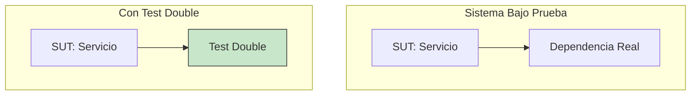
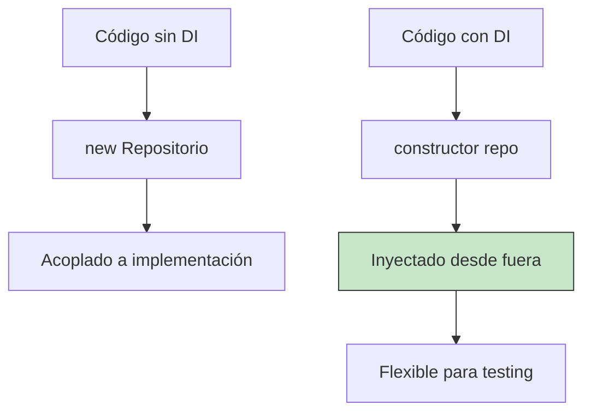
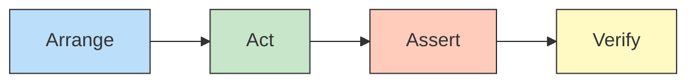

- [9. Test con Dobles](#9-test-con-dobles)
  - [9.1. Fundamentos de los Dobles de Test](#91-fundamentos-de-los-dobles-de-test)
    - [9.1.1. ¿Qué es un Test Double?](#911-qué-es-un-test-double)
    - [9.1.2. ¿Por qué usar Test Doubles?](#912-por-qué-usar-test-doubles)
    - [9.1.3. Importancia de la Inyección de Dependencias](#913-importancia-de-la-inyección-de-dependencias)
  - [9.2. Tipos de Test Doubles](#92-tipos-de-test-doubles)
    - [9.2.1. Dummy](#921-dummy)
    - [9.2.2. Stub](#922-stub)
    - [9.2.3. Fake](#923-fake)
    - [9.2.4. Spy](#924-spy)
    - [9.2.5. Mock](#925-mock)
    - [9.2.6. Comparativa de Test Doubles](#926-comparativa-de-test-doubles)
  - [9.3. Moq: La Librería de Mocking en .NET](#93-moq-la-librería-de-mocking-en-net)
    - [9.3.1. Instalación de Moq](#931-instalación-de-moq)
    - [9.3.2. Conceptos Básicos de Moq](#932-conceptos-básicos-de-moq)
    - [9.3.3. Crear un Mock](#933-crear-un-mock)
  - [9.4. El Patrón AAA Extendido: Arrange-Act-Assert + Verify](#94-el-patrón-aaa-extendido-arrange-act-assert--verify)
    - [9.4.1. Arrange: Configurar el Mock](#941-arrange-configurar-el-mock)
    - [9.4.2. Act: Ejecutar la Acción](#942-act-ejecutar-la-acción)
    - [9.4.3. Assert: Verificar el Resultado](#943-assert-verificar-el-resultado)
    - [9.4.4. Verify: Verificar Interacciones](#944-verify-verificar-interacciones)
  - [9.5. Configuración de Mocks con Moq](#95-configuración-de-mocks-con-moq)
    - [9.5.1. Setup: Configurar Comportamiento](#951-setup-configurar-comportamiento)
    - [9.5.2. Returns: Definir Valores de Retorno](#952-returns-definir-valores-de-retorno)
    - [9.5.3. It: Matchers de Argumentos](#953-it-matchers-de-argumentos)
    - [9.5.4. Configurar Excepciones](#954-configurar-excepciones)
    - [9.5.5. Configurar Colecciones y Listas](#955-configurar-colecciones-y-listas)
  - [9.6. Verificación con Verify](#96-verificación-con-verify)
    - [9.6.1. Verify: Verificar Llamadas](#961-verify-verificar-llamadas)
    - [9.6.2. Times: Veces que se Ejecuta](#962-times-veces-que-se-ejecuta)
    - [9.6.3. Verify con Argumentos](#963-verify-con-argumentos)
  - [9.7. Mock Global vs Mock Local](#97-mock-global-vs-mock-local)
    - [9.7.1. Mock Local (por Test)](#971-mock-local-por-test)
    - [9.7.2. Mock Global (compartido)](#972-mock-global-compartido)
    - [9.7.3. Cuándo Usar Cada Uno](#973-cuándo-usar-cada-uno)
  - [9.8. Abstracciones e Interfaces](#98-abstracciones-e-interfaces)
    - [9.8.1. Por qué usar Interfaces](#981-por-qué-usar-interfaces)
    - [9.8.2. Ejemplo Práctico](#982-ejemplo-práctico)
  - [9.9. Ejemplos Completos con Moq](#99-ejemplos-completos-con-moq)
    - [9.9.1. Ejemplo: Calculadora](#991-ejemplo-calculadora)
    - [9.9.2. Ejemplo: Calculadora Financiera](#992-ejemplo-calculadora-financiera)
    - [9.9.3. Ejemplo: Repositorio con ICrudRepository](#993-ejemplo-repositorio-con-icrudrepository)
    - [9.9.4. Ejemplo: Servicio con Excepciones de Dominio](#994-ejemplo-servicio-con-excepciones-de-dominio)
  - [9.10. Errores Comunes y Mejores Prácticas](#910-errores-comunes-y-mejores-prácticas)


# 9. Test con Dobles

> 📝 **Nota:** Todos los ejemplos de este tema usan **FluentAssertions** para las aserciones. Asegúrate de incluir el paquete NuGet:
> ```bash
> dotnet add package FluentAssertions
> ```

Los test doubles (o dobles de prueba) son fundamentales para escribir pruebas unitarias efectivas. Permiten aislar el código bajo prueba de sus dependencias externas, garantizando que nuestros tests sean rápidos, fiables y fáciles de mantener.

---

## 9.1. Fundamentos de los Dobles de Test

### 9.1.1. ¿Qué es un Test Double?

Un **Test Double** es un objeto que reemplaza a una dependencia real durante la ejecución de pruebas. El nombre proviene de los "dobles de riesgo" en el cine, que sustituyen a los actores principales en escenas peligrosas.



### 9.1.2. ¿Por qué usar Test Doubles?

| Problema sin Test Doubles | Solución con Test Doubles |
|---------------------------|--------------------------|
| Tests lentos (acceso a BD) | Tests rápidos (sin BD real) |
| Dependencia de datos externos | Datos controlados |
| Tests no deterministas | Resultados reproducibles |
| Dificultad de probar casos de error | Fácil simulación de errores |
| Acoplamiento a implementación | Aislamiento del código |

### 9.1.3. Importancia de la Inyección de Dependencias

Para poder usar Test Doubles, nuestro código debe estar preparado para recibir sus dependencias desde el exterior. Esto se logra mediante **Inyección de Dependencias (DI)**.



**Código con Inyección de Dependencias:**

```csharp
// ✅ BUENO: Dependencia inyectada vía constructor
public class UsuarioService
{
    private readonly IUsuarioRepository _repository;
    
    public UsuarioService(IUsuarioRepository repository)
    {
        _repository = repository; // Se puede mockear
    }
}

// ❌ MALO: Dependencia creada internamente
public class UsuarioService
{
    private readonly IUsuarioRepository _repository = new SqlUsuarioRepository();
    // No se puede mockear fácilmente
}
```

> 📝 **Recordatorio del curso:** Durante todo el módulo hemos implementado inyección de dependencias usando interfaces. Esto nos permite ahora reemplazar las implementaciones reales por Test Doubles en nuestros tests.

---

## 9.2. Tipos de Test Doubles

Existen cinco tipos principales de Test Doubles, cada uno con un propósito específico:

### 9.2.1. Dummy

Un **Dummy** es el tipo más simple. Se pasa como parámetro pero nunca se usa realmente. Solo cumple con los requisitos de firma del método.

```csharp
// Ejemplo de Dummy
public class Pedido
{
    public int Id { get; set; }
    public string Producto { get; set; }
    public int Cantidad { get; set; }
}

public class CalculadoraPrecios
{
    public decimal CalcularTotal(Pedido pedido, decimal descuento)
    {
        // El descuento no se usa, pero se requiere como parámetro
        return pedido.Cantidad * 10m * (1 - descuento);
    }
}

// Test con Dummy
[Test]
public void CalcularTotal_ConDummy_RetornaPrecio()
{
    var pedidoDummy = new Pedido { Id = 0, Producto = "", Cantidad = 5 };
    var calculadora = new CalculadoraPrecios();
    
    decimal resultado = calculadora.CalcularTotal(pedidoDummy, 0.1m);
    
    resultado.Should().Be(45m);
}
```

### 9.2.2. Un Stub

Un **Stub** proporciona respuestas predefinidas a las llamadas durante el test. Se usa para controlar las entradas del código bajo prueba.

```csharp
// Stub: Proporciona respuestas predefinidas
public interface IRepositorio<T>
{
    T? GetById(int id);
    IEnumerable<T> GetAll();
}

public class StubRepositorio<T> : IRepositorio<T>
{
    private readonly T _valorRetorno;
    
    public StubRepositorio(T valorRetorno)
    {
        _valorRetorno = valorRetorno;
    }
    
    public T? GetById(int id) => _valorRetorno;
    public IEnumerable<T> GetAll() => Enumerable.Empty<T>();
}

// Usando el stub
[Test]
public void ObtenerUsuario_IdExistente_RetornaUsuario()
{
    var usuarioEsperado = new Usuario { Id = 1, Nombre = "Juan" };
    var stubRepo = new StubRepositorio<Usuario>(usuarioEsperado);
    var servicio = new UsuarioService(stubRepo);
    
    var resultado = servicio.GetById(1);
    
    resultado.Nombre.Should().Be("Juan");
}
```

### 9.2.3. Fake

Un **Fake** es una implementación simplificada pero funcional. A diferencia del stub, tiene algo de lógica de negocio, pero no es apta para producción.

```csharp
// Fake: Implementación simplificada funcional
public class FakeUsuarioRepository : IUsuarioRepository
{
    private readonly List<Usuario> _usuarios = new();
    
    public Usuario? GetById(int id)
    {
        return _usuarios.FirstOrDefault(u => u.Id == id);
    }
    
    public IEnumerable<Usuario> GetAll()
    {
        return _usuarios;
    }
    
    public void Add(Usuario usuario)
    {
        usuario.Id = _usuarios.Count + 1;
        _usuarios.Add(usuario);
    }
}

// Uso del fake
[Test]
public void AgregarUsuario_FakeRepository_UsuarioConId()
{
    var fakeRepo = new FakeUsuarioRepository();
    var servicio = new UsuarioService(fakeRepo);
    
    var nuevoUsuario = new Usuario { Nombre = "Ana", Email = "ana@email.com" };
    servicio.Agregar(nuevoUsuario);
    
    nuevoUsuario.Id.Should().Be(1);
    fakeRepo.GetAll().Should().HaveCount(1);
}
```

### 9.2.4. Spy

Un **Spy** registra información sobre cómo fue llamado. Se usa para verificar interacciones después de la ejecución.

```csharp
// Spy: Registra llamadas
public class SpyEmailService : IEmailService
{
    public int VecesEnviado { get; private set; }
    public List<string> Destinatarios { get; } = new();
    public List<string> Mensajes { get; } = new();
    
    public void Enviar(string destinatario, string mensaje)
    {
        VecesEnviado++;
        Destinatarios.Add(destinatario);
        Mensajes.Add(mensaje);
    }
}

// Uso del spy
[Test]
public void RegistrarUsuario_EnviaEmail_VerificarConSpy()
{
    var spyEmail = new SpyEmailService();
    var servicio = new UsuarioService(spyEmail);
    
    servicio.Registrar(new Usuario { Nombre = "Juan", Email = "juan@email.com" });
    
    // Verificar después con el spy
    spyEmail.VecesEnviado.Should().Be(1);
    spyEmail.Destinatarios[0].Should().Be("juan@email.com");
}
```

### 9.2.5. Mock

Un **Mock** es similar al spy pero las expectativas se configuran **antes** de la ejecución. Verifica que las llamadas ocurran exactamente como se esperaba.

```csharp
// Con Moq sería:
[Test]
public void RegistrarUsuario_EnviaEmail_ConMock()
{
    var mockEmail = new Mock<IEmailService>();
    
    var servicio = new UsuarioService(mockEmail.Object);
    
    servicio.Registrar(new Usuario { Nombre = "Juan", Email = "juan@email.com" });
    
    // Verificar ANTES de ejecutar (expectativa)
    mockEmail.Verify(e => e.Enviar(
        It.IsAny<string>(), 
        It.IsAny<string>()), 
        Times.Once);
}
```

### 9.2.6. Comparativa de Test Doubles

| Tipo | Propósito | Cuándo Usarlo |
|------|-----------|---------------|
| **Dummy** | Cumplir firma de método | Parámetros que no se usan |
| **Stub** | Controlar entradas | Tests de estado (output) |
| **Fake** | Implementación ligera | Tests de integración |
| **Spy** | Registrar llamadas | Verificar interacciones |
| **Mock** | Verificar comportamiento | Tests de comportamiento |

---

## 9.3. Moq: La Librería de Mocking en .NET

**Moq** es la librería de mocking más popular en .NET. Permite crear mocks de forma sencilla y expresiva.

### 9.3.1. Instalación de Moq

```bash
dotnet add package Moq
```

### 9.3.2. Conceptos Básicos de Moq

| Concepto | Descripción |
|----------|-------------|
| `Mock<T>` | Crea el objeto mock |
| `Setup()` | Configura el comportamiento esperado |
| `Returns()` | Define qué devuelve el método |
| `Verify()` | Verifica que se cumplieron las expectativas |
| `It` | Matchers para argumentos |

### 9.3.3. Crear un Mock

```csharp
// Crear un mock básico
var mockRepo = new Mock<IUsuarioRepository>();

// Obtener el objeto para usar en el código
IUsuarioRepository repo = mockRepo.Object;
```

---

## 9.4. El Patrón AAA Extendido: Arrange-Act-Assert + Verify

El patrón AAA tradicional se extiende con un cuarto paso: **Verify**. Esto es especialmente importante cuando usamos mocks, ya que necesitamos verificar las interacciones.



### 9.4.1. Arrange: Configurar el Mock

```csharp
[Test]
public void Ejemplo_AAA_Extendido()
{
    // ARRANGE: Preparar el escenario
    // 1. Crear el mock
    var mockRepo = new Mock<IUsuarioRepository>();
    
    // 2. Configurar el comportamiento (Setup)
    mockRepo.Setup(r => r.GetById(1))
            .Returns(new Usuario { Id = 1, Nombre = "Juan" });
    
    // 3. Crear el servicio con el mock
    var servicio = new UsuarioService(mockRepo.Object);
    
    // Actuar...
}
```

### 9.4.2. Act: Ejecutar la Acción

```csharp
    // ACT: Ejecutar la acción bajo prueba
    var resultado = servicio.GetById(1);
```

### 9.4.3. Assert: Verificar el Resultado

```csharp
    // ASSERT: Verificar el resultado (estado)
    resultado.Should().NotBeNull();
    resultado.Nombre.Should().Be("Juan");
```

### 9.4.4. Verify: Verificar Interacciones

```csharp
    // VERIFY: Verificar interacciones (comportamiento)
    mockRepo.Verify(r => r.GetById(1), Times.Once);
}
```

**Completo:**

```csharp
[Test]
public void ObtenerUsuario_IdExistente_VerificaInteraccion()
{
    // Arrange
    var mockRepo = new Mock<IUsuarioRepository>();
    mockRepo.Setup(r => r.GetById(1))
            .Returns(new Usuario { Id = 1, Nombre = "Juan" });
    
    var servicio = new UsuarioService(mockRepo.Object);
    
    // Act
    var resultado = servicio.GetById(1);
    
    // Assert
    resultado.Nombre.Should().Be("Juan");
    
    // Verify
    mockRepo.Verify(r => r.GetById(1), Times.Once);
}
```

---

## 9.5. Configuración de Mocks con Moq

### 9.5.1. Setup: Configurar Comportamiento

```csharp
var mock = new Mock<IUsuarioRepository>();

// Configurar un método específico
mock.Setup(r => r.GetById(It.IsAny<int>()))
    .Returns(new Usuario { Nombre = "Test" });

// Configurar por argumento específico
mock.Setup(r => r.GetById(1))
    .Returns(new Usuario { Id = 1, Nombre = "Juan" });

// Configurar por condición
mock.Setup(r => r.GetById(It.Is<int>(id => id > 0)))
    .Returns(new Usuario { Nombre = "Mayor que cero" });
```

### 9.5.2. Returns: Definir Valores de Retorno

```csharp
var mock = new Mock<IUsuarioRepository>();

// Valor simple
mock.Setup(r => r.GetById(1))
    .Returns(new Usuario { Id = 1, Nombre = "Juan" });

// Retornar null
mock.Setup(r => r.GetById(It.IsAny<int>()))
    .Returns((Usuario?)null);

// Retornar colección
mock.Setup(r => r.GetAll())
    .Returns(new List<Usuario>
    {
        new Usuario { Id = 1, Nombre = "Juan" },
        new Usuario { Id = 2, Nombre = "Ana" }
    });

// Retornar usando función (callback con retorno)
mock.Setup(r => r.GetById(It.IsAny<int>()))
    .Returns((int id) => new Usuario { Id = id, Nombre = $"Usuario {id}" });

// Throws: Simular excepciones
mock.Setup(r => r.GetById(0))
    .Throws(new ArgumentException("ID no puede ser cero"));

// Retornar Task (para métodos async)
mock.Setup(r => r.GetByIdAsync(It.IsAny<int>()))
    .ReturnsAsync(new Usuario { Nombre = "Async User" });
```

### 9.5.3. It: Matchers de Argumentos

```csharp
var mock = new Mock<IUsuarioRepository>();

// It.IsAny<T>: cualquier valor
mock.Setup(r => r.GetById(It.IsAny<int>()))
    .Returns(new Usuario { Nombre = "Cualquiera" });

// It.Is<T>(condición): valor que cumple condición
mock.Setup(r => r.GetById(It.Is<int>(id => id > 0)))
    .Returns(new Usuario { Nombre = "Mayor que cero" });

mock.Setup(r => r.GetById(It.Is<int>(id => id < 0)))
    .Throws(new ArgumentException("ID negativo"));

// It.IsInRange: valor en rango
mock.Setup(r => r.GetById(It.IsInRange<int>(1, 100, Range.Inclusive)))
    .Returns(new Usuario { Nombre = "En rango" });

// It.IsIn: valor en lista
mock.Setup(r => r.GetById(It.IsIn(1, 2, 3)))
    .Returns(new Usuario { Nombre = "En lista" });

// It.IsRegex: coincide con regex
mock.Setup(r => r.Buscar(It.IsRegex<string>("@.*\\.com$")))
    .Returns(new List<Usuario>());
```

### 9.5.4. Configurar Excepciones

```csharp
var mock = new Mock<IUsuarioRepository>();

// Excepción simple
mock.Setup(r => r.GetById(0))
    .Throws<ArgumentException>();

// Excepción con mensaje
mock.Setup(r => r.GetById(0))
    .Throws(new ArgumentException("El ID no puede ser 0"));

// Excepción basada en argumento
mock.Setup(r => r.GetById(It.Is<int>(id => id < 0)))
    .Throws(new ArgumentException("ID negativo"));

// Excepción async
mock.Setup(r => r.GetByIdAsync(It.IsAny<int>()))
    .ThrowsAsync(new InvalidOperationException("Error async"));

// Para métodos que devuelven void
mock.Setup(r => r.Eliminar(It.IsAny<int>()))
    .Throws(new InvalidOperationException("No se puede eliminar"));

// Verificar que se lanzó excepción (en el test)
var servicio = new UsuarioService(mock.Object);
Assert.Throws<ArgumentException>(() => servicio.GetById(0));
```

### 9.5.5. Configurar Colecciones y Listas

```csharp
var mock = new Mock<IUsuarioRepository>();

// Retornar lista vacía
mock.Setup(r => r.GetAll())
    .Returns(new List<Usuario>());

// Retornar lista con elementos
mock.Setup(r => r.GetAll())
    .Returns(new List<Usuario>
    {
        new Usuario { Id = 1, Nombre = "Juan" },
        new Usuario { Id = 2, Nombre = "Ana" },
        new Usuario { Id = 3, Nombre = "Carlos" }
    });

// Retornar según filtro
mock.Setup(r => r.BuscarPorNombre(It.IsAny<string>()))
    .Returns((string nombre) => new List<Usuario>
    {
        new Usuario { Nombre = nombre }
    });

// Configurar para que siempre retorne la misma lista (importante para verificación)
var listaUsuarios = new List<Usuario>();
mock.Setup(r => r.GetAll()).Returns(listaUsuarios);

// Verificar cantidad de elementos devueltos
mock.Setup(r => r.GetAll()).Returns(() => listaUsuarios);
```

---

## 9.6. Verificación con Verify

### 9.6.1. Verify: Verificar Llamadas

```csharp
var mock = new Mock<IUsuarioRepository>();
var servicio = new UsuarioService(mock.Object);

// Ejecutar acción
servicio.Registrar(new Usuario { Nombre = "Juan", Email = "juan@email.com" });

// Verificar que se llamó al método
mock.Verify(r => r.Save(It.IsAny<Usuario>()), Times.Once);

// Verificar que NO se llamó
mock.Verify(r => r.Delete(It.IsAny<int>()), Times.Never);

// Verificar que se llamó al menos una vez
mock.Verify(r => r.Save(It.IsAny<Usuario>()), Times.AtLeastOnce);
```

### 9.6.2. Times: Veces que se Ejecuta

| Expresión | Descripción |
|-----------|-------------|
| `Times.Once` | Exactamente 1 vez |
| `Times.Never` | Ninguna vez |
| `Times.Exactly(n)` | Exactamente n veces |
| `Times.AtLeast(n)` | Al menos n veces |
| `Times.AtMost(n)` | Como máximo n veces |
| `Times.Between(n, m, Range.Exclusive)` | Entre n y m veces |

```csharp
// Ejemplos de Times
mock.Verify(r => r.Save(It.IsAny<Usuario>()), Times.Once);        // 1 vez
mock.Verify(r => r.Save(It.IsAny<Usuario>()), Times.Never);        // 0 veces
mock.Verify(r => r.Save(It.IsAny<Usuario>()), Times.Exactly(3));   // 3 veces
mock.Verify(r => r.Save(It.IsAny<Usuario>()), Times.AtLeastOnce()); // 1+ veces
mock.Verify(r => r.Save(It.IsAny<Usuario>()), Times.AtMost(5));   // ≤5 veces
```

### 9.6.3. Verify con Argumentos

```csharp
var mock = new Mock<IUsuarioRepository>();
var servicio = new UsuarioService(mock.Object);

// Ejecutar
servicio.Registrar(new Usuario { Id = 1, Nombre = "Juan", Email = "juan@email.com" });

// Verificar con argumento específico
mock.Verify(r => r.Save(
    It.Is<Usuario>(u => u.Nombre == "Juan" && u.Email == "juan@email.com")
), Times.Once);

// Verificar que se llamó con cualquier argumento
mock.Verify(r => r.Save(It.IsAny<Usuario>()), Times.Once);
```

---

## 9.7. Mock Global vs Mock Local

### 9.7.1. Mock Local (por Test)

El mock se crea y configura **para cada test individual**.

```csharp
[TestFixture]
public class UsuarioServiceTests
{
    private Mock<IUsuarioRepository> _mockRepo;
    private UsuarioService _servicio;
    
    [SetUp]
    public void SetUp()
    {
        // Se crea un nuevo mock para cada test
        _mockRepo = new Mock<IUsuarioRepository>();
        _servicio = new UsuarioService(_mockRepo.Object);
    }
    
    [Test]
    public void GetById_UsuarioExiste_RetornaUsuario()
    {
        // Arrange: Configuración específica de ESTE test
        _mockRepo.Setup(r => r.GetById(1))
                 .Returns(new Usuario { Id = 1, Nombre = "Juan" });
        
        // Act
        var resultado = _servicio.GetById(1);
        
        // Assert
        resultado.Nombre.Should().Be("Juan");
    }
    
    [Test]
    public void GetById_UsuarioNoExiste_RetornaNull()
    {
        // Arrange: OTRA configuración para este test
        _mockRepo.Setup(r => r.GetById(999))
                 .Returns((Usuario?)null);
        
        // Act
        var resultado = _servicio.GetById(999);
        
        // Assert
        resultado.Should().BeNull();
    }
}
```

**Ventajas:**
- Cada test es independiente
- No hay efectos secundarios entre tests
- Fácil de mantener

### 9.7.2. Mock Global (compartido)

El mock se comparte entre varios tests (usando `OneTimeSetUp`).

```csharp
[TestFixture]
public class UsuarioServiceTests
{
    private static Mock<IUsuarioRepository> _mockRepo; // Compartido
    private static UsuarioService _servicio;
    
    [OneTimeSetUp]
    public void OneTimeSetUp()
    {
        // Se crea UNA sola vez
        _mockRepo = new Mock<IUsuarioRepository>();
        _servicio = new UsuarioService(_mockRepo.Object);
    }
    
    [Test]
    public void TestUno()
    {
        // Configuremos lo que necesita este test
        _mockRepo.Setup(r => r.GetById(1))
                 .Returns(new Usuario { Id = 1, Nombre = "Juan" });
        
        var resultado = _servicio.GetById(1);
        
        resultado.Nombre.Should().Be("Juan");
    }
    
    [Test]
    public void TestDos()
    {
        // ⚠️ CUIDADO: Puede interferir con otros tests
        _mockRepo.Setup(r => r.GetById(2))
                 .Returns(new Usuario { Id = 2, Nombre = "Ana" });
        
        var resultado = _servicio.GetById(2);
        
        resultado.Nombre.Should().Be("Ana");
    }
}
```

### 9.7.3. Cuándo Usar Cada Uno

| Situación | Recomendación |
|-----------|---------------|
| Tests independientes | Mock Local |
| Tests que comparten estado | Mock Global con limpieza |
| Fixture compleja (BD, archivos) | Mock Global |
| Tests rápidos y simples | Mock Local |

> ⚠️ **Advertencia:** El Mock Global puede generar interdependencias entre tests. Es mejor usar Mock Local a menos que tengas una razón específica para compartir.

---

## 9.8. Abstracciones e Interfaces

### 9.8.1. Por qué usar Interfaces

Las interfaces son fundamentales para poder hacer mocking:

```csharp
// ✅ Interfaz: Se puede mockear
public interface IUsuarioRepository
{
    Usuario? GetById(int id);
    IEnumerable<Usuario> GetAll();
    void Save(Usuario usuario);
    void Delete(int id);
}

// Implementación concreta
public class SqlUsuarioRepository : IUsuarioRepository
{
    // Acceso a BD real
}

// En el servicio
public class UsuarioService
{
    private readonly IUsuarioRepository _repo;
    
    public UsuarioService(IUsuarioRepository repo)
    {
        _repo = repo; // Se puede inyectar el mock
    }
}
```

> 📝 **Recordatorio:** Durante todo el curso hemos usado interfaces e inyección de dependencias. Esto nos permite ahora reemplazar las implementaciones reales por mocks en los tests.

### 9.8.2. Ejemplo Práctico

```csharp
// Interfaz del repositorio (lo que mockearemos)
public interface ICrudRepository<TKey, TEntity> where TEntity : class
{
    IEnumerable<TEntity> GetAll();
    TEntity? GetById(TKey id);
    TEntity? Create(TEntity entity);
    TEntity? Update(TKey id, TEntity entity);
    TEntity? Delete(TKey id);
}

// Entidad
public class Persona
{
    public int Id { get; set; }
    public string Nombre { get; set; } = string.Empty;
    public string Email { get; set; } = string.Empty;
    public DateTime CreatedAt { get; set; }
    public DateTime UpdatedAt { get; set; }
    public bool IsDeleted { get; set; }
    public DateTime? DeletedAt { get; set; }
}

// Servicio que usa el repositorio
public class PersonaService
{
    private readonly ICrudRepository<int, Persona> _repository;
    
    public PersonaService(ICrudRepository<int, Persona> repository)
    {
        _repository = repository;
    }
    
    public Persona? ObtenerPorId(int id)
    {
        return _repository.GetById(id);
    }
    
    public IEnumerable<Persona> ObtenerTodas()
    {
        return _repository.GetAll();
    }
}
```

---

## 9.9. Ejemplos Completos con Moq

### 9.9.1. Ejemplo: Calculadora

```csharp
// Interfaz para la calculadora
public interface ICalculadora
{
    int Sumar(int a, int b);
    int Restar(int a, int b);
    int Multiplicar(int a, int b);
    decimal Dividir(int a, int b);
}

// Implementación real
public class Calculadora : ICalculadora
{
    public int Sumar(int a, int b) => a + b;
    public int Restar(int a, int b) => a - b;
    public int Multiplicar(int a, int b) => a * b;
    public decimal Dividir(int a, int b)
    {
        if (b == 0) throw new DivideByZeroException("No se puede dividir por cero");
        return (decimal)a / b;
    }
}

// Servicio que usa la calculadora
public class ServicioCalculadora
{
    private readonly ICalculadora _calculadora;
    
    public ServicioCalculadora(ICalculadora calculadora)
    {
        _calculadora = calculadora;
    }
    
    public int SumarYDuplicar(int a, int b)
    {
        int suma = _calculadora.Sumar(a, b);
        return _calculadora.Multiplicar(suma, 2);
    }
}

[TestFixture]
public class ServicioCalculadoraTests
{
    private Mock<ICalculadora> _mockCalculadora;
    private ServicioCalculadora _servicio;
    
    [SetUp]
    public void SetUp()
    {
        _mockCalculadora = new Mock<ICalculadora>();
        _servicio = new ServicioCalculadora(_mockCalculadora.Object);
    }
    
    [Test]
    public void SumarYDuplicar_LlamadasCorrectas_RetornaResultado()
    {
        // Arrange
        _mockCalculadora.Setup(c => c.Sumar(5, 3))
                       .Returns(8);
        _mockCalculadora.Setup(c => c.Multiplicar(8, 2))
                       .Returns(16);
        
        // Act
        var resultado = _servicio.SumarYDuplicar(5, 3);
        
        // Assert
        resultado.Should().Be(16);
        
        // Verify: Verificar que se llamaron los métodos
        _mockCalculadora.Verify(c => c.Sumar(5, 3), Times.Once);
        _mockCalculadora.Verify(c => c.Multiplicar(8, 2), Times.Once);
    }
    
    [Test]
    public void SumarYDuplicar_VerificaOrdenDeLlamadas()
    {
        // Arrange
        _mockCalculadora.Setup(c => c.Sumar(It.IsAny<int>(), It.IsAny<int>()))
                       .Returns(10);
        _mockCalculadora.Setup(c => c.Multiplicar(It.IsAny<int>(), It.IsAny<int>()))
                       .Returns(20);
        
        // Act
        _servicio.SumarYDuplicar(3, 7);
        
        // Verify: Verificar secuencia de llamadas
        _mockCalculadora.VerifySequence(
            c => c.Sumar(3, 7),
            c => c.Multiplicar(10, 2)
        );
    }
}
```

### 9.9.2. Ejemplo: Calculadora Financiera

```csharp
// Interfaz de la calculadora financiera
public interface ICalculadoraFinanciera
{
    decimal CalcularInteresSimple(decimal capital, decimal tasa, int tiempo);
    decimal CalcularInteresCompuesto(decimal capital, decimal tasa, int tiempo);
    decimal CalcularCuotaMensual(decimal capital, decimal tasaAnual, int meses);
    decimal CalcularVAN(IEnumerable<decimal> flujos, decimal tasaDescuento);
}

// Servicio de inversiones
public class ServicioInversiones
{
    private readonly ICalculadoraFinanciera _calculadora;
    
    public ServicioInversiones(ICalculadoraFinanciera calculadora)
    {
        _calculadora = calculadora;
    }
    
    public decimal SimularInversion(decimal capital, int meses, decimal tasaAnual)
    {
        // Convertir tasa anual a mensual
        decimal tasaMensual = tasaAnual / 12 / 100;
        
        // Calcular con interés compuesto
        return _calculadora.CalcularInteresCompuesto(capital, tasaMensual, meses);
    }
    
    public bool EsRentable(IEnumerable<decimal> flujos, decimal tasaDescuento)
    {
        var van = _calculadora.CalcularVAN(flujos, tasaDescuento);
        return van > 0;
    }
}

[TestFixture]
public class ServicioInversionesTests
{
    private Mock<ICalculadoraFinanciera> _mockCalc;
    private ServicioInversiones _servicio;
    
    [SetUp]
    public void SetUp()
    {
        _mockCalc = new Mock<ICalculadoraFinanciera>();
        _servicio = new ServicioInversiones(_mockCalc.Object);
    }
    
    [Test]
    public void SimularInversion_CalculaInteresCompuesto_RetornaMonto()
    {
        // Arrange
        _mockCalc.Setup(c => c.CalcularInteresCompuesto(1000m, 1m, 12))
                .Returns(1126.83m);
        
        // Act
        var resultado = _servicio.SimularInversion(1000m, 12, 12m);
        
        // Assert
        resultado.Should().Be(1126.83m).And.BeApproximately(1126.83m, 0.01m);
        
        // Verify
        _mockCalc.Verify(c => c.CalcularInteresCompuesto(1000m, 1m, 12), Times.Once);
    }
    
    [Test]
    public void EsRentable_VANPositivo_RetornaTrue()
    {
        // Arrange
        var flujos = new[] { -1000m, 300m, 400m, 500m };
        _mockCalc.Setup(c => c.CalcularVAN(flujos, 0.10m))
                .Returns(56.78m);
        
        // Act
        var resultado = _servicio.EsRentable(flujos, 0.10m);
        
        // Assert
        resultado.Should().BeTrue();
    }
    
    [Test]
    public void EsRentable_VANNegativo_RetornaFalse()
    {
        // Arrange
        var flujos = new[] { -1000m, 100m, 100m, 100m };
        _mockCalc.Setup(c => c.CalcularVAN(flujos, 0.10m))
                .Returns(-250m);
        
        // Act
        var resultado = _servicio.EsRentable(flujos, 0.10m);
        
        // Assert
        resultado.Should().BeFalse();
    }
}
```

### 9.9.3. Ejemplo: Repositorio con ICrudRepository

```csharp
// Interfaz del repositorio
public interface ICrudRepository<TKey, TEntity> where TEntity : class
{
    IEnumerable<TEntity> GetAll();
    TEntity? GetById(TKey id);
    TEntity? Create(TEntity entity);
    TEntity? Update(TKey id, TEntity entity);
    TEntity? Delete(TKey id);
}

// Entidad Persona
public class Persona
{
    public int Id { get; set; }
    public string Nombre { get; set; } = string.Empty;
    public string Email { get; set; } = string.Empty;
    public DateTime CreatedAt { get; set; }
    public DateTime UpdatedAt { get; set; }
    public bool IsDeleted { get; set; }
    public DateTime? DeletedAt { get; set; }
}

// Servicio que usa el repositorio
public class PersonaService
{
    private readonly ICrudRepository<int, Persona> _repository;
    
    public PersonaService(ICrudRepository<int, Persona> repository)
    {
        _repository = repository;
    }
    
    public IEnumerable<Persona> ObtenerTodas()
    {
        return _repository.GetAll();
    }
    
    public Persona? ObtenerPorId(int id)
    {
        return _repository.GetById(id);
    }
    
    public Persona? Crear(Persona persona)
    {
        persona.CreatedAt = DateTime.Now;
        return _repository.Create(persona);
    }
    
    public bool Eliminar(int id)
    {
        var persona = _repository.GetById(id);
        if (persona == null) return false;
        
        persona.IsDeleted = true;
        persona.DeletedAt = DateTime.Now;
        _repository.Update(id, persona);
        return true;
    }
}

[TestFixture]
public class PersonaServiceTests
{
    private Mock<ICrudRepository<int, Persona>> _mockRepo;
    private PersonaService _servicio;
    
    [SetUp]
    public void SetUp()
    {
        _mockRepo = new Mock<ICrudRepository<int, Persona>>();
        _servicio = new PersonaService(_mockRepo.Object);
    }
    
    [Test]
    public void ObtenerTodas_ConPersonas_RetornaLista()
    {
        // Arrange
        var personas = new List<Persona>
        {
            new Persona { Id = 1, Nombre = "Juan", Email = "juan@email.com" },
            new Persona { Id = 2, Nombre = "Ana", Email = "ana@email.com" }
        };
        _mockRepo.Setup(r => r.GetAll()).Returns(personas);
        
        // Act
        var resultado = _servicio.ObtenerTodas();
        
        // Assert
        resultado.Should().HaveCount(2);
        _mockRepo.Verify(r => r.GetAll(), Times.Once);
    }
    
    [Test]
    public void ObtenerPorId_Existe_RetornaPersona()
    {
        // Arrange
        var persona = new Persona { Id = 1, Nombre = "Juan" };
        _mockRepo.Setup(r => r.GetById(1)).Returns(persona);
        
        // Act
        var resultado = _servicio.ObtenerPorId(1);
        
        // Assert
        resultado.Should().NotBeNull();
        resultado.Nombre.Should().Be("Juan");
    }
    
    [Test]
    public void ObtenerPorId_NoExiste_RetornaNull()
    {
        // Arrange
        _mockRepo.Setup(r => r.GetById(It.IsAny<int>())).Returns((Persona?)null);
        
        // Act
        var resultado = _servicio.ObtenerPorId(999);
        
        // Assert
        resultado.Should().BeNull();
    }
    
    [Test]
    public void Crear_PersonaValida_RetornaPersonaConId()
    {
        // Arrange
        var personaNueva = new Persona { Nombre = "Carlos", Email = "carlos@email.com" };
        var personaCreada = new Persona { Id = 1, Nombre = "Carlos", Email = "carlos@email.com" };
        
        _mockRepo.Setup(r => r.Create(It.IsAny<Persona>()))
                .Returns(personaCreada);
        
        // Act
        var resultado = _servicio.Crear(personaNueva);
        
        // Assert
        resultado.Should().NotBeNull();
        resultado.Id.Should().Be(1);
        
        // Verify
        _mockRepo.Verify(r => r.Create(It.Is<Persona>(p => 
            p.Nombre == "Carlos" && p.Email == "carlos@email.com"
        )), Times.Once);
    }
    
    [Test]
    public void Eliminar_Existe_RetornaTrue()
    {
        // Arrange
        var persona = new Persona { Id = 1, Nombre = "Juan", IsDeleted = false };
        _mockRepo.SetupSequence(r => r.GetById(1))
                .Returns(persona)
                .Returns(new Persona { Id = 1, IsDeleted = true });
        _mockRepo.Setup(r => r.Update(1, It.IsAny<Persona>()))
                .Returns(new Persona { Id = 1, IsDeleted = true });
        
        // Act
        var resultado = _servicio.Eliminar(1);
        
        // Assert
        resultado.Should().BeTrue();
        _mockRepo.Verify(r => r.Update(1, It.Is<Persona>(p => p.IsDeleted)), Times.Once);
    }
    
    [Test]
    public void Eliminar_NoExiste_RetornaFalse()
    {
        // Arrange
        _mockRepo.Setup(r => r.GetById(999)).Returns((Persona?)null);
        
        // Act
        var resultado = _servicio.Eliminar(999);
        
        // Assert
        resultado.Should().BeFalse();
        _mockRepo.Verify(r => r.Update(It.IsAny<int>(), It.IsAny<Persona>()), Times.Never);
    }
}
```

### 9.9.4. Ejemplo: Servicio con Excepciones de Dominio

Este es el ejemplo más completo: un servicio que lanza excepciones de dominio en lugar de retornar nulls.

```csharp
// Excepciones de dominio
public class PersonaNotFoundException : Exception
{
    public int Id { get; }
    public PersonaNotFoundException(int id) 
        : base($"No se encontró la persona con ID {id}")
    {
        Id = id;
    }
}

public class PersonaAlreadyExistsException : Exception
{
    public string Email { get; }
    public PersonaAlreadyExistsException(string email)
        : base($"Ya existe una persona con el email {email}")
    {
        Email = email;
    }
}

public class InvalidPersonaDataException : Exception
{
    public InvalidPersonaDataException(string mensaje) : base(mensaje) { }
}

// Interfaz del repositorio
public interface IPersonaRepository
{
    Persona? GetById(int id);
    Persona? GetByEmail(string email);
    IEnumerable<Persona> GetAll();
    Persona Create(Persona persona);
    Persona Update(int id, Persona persona);
    bool Delete(int id);
}

// Servicio con excepciones de dominio
public class PersonaDomainService
{
    private readonly IPersonaRepository _repository;
    
    public PersonaDomainService(IPersonaRepository repository)
    {
        _repository = repository;
    }
    
    public Persona ObtenerPorId(int id)
    {
        var persona = _repository.GetById(id);
        if (persona == null)
            throw new PersonaNotFoundException(id);
        if (persona.IsDeleted)
            throw new PersonaNotFoundException(id);
        return persona;
    }
    
    public IEnumerable<Persona> ObtenerTodas()
    {
        return _repository.GetAll().Where(p => !p.IsDeleted);
    }
    
    public Persona Crear(string nombre, string email)
    {
        // Validaciones de dominio
        if (string.IsNullOrWhiteSpace(nombre))
            throw new InvalidPersonaDataException("El nombre es obligatorio");
        
        if (string.IsNullOrWhiteSpace(email))
            throw new InvalidPersonaDataException("El email es obligatorio");
        
        if (!email.Contains("@"))
            throw new InvalidPersonaDataException("El email no tiene formato válido");
        
        // Verificar si ya existe
        var existente = _repository.GetByEmail(email);
        if (existente != null)
            throw new PersonaAlreadyExistsException(email);
        
        // Crear
        var persona = new Persona
        {
            Nombre = nombre,
            Email = email,
            CreatedAt = DateTime.Now,
            IsDeleted = false
        };
        
        return _repository.Create(persona);
    }
    
    public Persona Actualizar(int id, string nombre, string email)
    {
        var persona = _repository.GetById(id);
        if (persona == null || persona.IsDeleted)
            throw new PersonaNotFoundException(id);
        
        // Verificar email único
        var existente = _repository.GetByEmail(email);
        if (existente != null && existente.Id != id)
            throw new PersonaAlreadyExistsException(email);
        
        persona.Nombre = nombre;
        persona.Email = email;
        persona.UpdatedAt = DateTime.Now;
        
        return _repository.Update(id, persona);
    }
    
    public void Eliminar(int id)
    {
        var persona = _repository.GetById(id);
        if (persona == null || persona.IsDeleted)
            throw new PersonaNotFoundException(id);
        
        persona.IsDeleted = true;
        persona.DeletedAt = DateTime.Now;
        persona.UpdatedAt = DateTime.Now;
        
        _repository.Update(id, persona);
    }
}

// TESTS COMPLETOS
[TestFixture]
public class PersonaDomainServiceTests
{
    private Mock<IPersonaRepository> _mockRepo;
    private PersonaDomainService _servicio;
    
    [SetUp]
    public void SetUp()
    {
        _mockRepo = new Mock<IPersonaRepository>();
        _servicio = new PersonaDomainService(_mockRepo.Object);
    }
    
    // === TESTS DE ObtenerPorId ===
    
    [Test]
    public void ObtenerPorId_ExisteActiva_RetornaPersona()
    {
        // Arrange
        var persona = new Persona 
        { 
            Id = 1, 
            Nombre = "Juan", 
            Email = "juan@email.com",
            IsDeleted = false 
        };
        _mockRepo.Setup(r => r.GetById(1)).Returns(persona);
        
        // Act
        var resultado = _servicio.ObtenerPorId(1);
        
        // Assert
    resultado.Should().NotBeNull();
    resultado.Nombre.Should().Be("Juan");
    
    // Verify
    mockRepo.Verify(r => r.GetById(1), Times.Once);
}
```

**Completo:**

```csharp
[Fact]
public void ObtenerUsuario_IdExistente_VerificaInteraccion()
{
    // Arrange
    var mockRepo = new Mock<IUsuarioRepository>();
    mockRepo.Setup(r => r.GetById(1))
            .Returns(new Usuario { Id = 1, Nombre = "Juan" });
    
    var servicio = new UsuarioService(mockRepo.Object);
    
    // Act
    var resultado = servicio.GetById(1);
    
    // Assert
    resultado.Should().NotBeNull();
    resultado.Nombre.Should().Be("Juan");
    
    // Verify
    mockRepo.Verify(r => r.GetById(1), Times.Once);
}
    
    [Test]
    public void ObtenerPorId_NoExiste_ThrowsPersonaNotFoundException()
    {
        // Arrange
        _mockRepo.Setup(r => r.GetById(999)).Returns((Persona?)null);
        
        // Act & Assert
        var ex = Assert.Throws<PersonaNotFoundException>(() => _servicio.ObtenerPorId(999));
        ex.Id.Should().Be(999);
    }
    
    [Test]
    public void ObtenerPorId_EstaEliminada_ThrowsPersonaNotFoundException()
    {
        // Arrange
        var personaEliminada = new Persona 
        { 
            Id = 1, 
            IsDeleted = true, 
            DeletedAt = DateTime.Now 
        };
        _mockRepo.Setup(r => r.GetById(1)).Returns(personaEliminada);
        
        // Act & Assert
        Assert.Throws<PersonaNotFoundException>(() => _servicio.ObtenerPorId(1));
    }
    
    // === TESTS DE ObtenerTodas ===
    
    [Test]
    public void ObtenerTodas_ConPersonas_RetornaSoloActivas()
    {
        // Arrange
        var personas = new List<Persona>
        {
            new Persona { Id = 1, Nombre = "Juan", IsDeleted = false },
            new Persona { Id = 2, Nombre = "Ana", IsDeleted = true },
            new Persona { Id = 3, Nombre = "Carlos", IsDeleted = false }
        };
        _mockRepo.Setup(r => r.GetAll()).Returns(personas);
        
        // Act
        var resultado = _servicio.ObtenerTodas();
        
        // Assert
        resultado.Should().HaveCount(2);
        resultado.Any(p => p.Nombre == "Ana").Should().BeFalse();
    }
    
    // === TESTS DE Crear ===
    
    [Test]
    public void Crear_DatosValidos_RetornaPersonaCreada()
    {
        // Arrange
        var personaCreada = new Persona 
        { 
            Id = 1, 
            Nombre = "Juan", 
            Email = "juan@email.com" 
        };
        _mockRepo.Setup(r => r.GetByEmail("juan@email.com")).Returns((Persona?)null);
        _mockRepo.Setup(r => r.Create(It.IsAny<Persona>())).Returns(personaCreada);
        
        // Act
        var resultado = _servicio.Crear("Juan", "juan@email.com");
        
        // Assert
        resultado.Id.Should().Be(1);
        _mockRepo.Verify(r => r.Create(It.Is<Persona>(p => 
            p.Nombre == "Juan" && p.Email == "juan@email.com"
        )), Times.Once);
    }
    
    [Test]
    public void Crear_NombreVacio_ThrowsInvalidPersonaDataException()
    {
        // Arrange
        _mockRepo.Setup(r => r.GetByEmail(It.IsAny<string>())).Returns((Persona?)null);
        
        // Act & Assert
        var ex = Assert.Throws<InvalidPersonaDataException>(() => 
            _servicio.Crear("", "juan@email.com"));
        
        ex.Message.Should().Contain("nombre");
    }
    
    [Test]
    public void Crear_EmailInvalido_ThrowsInvalidPersonaDataException()
    {
        // Act & Assert
        var ex = Assert.Throws<InvalidPersonaDataException>(() => 
            _servicio.Crear("Juan", "email-invalido"));
        
        ex.Message.Should().Contain("email");
    }
    
    [Test]
    public void Crear_EmailYaExiste_ThrowsPersonaAlreadyExistsException()
    {
        // Arrange
        var existente = new Persona { Id = 1, Email = "juan@email.com" };
        _mockRepo.Setup(r => r.GetByEmail("juan@email.com")).Returns(existente);
        
        // Act & Assert
        var ex = Assert.Throws<PersonaAlreadyExistsException>(() => 
            _servicio.Crear("Juan", "juan@email.com"));
        
        ex.Email.Should().Be("juan@email.com");
    }
    
    // === TESTS DE Actualizar ===
    
    [Test]
    public void Actualizar_DatosValidos_RetornaPersonaActualizada()
    {
        // Arrange
        var persona = new Persona 
        { 
            Id = 1, 
            Nombre = "Juan", 
            Email = "juan@email.com",
            IsDeleted = false 
        };
        _mockRepo.SetupSequence(r => r.GetById(1))
                .Returns(persona);
        _mockRepo.SetupSequence(r => r.GetByEmail("juan nuevo@email.com"))
                .Returns((Persona?)null)
                .Returns(new Persona { Id = 2, Email = "juan nuevo@email.com" });
        _mockRepo.Setup(r => r.Update(1, It.IsAny<Persona>()))
                .Returns(new Persona { Id = 1, Nombre = "Juan Nuevo" });
        
        // Act
        var resultado = _servicio.Actualizar(1, "Juan Nuevo", "juan nuevo@email.com");
        
        // Assert
        resultado.Nombre.Should().Be("Juan Nuevo");
    }
    
    [Test]
    public void Actualizar_NoExiste_ThrowsPersonaNotFoundException()
    {
        // Arrange
        _mockRepo.Setup(r => r.GetById(999)).Returns((Persona?)null);
        
        // Act & Assert
        Assert.Throws<PersonaNotFoundException>(() => 
            _servicio.Actualizar(999, "Nuevo", "nuevo@email.com"));
    }
    
    // === TESTS DE Eliminar ===
    
    [Test]
    public void Eliminar_Existe_RealizaBorradoLogico()
    {
        // Arrange
        var persona = new Persona 
        { 
            Id = 1, 
            Nombre = "Juan",
            IsDeleted = false 
        };
        _mockRepo.Setup(r => r.GetById(1)).Returns(persona);
        _mockRepo.Setup(r => r.Update(1, It.IsAny<Persona>()))
                .Returns(new Persona { Id = 1, IsDeleted = true });
        
        // Act
        _servicio.Eliminar(1);
        
        // Verify
        _mockRepo.Verify(r => r.Update(1, It.Is<Persona>(p => 
            p.IsDeleted == true && p.DeletedAt != null
        )), Times.Once);
    }
    
    [Test]
    public void Eliminar_NoExiste_ThrowsPersonaNotFoundException()
    {
        // Arrange
        _mockRepo.Setup(r => r.GetById(999)).Returns((Persona?)null);
        
        // Act & Assert
        Assert.Throws<PersonaNotFoundException>(() => _servicio.Eliminar(999));
    }
    
    [Test]
    public void Eliminar_YaEliminado_ThrowsPersonaNotFoundException()
    {
        // Arrange
        var personaEliminada = new Persona 
        { 
            Id = 1, 
            IsDeleted = true,
            DeletedAt = DateTime.Now.AddDays(-1)
        };
        _mockRepo.Setup(r => r.GetById(1)).Returns(personaEliminada);
        
        // Act & Assert
        Assert.Throws<PersonaNotFoundException>(() => _servicio.Eliminar(1));
    }
}
```

---

## 9.10. Errores Comunes y Mejores Prácticas

| Error | Solución |
|-------|----------|
| Mockear el objeto equivocado | Mockear la interfaz, no la implementación |
| No verificar interacciones | Usar `Verify` para verificar llamadas |
| Olvidar configurar retornos | Siempre configurar lo que el mock debe retornar |
| Tests que dependen entre sí | Usar `SetUp` para crear mocks limpios |
| Mock demasiado específico | Usar `It.IsAny<>()` para flexibilidad |
| No verificar excepciones | Usar `Assert.Throws<T>()` |

> 📝 **Resumen:** Los test doubles son esenciales para escribir pruebas unitarias efectivas. Moq nos permite crear mocks de forma expresiva y verificar interacciones. El patrón AAA extendido (Arrange-Act-Assert + Verify) asegura que verifiquemos tanto el resultado como el comportamiento.

> ⚠️ **En el examen:** Debéis saber crear mocks con Moq, configurar comportamiento con Setup/Returns, verificar interacciones con Verify, y entender cuándo usar cada tipo de test double.
