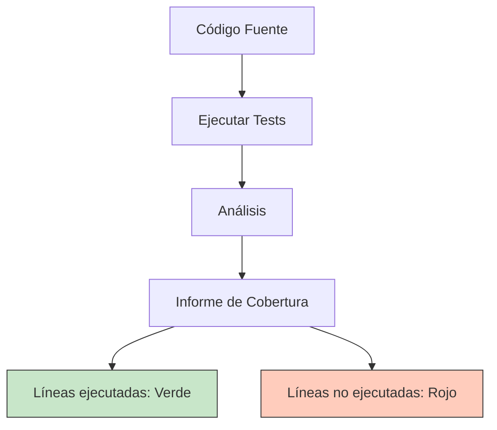
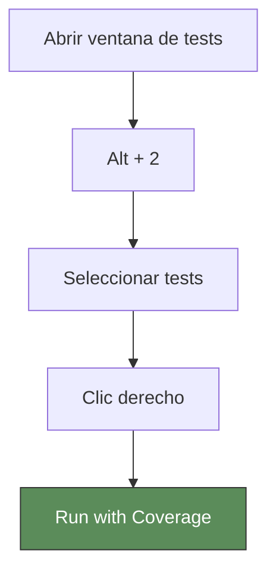
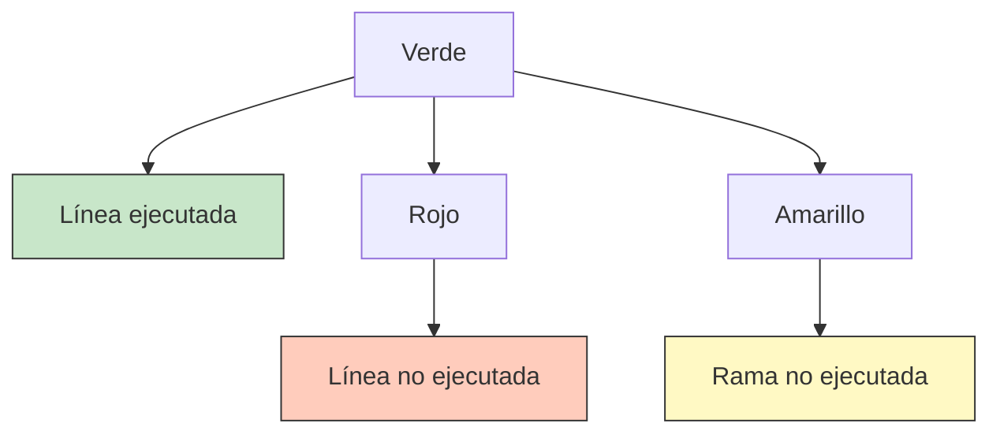

- [10. Cobertura de Código](#10-cobertura-de-código)
  - [10.1. ¿Qué es la Cobertura de Código?](#101-qué-es-la-cobertura-de-código)
    - [10.1.1. Definición](#1011-definición)
    - [10.1.2. Tipos de Cobertura](#1012-tipos-de-cobertura)
  - [10.2. Ventajas de la Cobertura de Código](#102-ventajas-de-la-cobertura-de-código)
    - [10.2.1. Beneficios Principales](#1021-beneficios-principales)
    - [10.2.2. Mitos y Realidades](#1022-mitos-y-realidades)
  - [10.3. Herramientas de Cobertura en .NET](#103-herramientas-de-cobertura-en-net)
    - [10.3.1. Coverlet](#1031-coverlet)
    - [10.3.2. ReportGenerator](#1032-reportgenerator)
  - [10.4. Generar Cobertura con Rider](#104-generar-cobertura-con-rider)
    - [10.4.1. Configuración en Rider](#1041-configuración-en-rider)
    - [10.4.2. Ejecutar Tests con Cobertura](#1042-ejecutar-tests-con-cobertura)
    - [10.4.3. Ver Informe de Cobertura](#1043-ver-informe-de-cobertura)
  - [10.5. Generar Cobertura desde Línea de Comandos](#105-generar-cobertura-desde-línea-de-comandos)
    - [10.5.1. Instalación de Herramientas](#1051-instalación-de-herramientas)
    - [10.5.2. Ejecutar Tests con Cobertura](#1052-ejecutar-tests-con-cobertura)
    - [10.5.3. Generar Informe HTML](#1053-generar-informe-html)
  - [10.6. Entender los Informes de Cobertura](#106-entender-los-informes-de-cobertura)
    - [10.6.1. Métricas Principales](#1061-métricas-principales)
    - [10.6.2. Interpretar el Informe](#1062-interpretar-el-informe)
  - [10.7. Configuración de Umbrales](#107-configuración-de-umbrales)
  - [10.8. Ejemplo Práctico](#108-ejemplo-práctico)


# 10. Cobertura de Código

La cobertura de código es una métrica que indica qué porcentaje del código fuente es ejecutado por las pruebas automatizadas. Es una herramienta fundamental para evaluar la calidad de nuestra suite de tests.

---

## 10.1. ¿Qué es la Cobertura de Código?

### 10.1.1. Definición

La **cobertura de código** (o code coverage) mide cuánto de nuestro código es ejecutado durante las pruebas. Se expresa como un porcentaje:

```
Cobertura = (Líneas ejecutadas / Líneas totales) × 100
```



### 10.1.2. Tipos de Cobertura

| Tipo | Descripción |
|------|-------------|
| **Line Coverage** | Porcentaje de líneas de código ejecutadas |
| **Branch Coverage** | Porcentaje de ramas (if/else) ejecutadas |
| **Method Coverage** | Porcentaje de métodos llamados |
| **Class Coverage** | Porcentaje de clases utilizadas |

---

## 10.2. Ventajas de la Cobertura de Código

### 10.2.1. Beneficios Principales

1. **Identificar código no probado**
   - Detecta áreas del código que nunca son ejecutadas por los tests
   - Revela lógica olvida

2. **Medir la efectividad de los tests**
   - Proporciona una métrica objetiva
   - Ayuda a identificar áreas críticas sin tests

3. **Detectar código muerto**
   - Código que nunca se ejecuta puede ser código obsoleto
   - Facilita la limpieza del proyecto

4. **Mejorar la confianza**
   - Alta cobertura = más confianza al refactorizar
   - Reduce el riesgo de regresiones

5. **Cumplir requisitos de calidad**
   - Muchas empresas exigen un porcentaje mínimo de cobertura
   - Estándar de la industria: 80%

### 10.2.2. Mitos y Realidades

| Mito | Realidad |
|------|----------|
| "100% de cobertura = código sin bugs" | La cobertura no garantiza ausencia de errores lógicos |
| "Alta cobertura = buenos tests" | Se puede tener alta cobertura con tests de mala calidad |
| "Solo importa el porcentaje" | Importa más qué código está cubierto que el porcentaje |
| "Cobertura baja = tests malos" | A veces es aceptable no cubrir código de infraestructura |

> ⚠️ **Importante:** La cobertura es una herramienta de ayuda, no un objetivo en sí mismo. Un 80% bien elegido es mejor que un 100% con tests mal diseñados.

---

## 10.3. Herramientas de Cobertura en .NET

### 10.3.1. Coverlet

**Coverlet** es una herramienta de cobertura de código multiplataforma para .NET.

```bash
# Instalación en el proyecto de tests
dotnet add package coverlet.collector
dotnet add package coverlet.msbuild
```

**Características:**
- Genera informes en formato Cobertura XML
- Soporta cobertura de líneas, ramas y métodos
- Integración nativa con `dotnet test`

### 10.3.2. ReportGenerator

**ReportGenerator** convierte los informes XML de cobertura en informes HTML legibles.

```bash
# Instalación global
dotnet tool install --global dotnet-reportgenerator-globaltool

# Actualizar si ya está instalado
dotnet tool update --global dotnet-reportgenerator-globaltool
```

---

## 10.4. Generar Cobertura con Rider

### 10.4.1. Configuración en Rider

1. **Abrir configuración de tests**
   - `Run` → `Edit Configurations...`
   - O hacer clic en el engranaje junto al botón de ejecutar

2. **Añadir configuración de cobertura**
   - Clic en `+` → `.NET Tests`
   - Configurar el proyecto de tests

3. **Habilitar cobertura**
   - En la pestaña `Code Coverage`
   - Seleccionar `Coverage` → `Collect full coverage data`

### 10.4.2. Ejecutar Tests con Cobertura



**Atajos de teclado:**
- **Ctrl + Shift + F5**: Ejecutar con cobertura
- **Shift + Alt + F5**: Depurar con cobertura

### 10.4.3. Ver Informe de Cobertura

Rider muestra la cobertura directamente en el editor:



**Panel de cobertura en Rider:**
- `Alt + 6`: Abrir ventana de Coverage
- Muestra porcentaje por proyecto, clase y método
- Permite navegar al código no cubierto

---

## 10.5. Generar Cobertura desde Línea de Comandos

### 10.5.1. Instalación de Herramientas

```bash
# 1. Asegurarse de tener coverlet (ya viene con el template de NUnit)
dotnet add package coverlet.collector
dotnet add package coverlet.msbuild

# 2. Instalar ReportGenerator globalmente
dotnet tool install --global dotnet-reportgenerator-globaltool
```

### 10.5.2. Ejecutar Tests con Cobertura

```bash
# Ejecutar tests y collectar cobertura (formato Cobertura XML)
dotnet test --collect:"XPlat Code Coverage"

# O con el parámetro largo
dotnet test --collect:coverage
```

**Opciones adicionales:**

```bash
# Coverage con formato específico
dotnet test --collect:"XPlat Code Coverage" --coverage-output-format cobertura

# Coverage de un proyecto específico
dotnet test MiProyecto.Tests/MiProyecto.Tests.csproj --collect:"XPlat Code Coverage"

# Coverage con umbral mínimo (fallará si no se alcanza)
dotnet test --collect:"XPlat Code Coverage" --p:CollectCoverage=true --p:Threshold=80
```

**Configuración en el archivo .csproj:**

```xml
<PropertyGroup>
  <TargetFramework>net10.0</TargetFramework>
  <IsPackable>false</IsPackable>
</PropertyGroup>

<ItemGroup>
  <PackageReference Include="Microsoft.NET.Test.Sdk" Version="17.8.0" />
  <PackageReference Include="NUnit" Version="3.14.0" />
  <PackageReference Include="NUnit3TestAdapter" Version="4.5.0" />
  <PackageReference Include="FluentAssertions" Version="6.12.0" />
  <PackageReference Include="Moq" Version="4.20.70" />
  <PackageReference Include="coverlet.collector" Version="6.0.0" />
</ItemGroup>

<!-- Configuración de cobertura -->
<PropertyGroup>
  <CollectCoverage>true</CollectCoverage>
  <CoverletOutputFormat>cobertura</CoverletOutputFormat>
  <CoverletOutput>./coverage/</CoverletOutput>
</PropertyGroup>
```

### 10.5.3. Generar Informe HTML

```bash
# 1. Ejecutar tests con cobertura
dotnet test --collect:"XPlat Code Coverage"

# 2. Generar informe HTML con ReportGenerator
reportgenerator 
  -reports:"TestResults/**/coverage.cobertura.xml" 
  -targetdir:"coveragereport" 
  -reporttypes:Html
```

**Otros formatos de informe:**

```bash
# Solo resumen en texto
reportgenerator 
  -reports:"TestResults/**/coverage.cobertura.xml" 
  -targetdir:"report" 
  -reporttypes:TextSummary

# Formato completo HTML
reportgenerator 
  -reports:"TestResults/**/coverage.cobertura.xml" 
  -targetdir:"report" 
  -reporttypes:Html

# Formato JSON
reportgenerator 
  -reports:"TestResults/**/coverage.cobertura.xml" 
  -targetdir:"report" 
  -reporttypes:JsonSummary
```

**Ver el informe:**

```bash
# En Windows
start coveragereport/index.html

# En macOS
open coveragereport/index.html

# En Linux
xdg-open coveragereport/index.html
```

---

## 10.6. Entender los Informes de Cobertura

### 10.6.1. Métricas Principales

| Métrica | Descripción | Objetivo típico |
|---------|-------------|-----------------|
| **Line Coverage** | % de líneas ejecutadas | 80% |
| **Branch Coverage** | % de ramas ejecutadas | 70% |
| **Method Coverage** | % de métodos ejecutados | 80% |
| **Class Coverage** | % de clases utilizadas | 90% |

### 10.6.2. Interpretar el Informe

```html
<!-- Ejemplo de informe HTML -->
<!DOCTYPE html>
<html>
<head>
    <title>Coverage Report</title>
</head>
<body>
    <h1>Coverage Summary</h1>
    
    <table>
        <tr>
            <th>Assembly</th>
            <th>Line Coverage</th>
            <th>Branch Coverage</th>
            <th>Method Coverage</th>
        </tr>
        <tr>
            <td>MiProyecto.dll</td>
            <td style="color:green">85%</td>
            <td style="color:green">72%</td>
            <td style="color:green">90%</td>
        </tr>
    </table>
</body>
</html>
```

**Colores del informe:**
- **Verde (cubierto):** Código ejecutado por los tests
- **Rojo (no cubierto):** Código nunca ejecutado
- **Amarillo (parcial):** Rama (if/else) no completamente ejecutada

---

## 10.7. Configuración de Umbrales

Podemos configurar que el build falle si no se alcanza un umbral de cobertura:

```xml
<!-- En el archivo .csproj -->
<PropertyGroup>
  <CollectCoverage>true</CollectCoverage>
  <Threshold>80</Threshold>
  <ThresholdType>line</ThresholdType>
  <ThresholdStat>average</ThresholdStat>
</PropertyGroup>
```

**Opciones de ThresholdType:**
- `line`: Cobertura de líneas
- `branch`: Cobertura de ramas
- `method`: Cobertura de métodos

**Opciones de ThresholdStat:**
- `average`: Promedio del proyecto
- `total`: Total del proyecto

**Ejemplo con umbrales múltiples:**

```xml
<PropertyGroup>
  <CollectCoverage>true</CollectCoverage>
</PropertyGroup>

<ItemGroup>
  <!-- Porcentajes mínimos por ensamblado -->
  <CoverageThresholdByAssembly Include="MiProyecto.Domain">
    <Threshold>90</Threshold>
  </CoverageThresholdByAssembly>
  <CoverageThresholdByAssembly Include="MiProyecto.Services">
    <Threshold>80</Threshold>
  </CoverageThresholdByAssembly>
</ItemGroup>
```

---

## 10.8. Ejemplo Práctico

### Paso 1: Proyecto de ejemplo

```csharp
// Calculadora.cs
public class Calculadora
{
    public int Sumar(int a, int b) => a + b;
    public int Restar(int a, int b) => a - b;
    public int Multiplicar(int a, int b) => a * b;
    
    public decimal Dividir(int a, int b)
    {
        if (b == 0)
            throw new DivideByZeroException("No se puede dividir por cero");
        return (decimal)a / b;
    }
}
```

### Paso 2: Tests incompletos (sin cobertura total)

```csharp
[TestFixture]
public class CalculadoraTests
{
    private Calculadora _calc;
    
    [SetUp]
    public void SetUp() => _calc = new Calculadora();
    
    [Test]
    public void Sumar_DosNumeros_RetornaSuma()
    {
        _calc.Sumar(2, 3).Should().Be(5);
    }
    
    // Falta test de Dividir
}
```

### Paso 3: Ejecutar con cobertura

```bash
dotnet test --collect:"XPlat Code Coverage"
```

**Resultado en consola:**
```
+--------------------------------------------------+
| Module             | Line coverage | Branch coverage |
+--------------------+---------------+----------------+
| Calculadora.dll    | 75%           | 50%            |
+--------------------+---------------+----------------+
```

### Paso 4: Añadir test que falta

```csharp
[Test]
public void Dividir_PorCero_ThrowsException()
{
    Action act = () => _calc.Dividir(10, 0);
    act.Should().Throw<DivideByZeroException>();
}
```

### Paso 5: Ejecutar de nuevo

```bash
dotnet test --collect:"XPlat Code Coverage"

# Generar informe HTML
reportgenerator -reports:"TestResults/**/coverage.cobertura.xml" -targetdir:coverage -reporttypes:Html
```

**Resultado final:**
```
+--------------------------------------------------+
| Module             | Line coverage | Branch coverage |
+--------------------+---------------+----------------+
| Calculadora.dll    | 100%          | 100%            |
+--------------------+---------------+----------------+
```

---

## 10.9. Integración en CI/CD

### GitHub Actions

```yaml
name: Tests with Coverage

on: [push, pull_request]

jobs:
  test:
    runs-on: ubuntu-latest
    
    steps:
    - uses: actions/checkout@v3
    
    - name: Setup .NET
      uses: actions/setup-dotnet@v3
      with:
        dotnet-version: '10.0.x'
    
    - name: Restore
      run: dotnet restore
    
    - name: Test with Coverage
      run: dotnet test --collect:"XPlat Code Coverage" --coverage-output-format cobertura
      
    - name: ReportGenerator
      uses: danielpalme/reportgenerator-action@v5
      with:
        reports: '**/coverage.cobertura.xml'
        targetdir: 'coveragereport'
        
    - name: Upload Coverage
      uses: actions/upload-artifact@v3
      with:
        name: coverage-report
        path: coveragereport/
```

### Script automatizado

```bash
# coverage.sh
#!/bin/bash

echo "Ejecutando tests con cobertura..."
dotnet test --collect:"XPlat Code Coverage"

echo "Generando informe HTML..."
reportgenerator \
  -reports:"TestResults/**/coverage.cobertura.xml" \
  -targetdir:"coveragereport" \
  -reporttypes:Html

echo "Informe generado en: coveragereport/index.html"
```

---

> 📝 **Resumen:** La cobertura de código es una métrica fundamental para evaluar la calidad de nuestras pruebas. Coverlet y ReportGenerator son las herramientas estándar en .NET. Rider proporciona integración visual excelente. El objetivo típico es mantener un 80% de cobertura, pero recuerda: cobertura alta no significa tests de calidad.

> ⚠️ **En el examen:** Debéis saber ejecutar tests con cobertura, interpretar los informes, y entender qué significa cada métrica.
