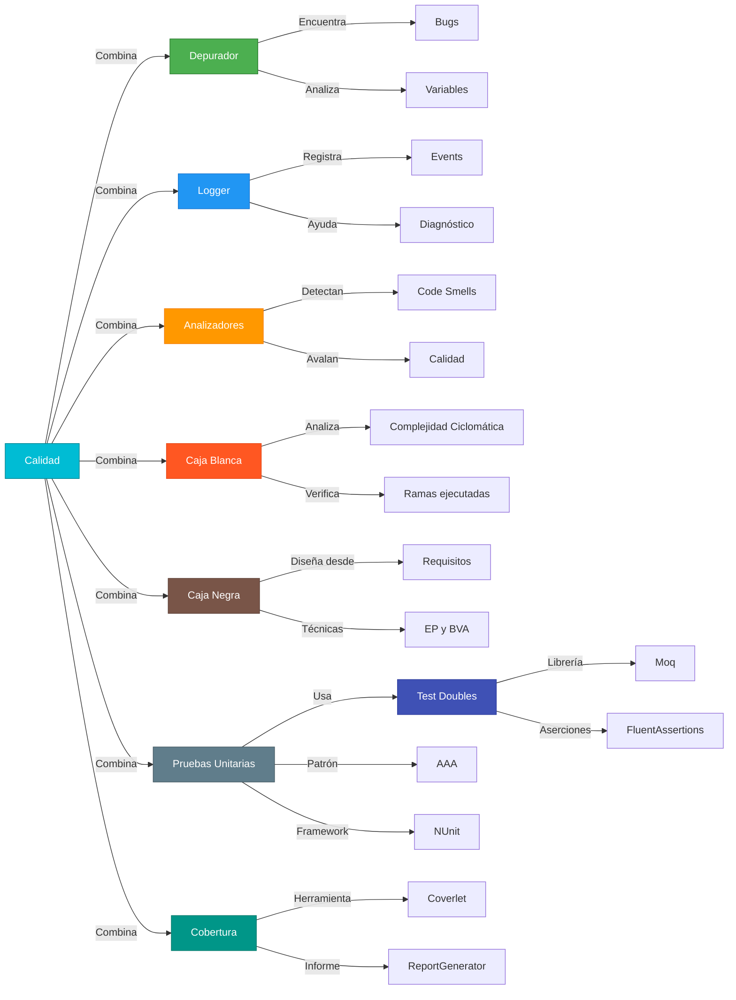
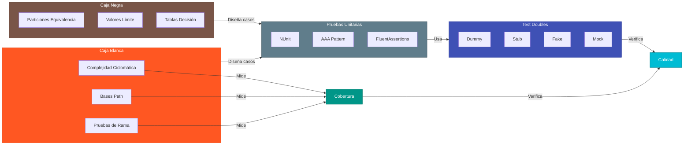
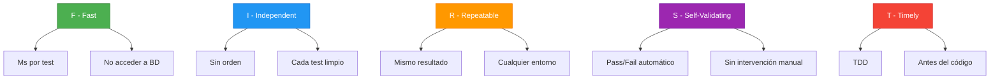

# 11. Resumen y Checklist de Evaluación

---

## 11.1. Resumen de la Unidad

| Tema | Propósito | Pregunta que Responde |
|------|-----------|----------------------|
| **Caja Blanca** | Probar el código internamente | ¿Cómo funciona mi código por dentro? |
| **Caja Negra** | Probar desde los requisitos | ¿Mi código hace lo que debe? |
| **Pruebas Unitarias** | Tests de unidades aisladas | ¿Cada función funciona correctamente? |
| **Test Doubles** | Simular dependencias | ¿Cómo pruebo sin base de datos? |
| **Cobertura** | Medir qué código está probado | ¿Cuánto de mi código está cubierto? |

### La Relación Entre Todo

> **📝 Nota del Profesor:** Las pruebas de software son una red de seguridad. Sin ellas, refactorizar es peligroso. Con ellas, puedes dormir tranquilo.

---

## 11.2. Mapa Mental de la Unidad

```mermaid
graph TD
    A["📚 UD07<br/>Calidad y Pruebas"] --> B["📖 1. QA y Testing"]
    A --> C["📖 2. Depurador"]
    A --> D["📖 3. Loggers"]
    A --> E["📖 4. Analizadores"]
    A --> F["📖 5. Pirámide Pruebas"]
    A --> G["📖 6. Caja Blanca"]
    A --> H["📖 7. Caja Negra"]
    A --> I["📖 8. Unit Tests"]
    A --> J["📖 9. Test Doubles"]
    A --> K["📖 10. Cobertura"]
    
    B --> B1[Qué es QA]
    B --> B2[Tipos de pruebas]
    B --> B3[Errores comunes]
    
    C --> C1[Puntos de ruptura]
    C --> C2[Depuración paso a paso]
    C --> C3[Inspeccionar variables]
    
    D --> D1[Microsoft.Extensions.Logging]
    D --> D2[Serilog]
    D --> D3[Niveles de log]
    
    E --> E1[SonarLint]
    E --> E2[SonarQube]
    E --> E3[StyleCop]
    
    F --> F1[Pirámide 70-20-10]
    F --> F2[TDD]
    F --> F3[BDD]
    
    G --> G1[Complejidad Ciclomática]
    G --> G2[McCabe]
    G --> G3[Bases path]
    
    H --> H1[Equivalence Partitioning]
    H --> H2[Boundary Value Analysis]
    H --> H3[Tablas de decisión]
    
    I --> I1[NUnit]
    I --> I2[AAA Pattern]
    I --> I3[FluentAssertions]
    I --> I4[SetUp/TearDown]
    
    J --> J1[Dummy]
    J --> J2[Stub]
    J --> J3[Fake]
    J --> J4[Mock]
    J --> J5[Moq]
    
    K --> K1[Coverlet]
    K --> K2[ReportGenerator]
    K --> K3[Umbral 80%]
    
    style A fill:#1e88e5,stroke:#1565c0,color:#fff
    style B fill:#43a047,stroke:#2e7d32,color:#fff
    style C fill:#ff9800,stroke:#f57c00,color:#fff
    style D fill:#9c27b0,stroke:#7b1fa2,color:#fff
    style E fill:#00bcd4,stroke:#00838f,color:#fff
    style F fill:#e91e63,stroke:#c2185b,color:#fff
    style G fill:#ff5722,stroke:#e64a19,color:#fff
    style H fill:#795548,stroke:#5d4037,color:#fff
    style I fill:#607d8b,stroke:#455a64,color:#fff
    style J fill:#3f51b5,stroke:#303f9f,color:#fff
    style K fill:#009688,stroke:#00796b,color:#fff
```

---

## 11.3. La Relación Entre Técnicas de Prueba

### Tabla Comparativa: Tipos de Prueba

| Aspecto | Caja Blanca | Caja Negra |
|---------|-------------|-------------|
| **Perspectiva** | Interna | Externa |
| **Basado en** | Código fuente | Requisitos |
| **Conocimiento** | Requiere conocer el código | No requiere código |
| **Técnicas** | Complejidad, ramas, paths | EP, BVA, tablas decisión |
| **Cuándo usarla** | Unit tests | Integration tests |

### Tabla Comparativa: Test Doubles

| Tipo | Propósito | Cuándo Usarlo |
|------|-----------|---------------|
| **Dummy** | Cumplir parámetros | Nunca se usa |
| **Stub** | Retornar valores fijos | Tests de estado |
| **Fake** | Implementación ligera | Tests de integración |
| **Mock** | Verificar interacciones | Tests de comportamiento |
| **Spy** | Registrar llamadas | Verificar después |

---

## 11.4. Principios F.I.R.S.T. en Pruebas Unitarias

---

## 11.5. Glosario de Términos

| Término | Definición |
|---------|------------|
| **Test Double** | Objeto que reemplaza una dependencia real en tests |
| **Mock** | Test double que verifica interacciones |
| **Stub** | Test double que retorna valores predefinidos |
| **Dummy** | Objeto usado solo para cumplir parámetros |
| **Fake** | Implementación simplificada funcional |
| **Spy** | Test double que registra llamadas |
| **AAA** | Arrange-Act-Assert patrón de tests |
| **EP** | Equivalence Partitioning - particiones de equivalencia |
| **BVA** | Boundary Value Analysis - análisis de valores límite |
| **Complejidad Ciclomática** | Métrica de complejidad de McCabe |
| **Coverlet** | Herramienta de cobertura para .NET |
| **FluentAssertions** | Librería de aserciones fluidas |
| **NUnit** | Framework de testing para .NET |
| **Moq** | Librería de mocking para .NET |
| **TDD** | Test Driven Development |
| **BDD** | Behavior Driven Development |
| **Cobertura** | Porcentaje de código ejecutado por tests |
| **Verify** | Verificar que un método fue llamado |

---

## 11.7. Checklist de Evaluación

### ✓ Conceptos Fundamentales
- [ ] Entiende la diferencia entre Caja Blanca y Caja Negra
- [ ] Sabe aplicar Particiones de Equivalencia
- [ ] Sabe aplicar Análisis de Valores Límite
- [ ] Conoce la pirámide de pruebas (70-20-10)

### ✓ Pruebas Unitarias
- [ ] sabe crear un test con NUnit
- [ ] Aplica el patrón AAA correctamente
- [ ] Usa FluentAssertions para aserciones
- [ ] sabe usar SetUp y TearDown
- [ ] sabe crear tests parametrizados

### ✓ Test Doubles
- [ ] Entiende la diferencia entre Dummy, Stub, Fake, Mock
- [ ] sabe crear mocks con Moq
- [ ] sabe configurar comportamiento con Setup/Returns
- [ ] sabe verificar interacciones con Verify

### ✓ Cobertura
- [ ] sabe ejecutar tests con cobertura
- [ ] sabe interpretar informes de coverage
- [ ] Conoce el objetivo del 80% de cobertura

---

> **💡 Consejo Final:** La práctica hace al maestro. Cada vez que implementes una funcionalidad, escribe los tests primero (TDD) o inmediatamente después. No lasciques para mañana lo que puedes probar hoy.

> **📝 Nota del Profesor:** "First make it work, then make it clean, then make it fast" (primero haz que funcione, luego hazlo limpio, luego hazlo rápido). Y siempre, siempre, siempre: testea tu código.
